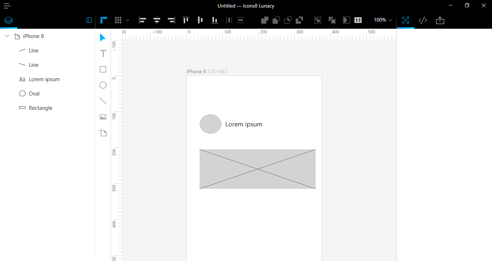
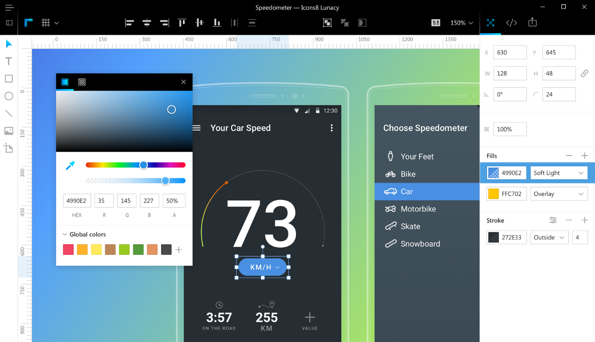
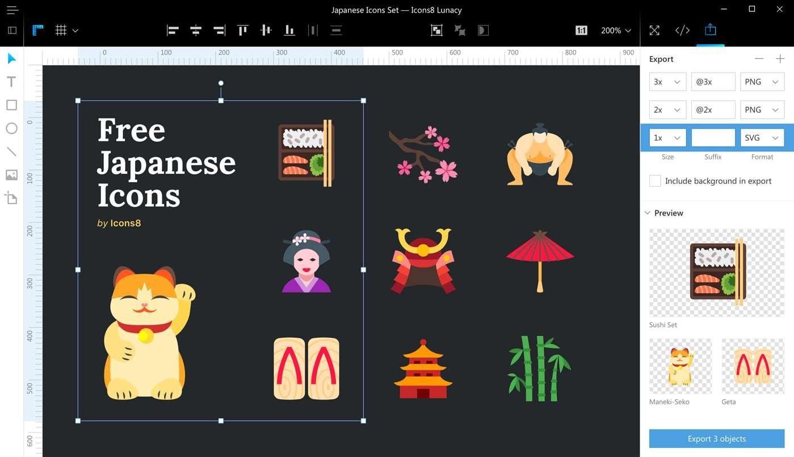
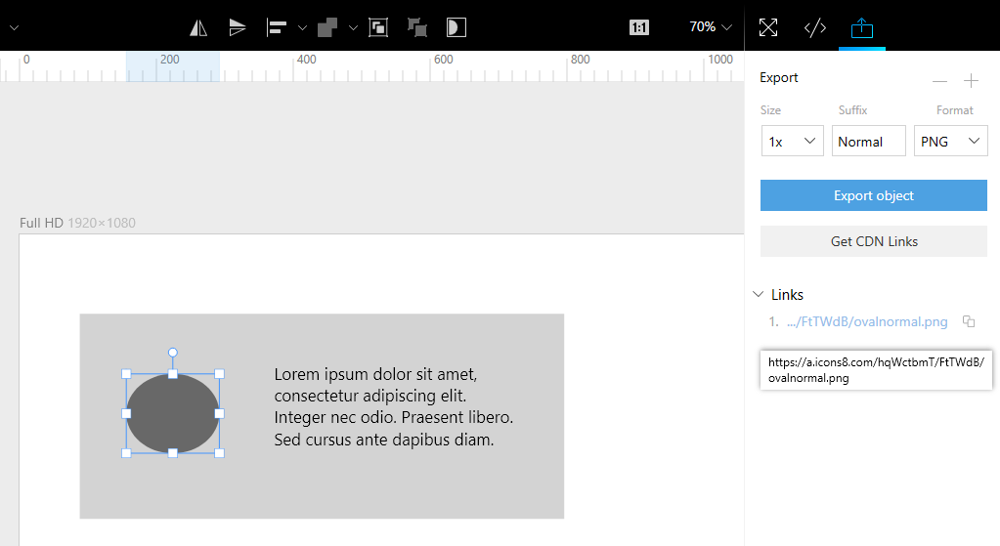

---
# Page settings
layout: default
keywords:
comments: false

# Hero section
title: About Lunacy

# Micro navigation
micro_nav: false

# Page navigation
page_nav:
    next:
        content: Interface
        url: '/interface'
---

## Speed Art Video

Here's a review of all the features with the features that one uses on a typical project. Music credits: [Young Ferry](https://icons8.com/music/author/yung-ferry) from [Fugue Music](https://icons8.com/music).

<iframe width="739" height="416" src="https://www.youtube.com/embed/7E_3ZZhHeoQ" frameborder="0" allow="autoplay; encrypted-media" allowfullscreen></iframe>

## Features

Lunacy is a native Windows app that works offline and supports .sketch files. We mean it; it's _not_ JavaScript wrapped into Electron. Therefore, our setup file is only 15 Mb. It's fast and takes only 200 Mb of memory for a typical project.

### Sketch Compatibility

Lunacy is compatible with .sketch format. More specifically, you can:

#### Read .sketch Files of any Version

This is important, as Sketch completely changed the format in version 43, and kept migrating it to the new format until version 50.

* If you've downloaded an old UI kit from [Sketchappsources](https://www.sketchappsources.com/), Lunacy will be able to read it.

* If you have a file sent by your teammate that uses the latest version of Sketch, Lunacy will be able read to it.

* If Sketch changes the format again, we’ll update Lunacy accordingly. We are members of the so called “Friends of Sketch” group, and we get the early builds so that we can fix it before the release.

* We also work on reading the slightly broken files generated by [PSD to Sketch](https://avocode.com/convert-psd-to-sketch/?lng=en) Converter (they have non-unique IDs).

#### Save .sketch Files

We save the files in .sketch format while preserving the original structure: naming, groups, and IDs.

As of version 3.7, _Lunacy doesn't fully support the symbols_. We save the symbols as generic groups, meaning that your designs will look the same, but updating a symbol won’t affect its instances.

#### Tools, Objects, and Properties

We cover all the data structures of Sketch, including masks, gradients, rounded corners, curves, sophisticated text formatting and many more.

### Full Editor

#### Create New Designs

Using Lunacy, you are able to create new designs. It’s a perfect tool for prototyping. You can add simple shape elements to your layout (such as drawing an oval, rectangle, line, or adding a bitmap), as well as draw, align and join objects.

#### Modify Existing Designs

Lunacy is a full-fledged editor that allows you to modify existing designs.

#### Generate Source Code

Lunacy allows you to see CSS and XAML code of elements.

#### Export Assets

You can export any assets from you document in PNG, SVG or XAML.

Exclusive feature: Upload directly to a CDN. Lunacy generates a CDN link for you without any extra effort from your side.

## Requirements

Lunacy is small and fast, so memory and processor are usually not an issue.

If you use the portable version, you will need [VC++ redistributable 2015](https://www.microsoft.com/en-us/download/details.aspx?id=48145)
and [Net Framework 4.6.1](
https://www.microsoft.com/en-us/download/details.aspx?id=49981) installed.