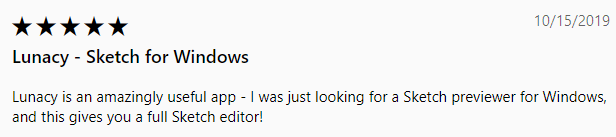
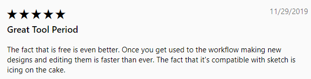
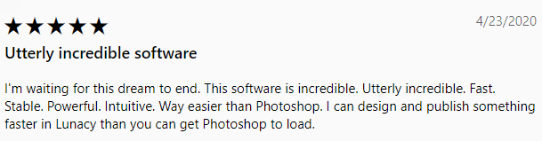

---
# Page settings
layout: default
keywords:
comments: false

# Hero section
title: About Lunacy
description: Basic information about Lunacy
icon: 'lunacy'

# Micro navigation
micro_nav: false

# Page navigation
page_nav:
    next:
        content: Interface
        url: '/interface'
---

## What is Lunacy

Lunacy is a Windows app for graphical design with **full support for .sketch files**. And when we say *full* support, we really mean it.

Yes, there are a few apps in the market that allow you to open .sketch files, but none of them can guarantee at least 80% rendering accuracy. Lunacy guarantees 99%. Irrespective of the the format version! Lunacy readily handles both dusty kits from Sketchappsources and the latest versions of sketch files.

Moreover, none of those apps allows you to edit a sketch project and save it back to a .sketch file. Except for Lunacy.

Born as a viewer of sketch files, Lunacy has developed into a fully-functional design app. <!--It inherits all the best things available in Sketch and brings new unique functionality.--> The idea behind the app is to let users focus on what's going on on the canvas rather than fussing around the right panel.

Another important thing about Lunacy is that it is **totally**, **absolutely**, **100% free**. No locked features, no ads.

How do we earn then? Lunacy is a product of Icons8, the company that runs one of the world's largest stocks of icons and a great stock of photos and vector illustrations. These stocks are integrated with Lunacy. You can use their content for free on condition that you provide links to Icons8 or you can subscribe to one of our <a href="https://icons8.com/pricing" target="_blank">paid plans</a> and forget about linking. Or you can use images of your own and use Lunacy at no charge at all.

## Lunacy facts

 Lunacy is absolutely free.

 Lunacy is the only Windows app that can both open and save .sketch files.

 Lunacy is a native Windows app and that is why it works faster than any other similar graphical design app.

 Lunacy is not demanding in terms of hardware requirements and runs fast even on moderate laptops.

 Lunacy works in the .sketch format. Supported export formats are: PNG, JPEG, BMP, TIFF, ICO, WEBP, SVG, PDF. Supported import formats are:  PNG, JPG, JPEG, WEBP, BMP, ICO, GIF, SVG.

 Lunacy supports Sketch Cloud. So, if you're on PC while the rest of your team are on Macs, it's no longer a problem. You can store, exchange and edit files through Sketch Cloud.

 Lunacy allows you to view and copy CSS, XAML and SVG code of your designs.

 Lunacy is an offline app. If you are not using our Library or Sketch Cloud, you don't need Internet connection.

 Lunacy respects privacy. We do not track your activity or analyze your files.

