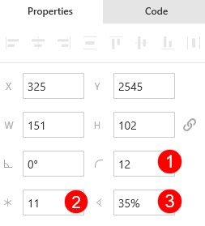
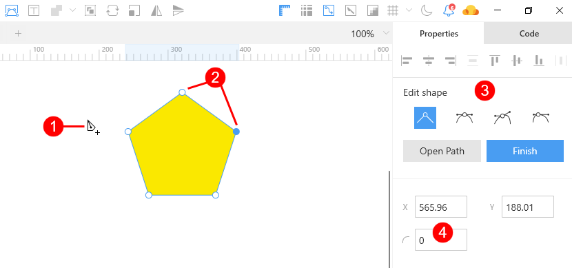
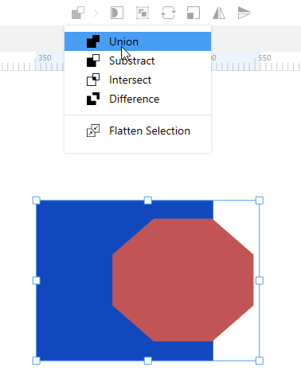
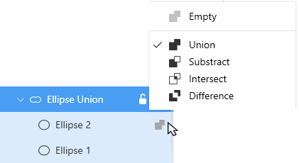
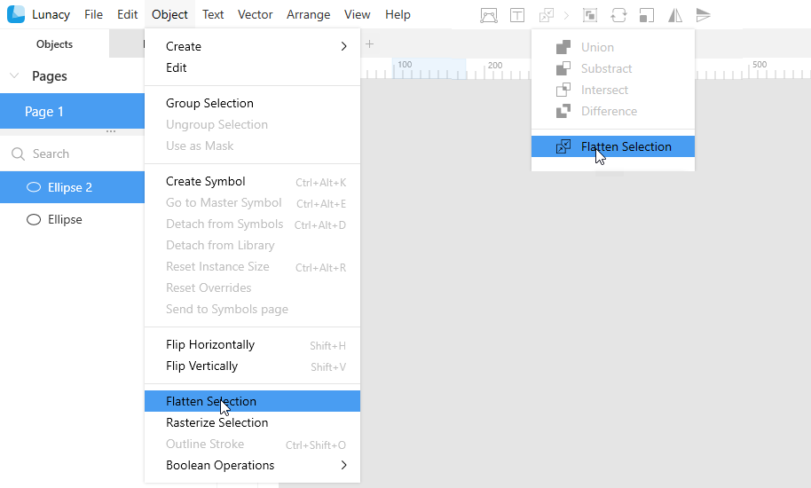
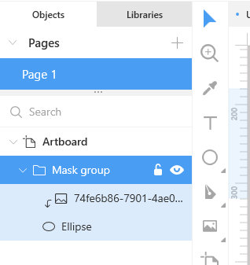
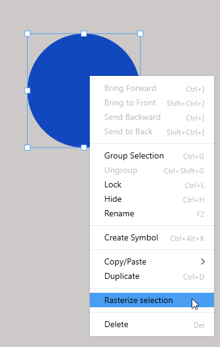

---
# Page settings
layout: default
keywords:
comments: false

# Hero section
title: Editing shapes
description: Make sure that you know everything about working with shapes in Lunacy
icon: 'pencil-tip'

# Micro navigation
micro_nav: false

# Page navigation
page_nav:
    next:
        content: Text
        url: '/text'
    prev:
        content: Objects
        url: '/objects'
---

## Introduction

If we put aside such specific <a href="https://docs.icons8.com/objects/#introduction" target="_blank">object types</a> as artboards and hotspots, all objects in Lunacy that are not text or rasters are vector shapes.

Lunacy provides a set of pre-made shapes that you can add in no time using the <a href="https://docs.icons8.com/tools/#shape-tools" target="_blank">shape tools</a>. Also, you can make use of the <a href="https://docs.icons8.com/tools/#pen-tool" target="_blank">pen</a> and <a href="https://docs.icons8.com/tools/#pencil-tool" target="_blank">pencil</a> tools to create freehand shapes and paths. Among the latter two, we should pay special attention to the pen tool, which allows you to edit vector shapes, both pre-made and freehand.

Another important thing for working with shapes is Boolean operations that allow you to combine shapes of all kinds and create even more fancy shapes whose diversity depends only on your creativity.

This section focuses on how to edit and transform vector shapes. For information about creating pre-made shapes, read <a href="https://docs.icons8.com/tools/#shape-tools" target="_blank">here</a> and <a href="https://docs.icons8.com/objects/#adding-objects" target="_blank">here</a>. For details about creating shapes with the pen tool, read <a href="https://docs.icons8.com/tools/#pen-tool" target="_blank">here</a>.

For information how to apply fills, borders, shadows and blurs, refer to the <a href="https://docs.icons8.com/styling" target="_blank">Styling</a> section.

## Transforming shapes through the Inspector

The figure below shows the controls in the Inspector that allow you to transform pre-made shapes. 

These controls include:

1. The **Corner radius** control. Available for most of pre-made shapes, except for ellipses, lines and arrows.
2. The **Points** control. Available only for stars and poligons.
3. The **Ratio** control. Available for stars only. Sets the ratio of star shapes.

The demo below shows these controls in action.

<video autoplay="" muted="" loop="" playsinline="" width="auto" poster="/public/shapes-transform1placeholder.png" height="auto"><source src="/public/shapes-transform1.mp4" type="video/mp4"></video>

### Adjusting the corner radius setting for rectangles

There are two more ways of changing the corner radius setting for rectangles drawn with the shape tool:

1. Drag the circle handles that appear inside a rectangle when you select it. This will change the radii of all corners. To change the radius of a single corner, hold `Alt` while dragging.
2. In the **Corner radius** control, enter four values separating them with spaces. This will be the values of the corner radii (starting from the top-left and going clockwise). Press `Enter` to submit.

<video autoplay="" muted="" loop="" playsinline="" width="auto" poster="/public/shapes-cronerradplaceholder1.png" height="auto"><source src="/public/shapes-cronerrad2.mp4" type="video/mp4"></video>

**Note:** The above methods won't work with rectangles drawn with the Pen tool.

See also the demo in the [Vector editing](#vector-editing) subsection. It shows how to edit individual corners in other shapes.

### Smooth corners

You can create shapes with perfectly smooth corners like in Apple interfaces and products.
To switch between round (default) and smooth corners, click  next to the corner radius field in the Inspector.

The figure below shows the difference between smooth (red) and round (blue) corners.

## [Vector editing](#vector-editing)

**Note**: Before you get down to reading this subsection, we recommend you get acquainted with <a href="https://docs.icons8.com/tools/#pen-tool" target="_blank">this</a> article first. It provides the basic information about the structure of vector objects, paths, point types and the usage of the Pen tool.

To enable the object edit mode, select the shape and then do one of the following:

* Double-click the shape.
* Press `Enter`.
* Click the **Edit object** button () on the context toolbar.

As you do it:

1. The Pen tool becomes active.
2. The selection frame disappears. You see the anchor points of the shape.
3. The **Edit shape** section appears in the Inspector.

{:.is-big}

In general, vector editing is all about manipulations with points and bending segments. The basic procedures are as follows:

* To select a point, just click it. To select multiple points, drag over them or hold down `Shift` while clicking.
* To move a point, select and drag it. This works with multiple points as well.
* To add a new point to a path, hover the cursor over the path, then click the path to get a straight point or double-click to set a mirrored point.
* To switch between other point types, use the controls in **Edit shape** section of the Inspector (#3 in the figure above).
* To bend segments, use curved points.
* To create a rounded corner on a straight point use the corner radius control (#4 in the figure above). It becomes active only when you select a straight point.
* To delete a point or several points, select it (them) and press the `Delete` key.

The next demo shows all the above procedures in action.

<video autoplay="" muted="" loop="" playsinline="" width="auto" poster="/public/shapes-editmode1.png" height="auto"><source src="/public/shapes-vectorediting3.mp4" type="video/mp4"></video>

## Boolean Operations

Boolean operations allow you to create complex shapes by combining parts or all of simple shapes. 

For this:
1. Select two or more overlapping shapes.
2. On the context tool bar, select the required Boolean operation as shown in the figure below.

Lunacy provides four types of Boolean operations:

* **Union**: Results in a shape that is the sum of areas of all selected shapes.
* **Subtract**: Removes overlapping areas from the lowermost shape. Opposite to the union operation.
* **Intersect**: The result of this operation is a shape that includes only the area where all selected shapes overlap.
* **Difference**: Results in a shape that does not include overlapping areas. Opposite to the intersect operation.

The demo below shows how Boolean operations work.

<video autoplay="" muted="" loop="" playsinline="" width="auto" poster="/public/shapes-booleansplaceholder.png" height="auto"><source src="/public/shapes-booleans.mp4" type="video/mp4"></video>

When you apply a Boolean operation, the selected shapes become a Boolean group. The figure below shows a view of a Boolean group in the **Objects** panel. Note that there is an icon next to one of the shapes. It indicates the type of the Boolean operation currently applied. By clicking this icon you invoke a menu where you can select another operation.

You can select individual shapes within the group through the **Objects** panel or on the canvas. If necessary, you can move and resize them on the canvas to modify the resulting shape.

**Tip:** There is no special button or menu option to disassemble a Boolean group. But you can do it by dragging shapes out of the group in the **Objects** panel.

## Flattening

The flattening operation is another method of creating complex shapes by combining two or more primitives. It is in a way similar to the Boolean union operation, but unlike the latter the result of flattening is a single object that cannot be disassembled. The **Flatten selection** option shares the same drop-down list with the Boolean operations and also is available on the **Object** menu (see the figure below).

The next demo shows how flattening works.

<video autoplay="" muted="" loop="" playsinline="" width="auto" poster="/public/shapes-flattenplaceholder.png" height="auto"><source src="/public/shapes-flat.mp4" type="video/mp4"></video>

## Masks

Masks allow you to use shapes for hiding parts of objects that don't fall within a shape.

To create a mask:

1. Add a shape that you will use as a mask over the target object(s).
2. Send the mask shape to back. You can skip this step, if you are applying a mask to a photo.
3. Select the mask shape and the target object(s).
4. On the context toolbar, click the **Toggle mask** button () or press `Ctrl+M`. The **Toggle mask** option is also available on the context menu.

<video autoplay="" muted="" loop="" playsinline="" width="100%" poster="/public/shapes-masksplaceholder.png" height="auto"><source src="/public/shapes-masks.mp4" type="video/mp4"></video>

When you apply a mask, Lunacy creates a mask group in the **Objects** list.

If it is necessary, you can select the mask shape right within the mask group and move, edit or resize the mask.

To remove a mask, select the mask group in the **Objects** panel or on the canvas and click the **Toggle mask** button (`Ctrl+M`).

## Outline stroke

The **Outline stroke** option (`Ctrl+Shift+O`) appears on the context menu and on the **Object** menu when you select a shape with a border. It allows you to convert that border into an independent object. Watch the demo below.

<video autoplay="" muted="" loop="" playsinline="" width="100%" poster="/public/shapes-outlinestrokeplaceholder.png" height="auto"><source src="/public/shapes-outlinestroke.mp4" type="video/mp4"></video>

## Rasterizing vector shapes

**Note:** Bear in mind that you cannot convert a raster back into a vector shape.

When it is necessary, you can turn vector shapes into rasters.

For this:

1. Select the required object(s).
2. Right-click over the selection, then click **Rasterize selection** on the context menu. This option is also available on the **Object** menu.

See also <a href="https://docs.icons8.com/interface/#show-pixels-on-zoom" target="_blank">Show pixels on zoom</a>.
