---
# Page settings
layout: default
keywords:
comments: false

# Hero section
title: Export
description: All you need to know about export in Lunacy
icon: 'folder-invoices'

# Micro navigation
micro_nav: false

# Page navigation
page_nav:
    next:
        content: Sketch Cloud
        url: '/cloud'
    prev:
        content: Images
        url: '/images'
---

## Overview

Lunacy allows you to export your designs into the following formats:

<table>
  <thead>
      <tr>
        <th>Format type</th>
        <th>Supported formats</th>
      </tr>
  </thead>
  <tbody>
      <tr>
        <td>Raster</td>
        <td>PNG, JPEG, BMP, TIFF, ICO, WEBP, GIF</td>
      </tr>
      <tr>
        <td>Vector</td>
        <td>SVG, PDF</td>
      </tr>
  </tbody>
</table>

You can export:

* Individual or multiple objects (both separately or as a single image)
* Content of certain artboards (together with the artboards or without them)
* Content within slices
* Document pages
* Entire projects

You can save export files to:

* Your computer
* Icons8 cloud

Moreover, within one export procedure you can get multiple files of different formats and sizes.

All these is detailed in the sections below. Also, here you will learn how to print your designs and how to get CSS, XAML and SVG code of your designs.

**Tip:** You can also use Sketch Cloud for saving you projects and sharing them with other people. For details about working with Sketch Cloud from Lunacy, read <a href="https://docs.icons8.com/cloud/" target="_blank">here</a>.

## Important notices

* Remember that during export Lunacy ignores all guides, square and layout grids, artboard names, as well as prototyping arrows and canvas color (not to be confused with the artboard color). There is now way to include them into export files.

* Also, note that if there is at least one artboard in your project, during *export of a project* Lunacy ignores all objects that are beyond artboards, as well as main components.

* The maximum dimension (height or width) of resulting raster files is limited to 16,000 pixels.

## Export settings (size, suffix/prefix, format)

Almost all export-related controls sit in the Inspector panel. The appearance of the export section depends on what you select on the canvas. For instance, when nothing is selected, you will see **Export project**. When you select an object or several objects, the export section appears as **Make exportable** (scroll to the bottom of the Inspector, if you don't see it on the screen).

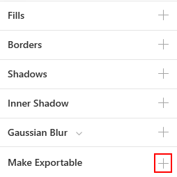

Click the plus icon. The **Export assets** panel appears.

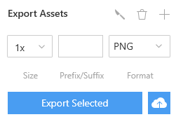

The basic controls in this panel are the following:

* **Size**. By default, Lunacy offers to export the selection or project in its original size (*1x*). But you can select any of the preset values or enter your own. For example, *8x*, *10x* or *0.3x*.
* **Prefix/Suffix**. This control allows you to define the suffix/prefix (click over the edit field to select, suffix is default) that will be added to the respective file name. Lunacy automatically generates values in the `@<size>` format for all sizes other than *1x*. But you can enter any string of your own in this field (symbols disallowed for file names will be ignored).
* **Format**. Serves to define the export file format. Note that when you select PDF as a target format, Lunacy always exports objects in their original sizes irrespective of the **Size** setting.

You can define as many formats and sizes as you need. For this, just click the plus icon to add a new row of settings.

<video autoplay="" muted="" loop="" playsinline="" width="auto" poster="/public/export-panelph.png" height="auto"><source src="/public/export-settings.mp4" type="video/mp4"></video>

For removing export settings, click the trash can icon.

Lunacy remembers all export settings that you define for each object. So, the next time when you select an object, the Inspector panel will the display **Export assets** section with your settings instead of the **Make exportable** caption.

### Export presets

You can save your export settings for further use and then quickly select them from the export settings menu as you need them.

There are two ways of creating export presets.

**Way 1**

1. In the **Export** section of the Inspector, click the settings button, then click **Create preset** on the displayed menu. The **Export Preset Editor** appears.
2. In the **Export Preset Editor**, define all the required settings.
3. Enter the name of the preset and click **Save**. Now, your custom preset will appear on the export settings menu.

**Way 2**

1. In the **Export** section of the Inspector, define all the required settings.
2. Click the settings button, then click **Create preset** on the displayed menu. The **Export Preset Editor** appears.
3. In the **Export Preset Editor**, enter the name of the preset and click **Save**. Now, your custom preset will appear on the export settings menu.

To edit or delete an export preset, hover the cursor over the preset on the export settings menu and click the respective icon (see the figure below). The export settings menu also features default presets for iOS and Android that cannot be altered or deleted.

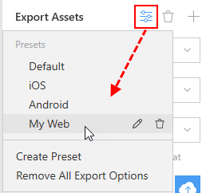

## Exporting single and multiple objects

To export a single object (grouped objects and component instances are also viewed as single objects), proceed as follows:

1. Select the object that you want to export.
2. In the Inspector, scroll down to the export section.
3. Click the plus icon. Export settings appear.
4. Define the required size, suffix/prefix and format. Repeat steps 3 and 4 as needed.
5. Click the **Export Selected** button.
6. In the displayed dialog box, browse to the target folder and confirm your intent. 
7. Once the procedure is complete, the **Open file location** link appears at the bottom of the Inspector. Click the link to see the resulting file(s).

The procedure of exporting multiple objects is almost similar to the previous one. The difference is that you can choose how to export the selected objects: each object into a separate file or as a single image. Just click the respective button when you are through with export settings.

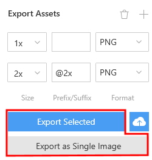

When selecting multiple objects you can get the *Click + to replace mixed content* caption shown in the figure below. It means that the selected objects have different export settings. By clicking the plus icon you will clear their current settings and define new ones.

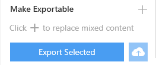

## Exporting content of artboards

To import content of an artboard or several artboards:

1. Select the artboard(-s).
2. In the Inspector, clear the **Include in export** checkbox (see the figure below), if you need only the content and don't want the artboard itself to appear in the export results.  
3. In the Inspector, scroll down to the export section.
4. Click the plus icon. Export settings appear.
5. Define the required size, suffix/prefix and format. Repeat steps 4 and 5 as needed.
6. Click the **Export Selected** button.
7. In the displayed dialog box, browse to the target folder and confirm your intent.
8. Once the procedure is complete, the **Open file location** link appears at the bottom of the Inspector. Click the link to see the resulting file(s).

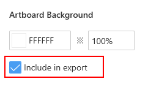

## Exporting content within slices

Slices are a special type of objects that allows you to export certain parts of your designs. You can add a slice to the canvas and quickly export everything that falls within its borders.

To add a slice you can:

* Use the <a href="https://docs.icons8.com/tools/#slice-tool" target="_blank">slice tool</a>.
* Click the slice icon () in the export section of the Inspector. The icon appears only when you select a single object. A click over the icon creates a slice of the same size as of the selection frame around the object. You can resize it by dragging handles, if necessary.

When you select a slice, two additional parameters appear in the export panel:

* **Trim Transparent Pixels**. With this parameter enabled Lunacy crops out unnecessary transparent pixels within the slice. This can be handy when you create a slice by hand with the slice tool.
* **Background color**. Allows you to define the background color that will appear in place of transparent pixels in the export file.

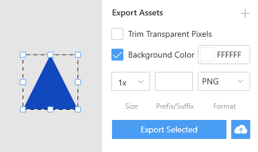

To hide/show slices on the canvas, use the **Show slices** button on the top bar.

To remove a slice from the canvas, select it and press`Del`.

To export the content of a slice:

1. Select the slice. You can select multiple slices at a time as well.
2. In the export section of the Inspector, define the required settings.
3. Click **Export Selected**.
4. In the displayed dialog box, browse to the target folder and confirm your intent.
5. Once the procedure is complete, the **Open file location** link appears at the bottom of the Inspector. Click the link to see the resulting file(s).

## Exporting a document page

The quickest way to export all content of a document page is as follows:

1. Use the `Ctrl+A` shortcut to select all objects available on the page.
2. In the export section of the Inspector, define the required settings.
3. Click the **Export Selected** or **Export as Single Image** button.
4. In the displayed dialog box, browse to the target folder and confirm your intent.
5. Once the procedure is complete, the **Open file location** link appears at the bottom of the Inspector. Click the link to see the resulting file(s).

## Exporting a project

**Note:** To be able to export a project, you should have at least one artboard in it. Also, bear in mind that during export of projects, Lunacy ignores all objects that are beyond artboards, as well as main components.

When exporting a project, Lunacy creates folders whose names correspond to the names of pages in the project. Inside these folders, Lunacy creates separate files for each object available on the respective page. Grouped objects and component instances are viewed as single objects.

To export a project:

1. Press `Esc` to deselect all objects. The **Export project** section appears in the Inspector.
2. Define the export settings as described <a href="https://docs.icons8.com/export/#export-settings-size-suffixprefix-format">above</a>.
3. Click **Export Project**.
4. In the displayed dialog box, browse to the target folder and confirm your intent.
5. Once the procedure is complete, the **Open file location** link appears at the bottom of the Inspector. Click the link to see the resulting folder(s) and file(s).

## Exporting to Icons8 Cloud

You can upload your designs to our Cloud and instantly share them with other people. Once the export procedure is complete, Lunacy returns you a link(s) to the cloud file(s) which you can send to your team or customer.

>**Note:** Do not confuse Icons8 Cloud and Sketch Cloud. Lunacy also supports the latter, but these are two different clouds. For details about working with Sketch Cloud, read <a href="https://docs.icons8.com/cloud" target="_blank">here</a>.

You can export to cloud:

* Single objects (grouped objects and component instances are also viewed as single objects).
* Entire projects. Note that you won't be able to export projects without artboards and that during export of projects Lunacy ignores objects beyond artboards. The only format available for export of projects is PDF. Lunacy creates a separate page for each artboard in the project.

### Exporting an object to Icons8 cloud

1. Select the object object that you want to export.
2. In the export section of the Inspector, click the **Export to Cloud** button. The **Export to Cloud** panel appears.
3. Define export settings as needed.
4. Click the **Export object** button. The link(s) to the export files appears below the button.
5. Click the copy link icon at the top of the **Links** section as shown in the figure below. This will copy to your clipboard all the resulting links at a time. You can copy individual links as well.

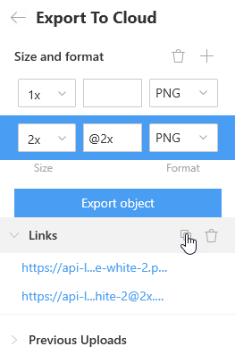

**Productivity Tip:** The `Alt+С + C` shortcut allows you to instantly upload an object to Icons8 cloud and get a link to it. Just select the required object and use the shortcut. That's it! The link to the export file is already in your clipboard. You can share it right away. This option is also available on the context menu.

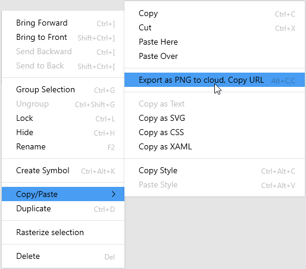

### Exporting a project to Icons8 cloud

1. Press `Esc` to deselect all objects.
2. In the export section of the Inspector, click the **Export to Cloud** button. The **Export to Cloud** panel appears.
3. In the **Export to Cloud** panel, click **Export**. The link to the export files appear below the button.
4. Hover the cursor over the link, then click the respective icon to copy the link to the clipboard.

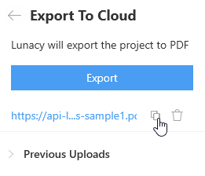

### Export history

Lunacy keeps the history of your uploads to the cloud. To view it, click **Previous uploads** in the **Export to Cloud** panel.

Hover the cursor over a link to see a preview of the file.

To delete a link from the list, click the trash can icon next to it.

To delete a file from the cloud, right-click the link to the file, then click **Remove this file from Lunacy servers**. After that you can click the link to make sure that it no longer works and then delete the link itself.

<video autoplay="" muted="" loop="" playsinline="" width="auto" poster="/public/export-historyph.png" height="auto"><source src="/public/export-history.mp4" type="video/mp4"></video>

**Note:** We in no way read or analyze files that you upload to Icons8 cloud. The guaranteed storage period of uploaded files is 60 days. After that they can be deleted from our servers without prior notice. Removed files cannot be restored. For this reason, please do not consider Icons8 cloud as a long-term storage.

## Other export options

Also, you can use the **File > Export** menu option or its `Ctrl + E` shortcut.

<table>
  <thead>
      <tr>
        <th>When you select</th>
        <th>Lunacy exports to the target folder</th>
      </tr>
  </thead>
  <tbody>
      <tr>
        <td>No objects</td>
        <td>The content of all available artboards in separate PNG files.</td>
      </tr>
      <tr>
        <td>A single object</td>
        <td>This object in any of the supported export formats.</td>
      </tr>
      <tr>
        <td>Multiple objects</td>
        <td>These objects in separate PNG files.</td>
      </tr>
    </tbody>
</table>

## Printing your designs

You can print the content of selected artboards:

1. Select one or several artboards.
2. In the **File** menu, click **Print** or use the `Ctrl + P` shortcut.

Lunacy exports the selection to PDF and opens it in your default PDF reader from where you can send the file to the printer.

## Code Preview

Lunacy allows you to view and copy CSS, XAML and SVG code for all objects in your document. This feature is ideal for web designers.

1. Select an object and click the **Code** tab in the Inspector.
2. In the displayed panel, click over the name of the required code to view the code. Or click the copy icon to copy the code.

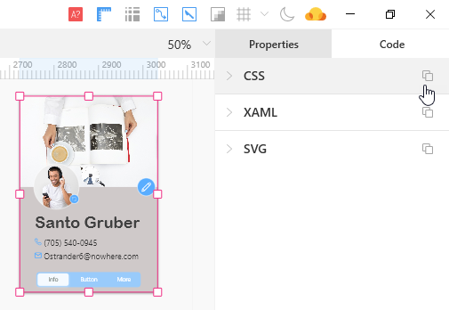

Alternatively, you can copy code through the context menu (see the figure below)

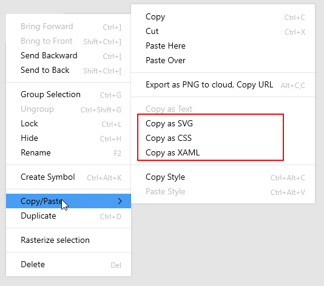

[//]: # (removed the unique features section - maybe we should recreate it as a set of links)
[//]: # (# Unique Features)
