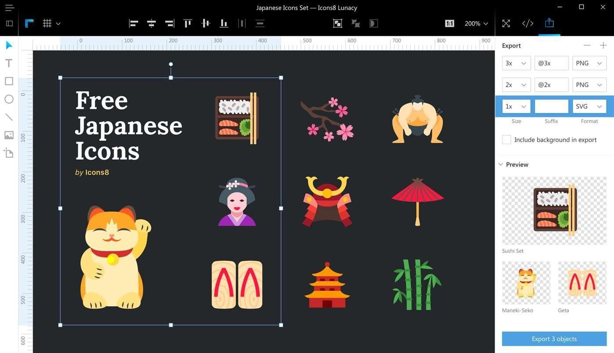
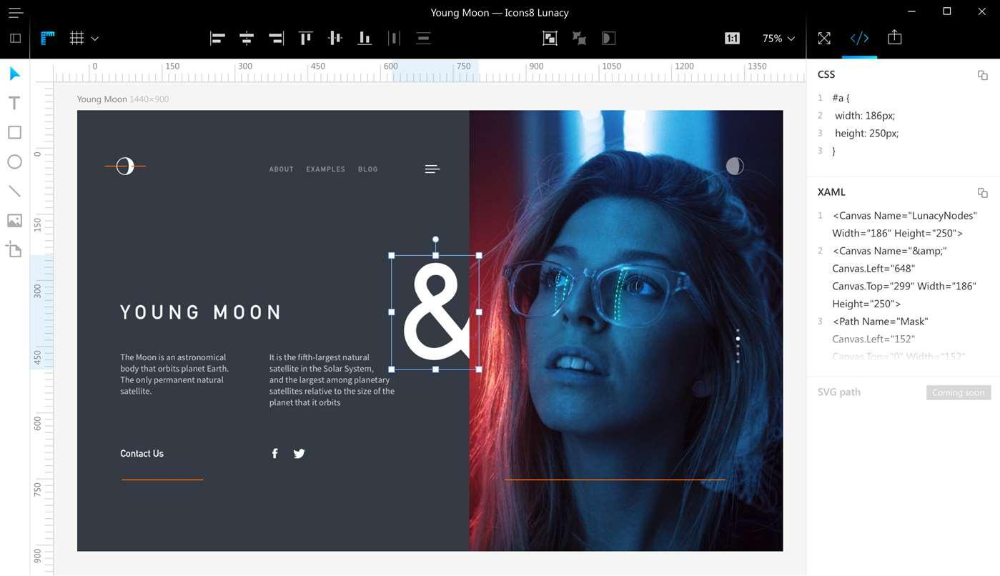
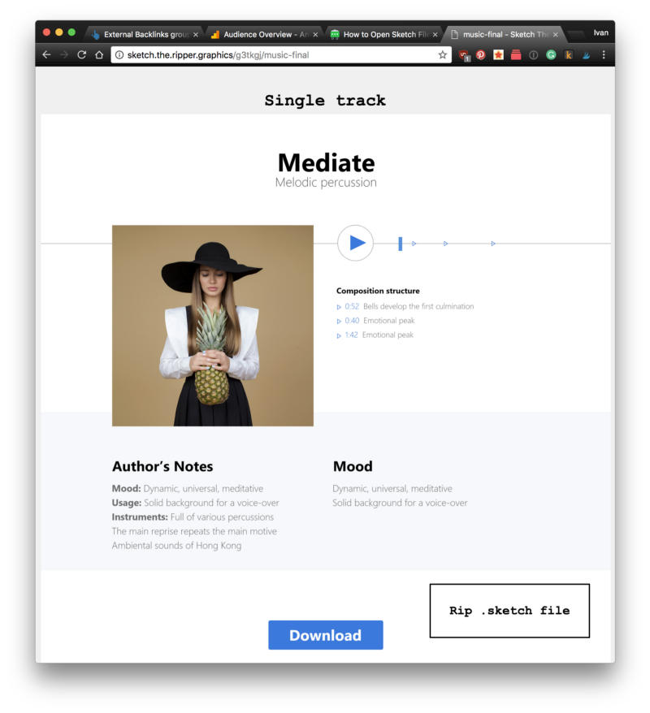

---
# Page settings
layout: default
keywords:
comments: false

# Hero section
title: Export
description: Learn about publishing capabilities and export formats of Lunacy
icon: 'folder-invoices'

# Micro navigation
micro_nav: false

# Page navigation
page_nav:
    next:
        content: Shortcuts
        url: '/shortcuts'
    prev:
        content: Libraries
        url: '/libraries'
---

## Exporting Individual Assets

When designing icons, mobile app layouts, web pages, or most anything else in Lunacy, you’ll likely want to export parts of your creation - or probably all of it! With Lunacy, it’s simple to mark what you want to export, and how you want it exported.

Simply click on the  item in the top toolbar and select the object (or objects) that you want to export.

You can export your assets either to PNG or SVG format.

For PNG format, you can choose a size or scale in which an element will export. The default size is '1x', which will export your layer at the actual size it was created. If you’re designing for mobile, you may want to export something at double or even triple the size you created it - in this case, ‘2x’ and ‘3x’.

## Publish to CDN

Lunacy allows you to publish assets directly to the web. Your image will be hosted on the fast servers in multiple regions of the world, ensuring quick delivery.

<iframe width="739" height="416" src="https://www.youtube.com/embed/u8cdtvOwlzg?rel=0" frameborder="0" allow="autoplay; encrypted-media" allowfullscreen></iframe>

Instead of saving an image to a disk, you can get its URL with a single click, ready to insert into your HTML. Lunacy uploads the file to Icons8 CDN servers.

This service is free, thanks to the generous sponsorship of [CDN77](https://www.cdn77.com/).

The export works in one-click. Simply select Export option and click 'Get CDN Links.' That’s all!

## Code Preview

Lunacy allows you to preview CSS and XAML code for all objects in your document. This feature is ideal for web designers. If you click on </> item in the top tab bar and select any element in the canvas, you’ll see the CSS/XAML code for this object in the right panel. You can also copy these code properties with one click.

## Publishing Design

Lunacy integrates with [Sketch the Ripper](http://sketch.the.ripper.graphics/) — a fast and rustic alternative to the advanced (and expensive!) tools like Zeplin, Avocode, or Simply. It allows you to smooth design handoff.

Imagine you are a designer who finished working on a piece. Instead of sending a .sketch file to your teammates, you share your designs with a single click and get a link to all the assets ripped off ([check this example](http://sketch.the.ripper.graphics/g3tkgj/music-final)). It sets a shortcut from design to development without the need of additional viewers.

[//]: # (removed the unique features section - maybe we should recreate it as a set of links)
[//]: # (# Unique Features)
