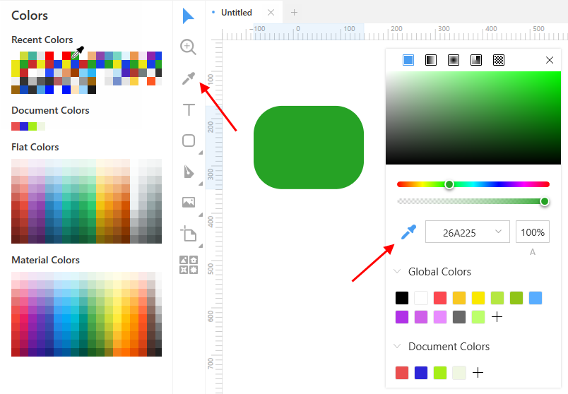

---
# Page settings
layout: default
keywords:
comments: false

# Hero section
title: Smart eyedropper
description: How to be quick, efficient and precise when working colors
icon: 'color-dropper'

# Micro navigation
micro_nav: false

# Page navigation
page_nav:
    next:
        content: Symbols
        url: '/symbols'
    prev:
        content: Styling
        url: '/styling'
---

Working with colors is an essential part of a designer's job. The Lunacy's smart eyedropper tool is designed to make this work easy and effective.

To use the eyedropper tool:

1. Select an object to which you are going to apply a color. If you don't select any object, Lunacy applies the color to the workspace.
2. Click the eyedropper icon on the toolbar or on the color picker panel, or just press `I`. The cursor turns into the eyedropper. Also, the **Colors** panel appears on the left. It features four pallets:
  
    * Recent colors
    * Document colors
    * Flat colors
    * Material colors

3. Hover the eyedropper over the color that you want to sample anywhere on the screen and click to apply it.

{:.is-big}

That is typically how all eyedroppers work in similar apps. But Lunacy's eyedropper also features a very nice zoom option that comes in handy when the target area is small and you need pixel precision. To enable zoom, hover the eyedropper over the target and hold down the left mouse button. Then point the eyedropper to the required pixel and release the mouse button. To exit the zoom mode, press `Esc` or quickly swipe the cursor anywhere away from the current area, see the demo below.

<video autoplay="" muted="" loop="" playsinline="" width="100%" poster="/public/eyedropper3-placeholder.png" height="auto"><source src="/public/eyedropper3.mp4" type="video/mp4"></video>

## How Lunacy applies color to objects

Depending on the styling properties of an object, Lunacy applies colors in the following order:

1. Fill
2. Border
3. Shadow
4. Inner shadow

So, if an object has a fill and a border, Lunacy updates the fill. If an object has no fill, but has a border and a shadow, Lunacy changes the border color and so on. If an object has several fills/borders/shadows/inner shadows, Lunacy applies the color to the one which sits at the top of the property list in the Inspector. Similar rules apply to text objects where text color has top priority.

To demonstrate all this, in the figure below we applied the colors of the rectangles to the ellipses with different sets of styling properties.

{:.is-big}

