Welcome to the official help for [Lunacy - Sketch for Windows](https://icons8.com/lunacy). 

#### Master Location

If you see this documentation elsewhere, you may want to check our first-hand location at [docs.icons8.com](https://docs.icons8.com). It's up to date and has the proper formatting of the inline videos.

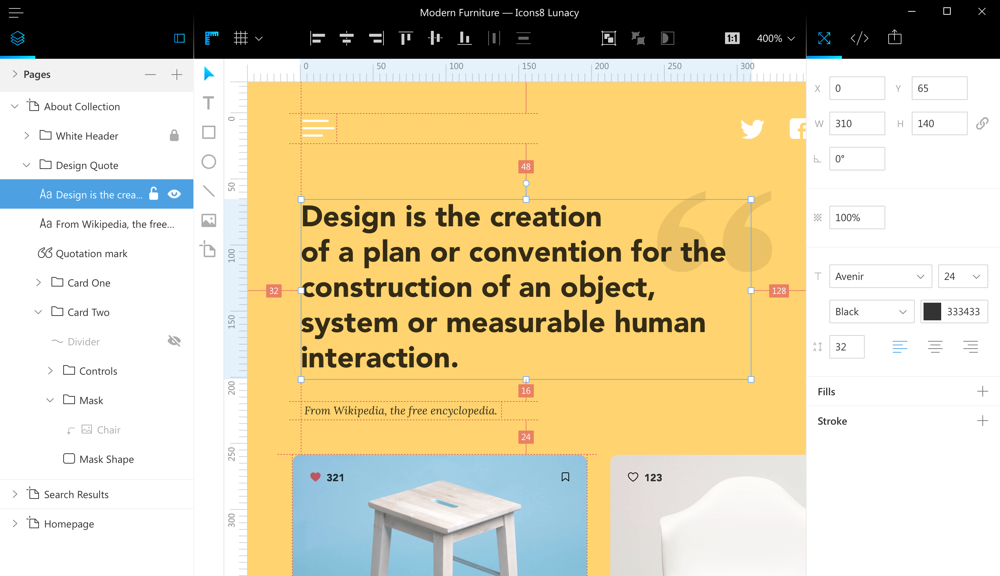

# About Lunacy

## Speed Art Video

Here's a review of all the features with the features that one uses on a typical project. Music credits: [Young Ferry](https://icons8.com/music/author/yung-ferry) from [Fugue Music](https://icons8.com/music).

<iframe width="739" height="416" src="https://www.youtube.com/embed/7E_3ZZhHeoQ" frameborder="0" allow="autoplay; encrypted-media" allowfullscreen></iframe>

## Features

Lunacy is a native Windows app that works offline and supports .sketch files. We mean it; it's _not_ JavaScript wrapped into Electron. Therefore, our setup file is only 15 Mb. It's fast and takes only 200 Mb of memory for a typical project.

### Sketch Compatibility

Lunacy is compatible with .sketch format. More specifically, you can:

#### Read .sketch Files of any Version

This is important, as Sketch completely changed the format in version 43, and kept migrating it to the new format until version 50.

* If you've downloaded an old UI kit from [Sketchappsources](https://www.sketchappsources.com/), Lunacy will be able to read it.

* If you have a file sent by your teammate that uses the latest version of Sketch, Lunacy will be able read to it.

* If Sketch changes the format again, we’ll update Lunacy accordingly. We are members of the so called “Friends of Sketch” group, and we get the early builds so that we can fix it before the release.

* We also work on reading the slightly broken files generated by [PSD to Sketch](https://avocode.com/convert-psd-to-sketch/?lng=en) Converter (they have non-unique IDs).

#### Save .sketch Files

We save the files in .sketch format while preserving the original structure: naming, groups, and IDs.

As of version 3.7, _Lunacy doesn't fully support the symbols_. We save the symbols as generic groups, meaning that your designs will look the same, but updating a symbol won’t affect its instances.

#### Tools, Objects, and Properties

We cover all the data structures of Sketch, including masks, gradients, rounded corners, curves, sophisticated text formatting and many more.

### Full Editor

#### Create New Designs

Using Lunacy, you are able to create new designs. It’s a perfect tool for prototyping. You can add simple shape elements to your layout (such as drawing an oval, rectangle, line, or adding a bitmap), as well as draw, align and join objects.

#### Modify Existing Designs

Lunacy is a full-fledged editor that allows you to modify existing designs.

#### Generate Source Code

Lunacy allows you to see CSS and XAML code of elements.

#### Export Assets

You can export any assets from you document in PNG, SVG or XAML.

Exclusive feature: Upload directly to a CDN. Lunacy generates a CDN link for you without any extra effort from your side.

## Requirements

Lunacy is small and fast, so memory and processor are usually not an issue.

If you use the portable version, you will need [VC++ redistributable 2015](https://www.microsoft.com/en-us/download/details.aspx?id=48145)
and [Net Framework 4.6.1](
https://www.microsoft.com/en-us/download/details.aspx?id=49981) installed.

# Interface

Lunacy’s interface is minimal. It contains only essential controls, so you don’t have to spend much time learning how to interact with it.

The interface is built using the following blocks:

* The **toolbar** along the top, which contains high-level tools and actions.
* The **objects** are the pane on your left, which contains all the **artboards** of your document.
* The **inspector** on the right, which lets you see and adjust the properties of the selected object or layer.
* The **canvas** in the middle is where you will see your work.

There are no floating panels. That way you always have a completely unobscured view of your сanvas.

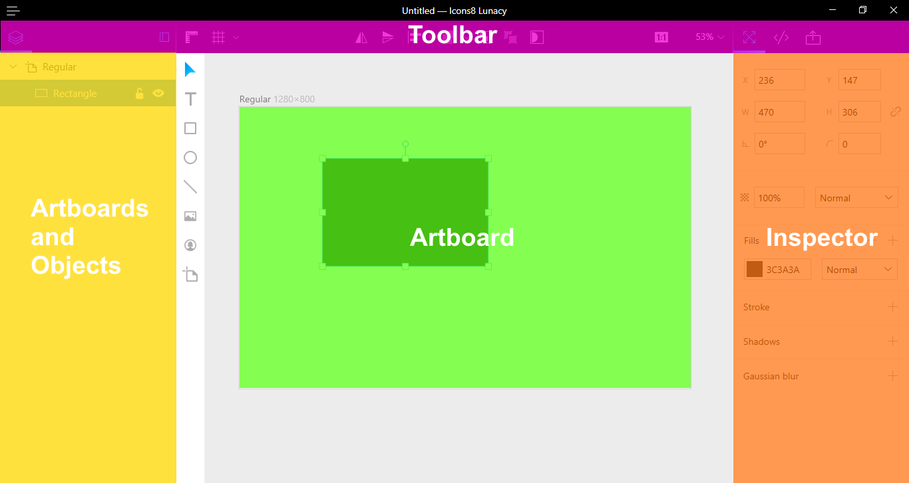

## List of Objects

The Artboard and Objects is the pane on your left. On the top level, you will find **artboards**. Artboard is a fixed frame inside the canvas. Designers usually create a new artboard for each new web page, mobile screen, banner ad, or other type of artwork. The use of artboards is optional; you can also draw directly on the canvas.

Inside the artboards, there are objects. Here you can see each object’s attributes, such as whether it’s hidden or locked;  you can also re-organize layers by renaming and re-ordering them.

Any object or group of objects can be hidden from the canvas by clicking on the eye icon that appears on the screen when you click on the object. Alternatively, you can hide the element using the keyboard shortcut **Ctrl + H.**

A padlock icon is used to lock the layer on your canvas, meaning it cannot be selected or moved again without being unlocked first. Alternatively, you can lock an object using the keyboard shortcut **Ctrl + L**

## Object Tools

The toolbar contains the elements you need in order to create your design. These include:

<table>
  <tr>
    <td>Object</td>
    <td>Keyboard shortcut</td>
  </tr>
  <tr>
    <td>Text</td>
    <td>T</td>
  </tr>
  <tr>
    <td>Rectangle </td>
    <td>R</td>
  </tr>
  <tr>
    <td>Oval</td>
    <td>O</td>
  </tr>
  <tr>
    <td>Line</td>
    <td>L</td>
  </tr>
  <tr>
    <td>Bitmap</td>
    <td>P</td>
  </tr>
  <tr>
    <td>Avatar</td>
    <td>Ctrl + P</td>
  </tr>
  <tr>
    <td>Artboard</td>
    <td>A</td>
  </tr>
</table>

Some of these shapes have extra options, like the ability to add stokes or round corners.

## Rulers and Grids

Rulers (keyboard shortcut **Ctrl + R**) and grids (keyboard shortcut **Ctrl + '**)will help you position objects exactly where you want them. The grid allows you to align objects to a particular layout.

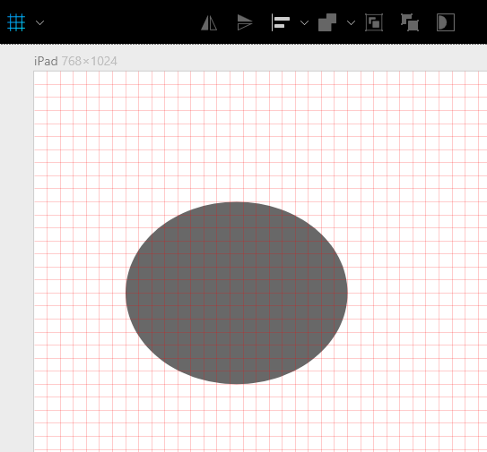

**Note:** Rulers and grids are not part of your design, and won't appear on your exported design.

Lunacy offers support for a regular (square) grid. Users have a number of options to choose from; the range of grid sizes start from 4x4, and goes up to 64x64.

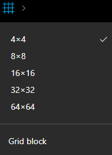

## Artboard

The artboard is where you will see your designs. Lunacy provides a variety of predefined artboard sizes to choose from. These start from the size for iWatch and goes up to Full HD sized layouts. You can modify the size of an artboard after creating it.

In Lunacy you have the ability  to add more than one artboard inside a canvas. For example, when designing a landing page, many designers create one artboard for the desktop as well as mobile version of the page.

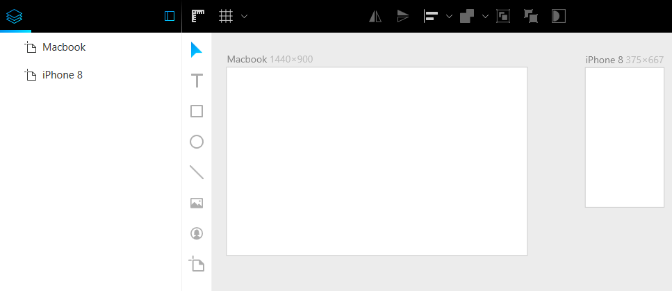

## Inspector

The Inspector on the right lets you adjust the properties of the selected object.

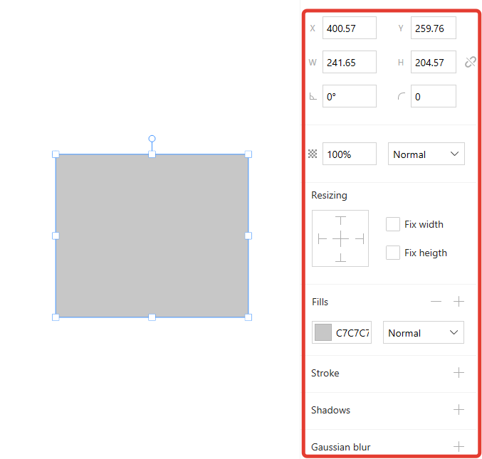

## Zoom

The Zoom lets you see a larger or smaller part of your document depending on the zoom level. You can change the zoom scale of your document from 25% to 800%.

In practice, designers use the shortcuts **Ctrl + '+' and Ctrl + ‘-’**. The shortcut **Ctrl + ‘0’** resets the zoom level to 1:1.

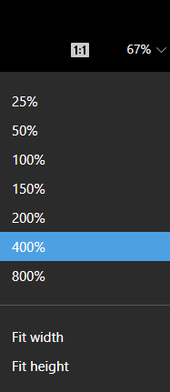

[//]: # (### Zoom to Area)

# Editing

## Selecting

Selecting objects in Lunacy is easy: You just click on an object in your canvas. Once the object is selected, you should see eight little handles along its outline; one in each corner and one in the center of each edge.

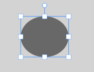

Alternatively, you can use the Layer list to select an object. Clicking an object's name in the list selects it on the canvas.

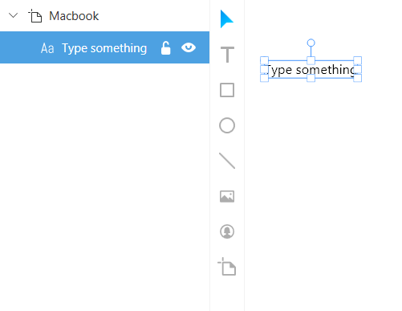

You can select multiple objects by holding down the Shift key on the keyboard and clicking on other objects.

Selecting Group vs. Object

If you click on an object within a group, Lunacy selects the whole group. This is usually quite handy: You can easily move around whole components in your design.

Sometimes you need to choose a single object though. To do so, hold Ctrl when choosing the object.

## Adding

The most common type of objects in your document will be shapes. The easiest way to add a shape is to pick one of the standard shapes from the toolbar. There is a wide variety of default shapes provided by Lunacy; these include ovals, rectangles, lines and more.

[//]: # (there was a weird broken table here; I removed it  - IB)

## Moving

### Moving With Keyboard

* Hit the arrow keys to move an object by one pixel
* Shift+Arrow moves objects by 10 pixels

Using keyboard is handy when you either

* Need precision
* Or need to move objects just a little bit (as designers, we spend 50% of our time making these small adjustments)

### Moving Horizontally and Vertically

Hold Shift while moving an object. Lunacy will lock one of the axes and move the object either horizontally or vertically.

## Duplicating

Hold Alt and move the object. Lunacy will create a copy.

Another way to create a copy, is by pressing Ctrl+D.

## Grouping

Grouping objects is a good way to organize a document. After creating a group, you can move, scale, and duplicate the group as a single object.

Designers use grouping a lot. One can even say that designers turn their documents into a series of nested groups.

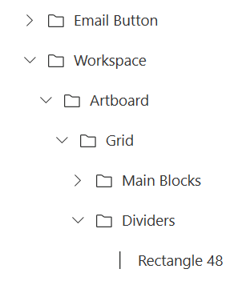

## Resizing

Each object in Lunacy has eight handles that become visible when you select objects. Those handles don't just indicate selection; you can also use them to resize a layer. Grab any of the handles and drag them to resize an object.

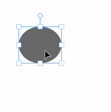

[//]: # (this piece must go somewhere else - ib)

[//]: # (Using Lunacy it's possible to view properties of objects. You need to select an object to see it’s properties in the right panel.)

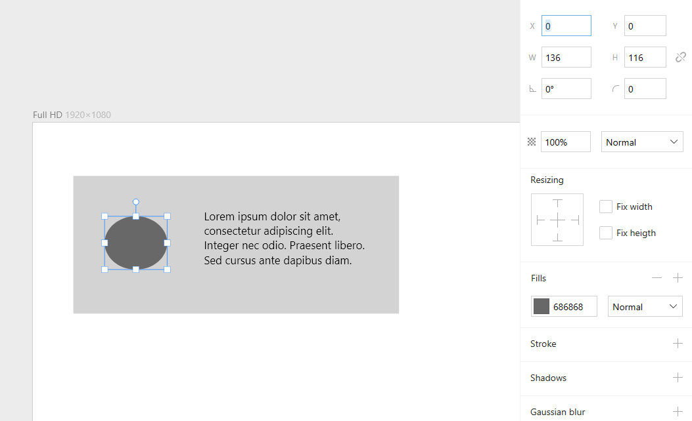

[//]: # (this resizing option is called somehow else - ib)

Notice the Resizing option.

Imagine you've got an object inside a group. When you resize this group, how the object should behave? Should it resize or stay locked?

For example, when _Fix Height_ is enabled, the height remains intact when you resize the parent vertically.

You only see this option if you selected an object inside a group or an artboard.

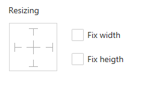

## Rotating

You can rotate an object using the rotate clock.

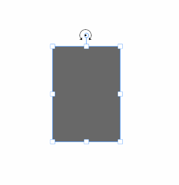

As rotation is a value measured in degrees, it can be edited via Lunacy's Inspector.

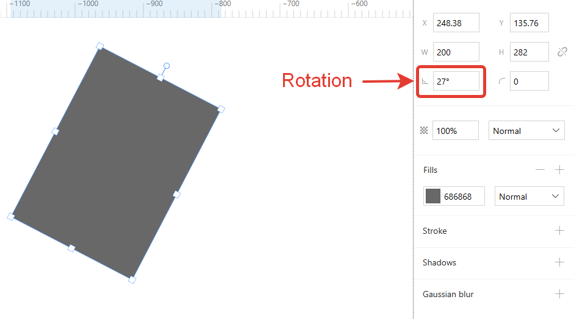

## Z-Axis Position

Each object on your artboard can be located on the Z-axis. You can:
* Bring objects forward (keyboard shortcut **Ctrl + J**)
* Bring it to the front (keyboard shortcut **Shift+Ctrl+J**)
* Send objects backward (keyboard shortcut **Ctrl + [**)
* Send an object directly to the back (keyboard shortcut **Shift + Ctrl + [**)

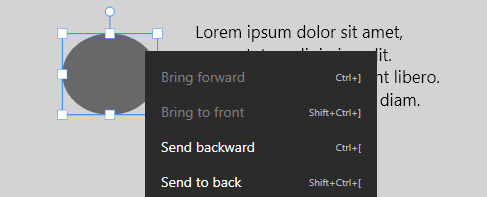

## Align and Distribute

In a bar at the very top of the canvas, you will find the buttons for aligning and distributing objects. These buttons will become active when you have more than one object selected.

| Button | Action | Shortcut |
|---|---|---|---|---|
|  | Flip horizontally | Ctrl + ←, Ctrl + → |
|   | Flip vertically | Ctrl +↓, Ctrl +↑ |
|  | Align | None |
|  |Group| Ctrl + G |

## Edit Shape

For some objects, like the rectangle, it’s possible to edit the shape. To activate Edit shape mode, you need to double click on the object. This option allows you to modify properties like Corner radius for a rectangle.

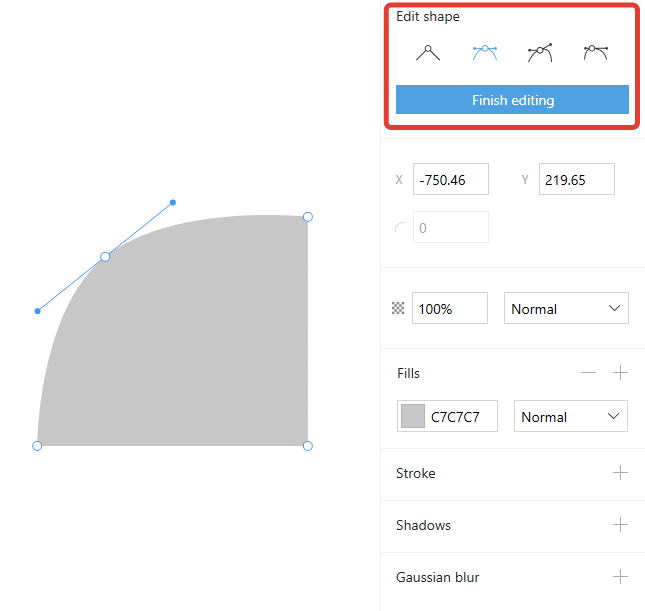

# Objects

Lunacy supports the typical tools for any vector editor.

<table>
  <tr>
    <td>Object</td>
    <td>Keyboard shortcut</td>
  </tr>
  <tr>
    <td>Text</td>
    <td>T</td>
  </tr>
  <tr>
    <td>Rectangle </td>
    <td>R</td>
  </tr>
  <tr>
    <td>Oval</td>
    <td>O</td>
  </tr>
  <tr>
    <td>Line</td>
    <td>L</td>
  </tr>
  <tr>
    <td>Bitmap</td>
    <td>P</td>
  </tr>
  <tr>
    <td>Avatar</td>
    <td>Ctrl + P</td>
  </tr>
  <tr>
    <td>Artboard</td>
    <td>A</td>
  </tr>
</table>

Let’s review some of these tools in more detail.

## Square

If you need a square, choose the Rectangle tool and hold shift while drawing.

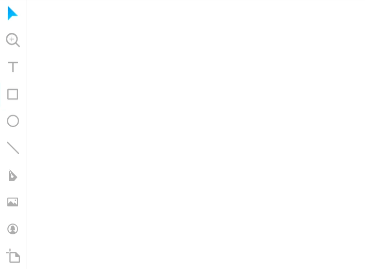

## Circle

## Straight Lines

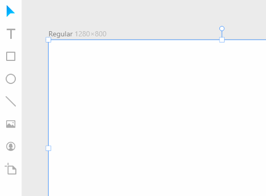

## Text

You can add text by choosing the Text tool from the Shapes and Objects toolbar (or press **T**). The pointer changes to the Text Input tool icon and then you can click anywhere in the Canvas to insert your text layer at that point. When you click on a canvas, a new text layer will be inserted with a “Type something” placeholder, ready for you to add your text.

When you have a text layer selected you will notice that the Inspector changes to show you all the properties that apply to text. Underneath the standard object properties, there’s an area for text style options which includes:

* Font family
* Font size
* Font weight
* Font color
* Line spacing
* Alignment options

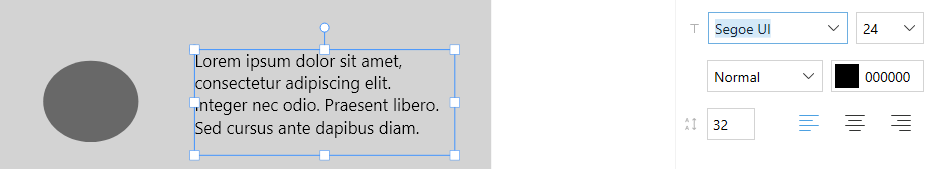

## Missing Fonts, Solved

When working with Sketch files that have been downloaded from the internet, or received from a colleague, it may contain fonts that you do not have on your system.

### Auto Downloading

If you open a file with missing fonts, Lunacy will check Google Fonts and download those that are missing. The process is so smooth, that you’ll never even notice it.

### Auto Installation

All the Google Fonts are already in the list. When you choose any one of them, Lunacy downloads it from the Google service. Smooth!

### Auto Replacing

In Lunacy, you only have to replace the font once throughout the entire document, while other editors require you to do it for every font instance.

[//]: # (Maybe we should cut the above into couple sentences - ib)

## Bitmaps

Bitmaps, or images are one of the object types that are supported in Lunacy. Bitmaps, (or raster) images are made up of pixels; those images can take many forms, such as screenshots or photographs. Lunacy supports all the most common image formats, like PNG, JPG, JPEG.

## Avatar Tool

When designing user interfaces, one of the most common tasks is creating avatars. This time consuming process is easy with Lunacy, as it has a tool specifically for this. The avatar tool lets you create them in one click.

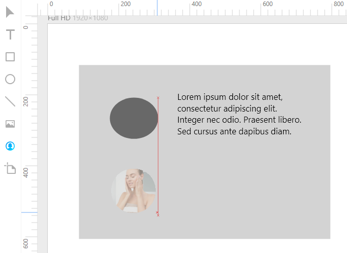

## Masks

The masks 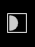(keyboard shortcut **Ctrl + M**) in Lunacy are used to show parts of objects selectively.. For example, masking two overlapping ovals gives you an oval image.

Before masking:

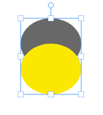

After masking

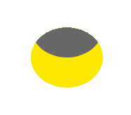

# Styling

You can change the styling options for each object in your document. All styling properties for your objects are available in the Inspector. If you decide to remove styling from an object, you need to select the object and hit the ‘-‘ button.

## Color Picker

Choose and save colors.

## Gradients

Create and edit gradients.

The following types of gradients are supported in Lunacy:

* Linear gradient

* Radial gradient

## Effects

Effects each need more explanation. Combining effects. Blending modes.

## Shadows

When Shadow is enabled for the object, it will cast the shadow outside of the shape. You can define the shadow’s X and Y position, as well as blur, radius, spread and color.

## Strokes

All objects, with the exception of text layers, can contain strokes. These can all have various thicknesses, colors and blending modes.

The border position of a stroke can be center, inside or outside.

Applying a 10px stroke for a rectangle object: Original object, center stroke, inside stroke, outside stroke

## Gaussian Blur

Gaussian blur is a blur type that will accurately blur in all directions.

## Formulas

Inspector also supports **formulas**. You can type anything from 2+2, to complex algebra.

You can **drag the values** up and down; they will increase or decrease.

## Rounded Corner Hack

You can specify the radius for each corner separately. To do so, type 4 values, each separated  with a space.

This property is especially handy for tabs.

## Margins and Distances

Lunacy shows margins, as well as distances between elements.

# Export

## Exporting Individual Assets

When designing icons, mobile app layouts, web pages, or most anything else in Lunacy, you’ll likely want to export parts of your creation - or probably all of it! With Lunacy, it’s simple to mark what you want to export, and how you want it exported.

Simply click on the  item in the top toolbar and select the object (or objects) that you want to export.

You can export your assets either to PNG or SVG format.

For PNG format, you can choose a size or scale in which an element will export. The default size is '1x', which will export your layer at the actual size it was created. If you’re designing for mobile, you may want to export something at double or even triple the size you created it - in this case, ‘2x’ and ‘3x’.

## Publish to CDN

Lunacy allows you to publish assets directly to the web. Your image will be hosted on the fast servers in multiple regions of the world, ensuring quick delivery.

<iframe width="739" height="416" src="https://www.youtube.com/embed/u8cdtvOwlzg?rel=0" frameborder="0" allow="autoplay; encrypted-media" allowfullscreen></iframe>

Instead of saving an image to a disk, you can get its URL with a single click, ready to insert into your HTML. Lunacy uploads the file to Icons8 CDN servers.

TThis service is free, thanks to the generous sponsorship of [KeyCDN](https://www.keycdn.com/).

The export works in one-click. Simply select Export option and click 'Get CDN Links.' That’s all!

## Code Preview

Lunacy allows you to preview CSS and XAML code for all objects in your document. This feature is ideal for web designers. If you click on </> item in the top tab bar and select any element in the canvas, you’ll see the CSS/XAML code for this object in the right panel. You can also copy these code properties with one click.

## Publishing Design

Lunacy integrates with [Sketch the Ripper](http://sketch.the.ripper.graphics/) — a fast and rustic alternative to the advanced (and expensive!) tools like Zeplin, Avocode, or Simply. It allows you to smooth design handoff.

Imagine you are a designer who finished working on a piece. Instead of sending a .sketch file to your teammates, you share your designs with a single click and get a link to all the assets ripped off ([check this example](http://sketch.the.ripper.graphics/g3tkgj/music-final)). It sets a shortcut from design to development without the need of additional viewers.

[//]: # (removed the unique features section - maybe we should recreate it as a set of links)
[//]: # (# Unique Features)

# Shortcuts

You can use keyboard shortcuts in Lunacy to help speed up your design process.

We keep these shortcuts consistent with both Sketch for Mac and Photoshop. If you are used to these certain combinations, they will likely work here as well.

You can use keyboard shortcuts to help speed up your design process. Commands are divided into several sections.

## General Shortcuts

| Action        | Hotkey(s)     |
| ------------- |:-------------:|
| Open |Ctrl+O |
| New |Ctrl+N |
| Save |Ctrl+S |
| Save as |Shift+Ctrl+S |
| Export |Ctrl+E |
| About |F1 |
| Exit |Alt+F4, Ctrl+Q |
| Copy |Ctrl+C |
| Cut |Ctrl+X |
| Paste |Ctrl+V |
| Undo |Ctrl+Z  |
| Redo |Ctrl+Y, Ctrl+Shift+Z |
| Toggle rules |Ctrl+R |
| Toggle grid |Ctrl+’ |
| Toggle left panel |Ctrl+T |

## Inserting Objects

| Action        | Hotkey(s)     |
| ------------- |:-------------:|
| Rectangle |R |
| Oval |O |
| Line |L |
| Text	|T |
| Artboard |A |
| Draw from center | Alt+Drag |
| Draw lock aspect |Shift+Drag |
| Select |S, Esc |
| Insert bitmap |P |
| Create avatar |Ctrl+P |

## Selecting Objects

| Action        | Hotkey(s)     |
| ------------- |:-------------:|
| Select layer |Click |
| Select all |Ctrl+A |
| Select all Artboards |Shift+Ctrl+A |
| Select in group |Ctrl+click |

## Editing Objects

| Action        | Hotkey(s)     |
| ------------- |:-------------:|
| Sape edit mode |Enter, double click |
| Finish editing |Escape |
| Delete layer |Backspace, Del |
| Toggle mask |Ctrl+M |
| Flip horizontaly |Ctrl+→, Ctrl+← |
| Flip vertical |Ctrl+↑, Ctrl+↓ |
| Union |Shift+Ctrl+U |
| Substract |Shift+Ctrl+P |
| Intersect |Shift+Ctrl+I |
| Difference |Shift+Ctrl+X |
| Align left |Shift+Ctrl+← |
| Align horizontally |Shift+Ctrl(+)- |
| Align right |Shift+Ctrl+→ |
| Align top |Shift+Ctrl+↑ |
| Align vertically |Shift+Ctrl+\| |
| Align bottom |Shift+Ctrl+↓  |
| Distribute horizontally |Shift+Ctrl+H |
| Distribute vertically |Shift+Ctrl+V |

## Text Editing

| Action        | Hotkey(s)     |
| ------------- |:-------------:|
| Bold |Ctrl+B |
| Italic  |Ctrl+I |
| Increase font size |Ctrl(+)+ |
| Decrease font size |Ctrl(+)– |
| Increase Character Spacing |Ctrl+→ |
| Decrease Character Spacing |Ctrl+← |
| Horizontal Align Left |Ctrl + Shift + { |
| Horizontal Align Center |Ctrl + Shift + \| |
| Horizontal Align Right |Ctrl + Shift + } |

## Moving and Resizing Objects

| Action        | Hotkey(s)     |
| ------------- |:-------------:|
| Distances from objects |Alt |
| Duplicate |Alt+Drag, Ctrl+D |
| Move long X/Y axis |Shift+Drag |
| Move by 1px |Arrow keys |
| Move by 10px |Shift+Arrow keys |
| Resize from center |Alt+resize |
| Preserve ratio |Shift+resize |
| Move canvas |Space+Drag |

## Arranging Objects

| Action        | Hotkey(s)     |
| ------------- |:-------------:|
| Group selection |Ctrl+G |
| Ungroup selection |Shift+Ctrl+G |
| Bring forward |Ctrl+\[ |
| Bring to front |Shift+Ctrl+\[ |
| Send backward |Ctrl+] |
| Send to back |Shift+Ctrl+] |
| Hide/show |Ctrl+H |
| Lock/unlock |Ctrl+L |

## Zoom and Focus

| Action        | Hotkey(s)     |
| ------------- |:-------------:|
| Zoom |Ctrl + Mouse Wheel |
| Zoom In |Ctrl(+)+,+ |
| Zoom Out |Ctrl(+)-,- |
| Zoom to 100% |Ctrl+0 |
| Zoom to all elements |Ctrl+1 |
| Zoom to selection |Ctrl+2 |
| Fit width |Ctrl+3 |
| Fit height |Ctrl+4 |

# FAQ

### Question: Will Lunacy work on Linux?

It’s definitely an option, although it requires additional development. If you’re willing to contribute, please check [this thread](https://lunatics.icons8.com/ideas/1/version-for-linux).

### Question: Do I need an internet connection to use Lunacy?

No, Lunacy doesn’t need to be connected to the internet.

### Question: How about going Open Source?

Short answer: Not at the moment, not all of it.

Long answer: Certainly, that would speed up the development.

On the other hand, it will slow it down too. Sometimes, a small team can advance more than a big community, especially in the beginning. We may reconsider it in the future.

If you are willing to contribute, you may want to create the interface for Linux. Check out [this thread](https://lunatics.icons8.com/ideas/1/version-for-linux).

### Question: How much are you planning to charge for Lunacy?

 Nothing. Lunacy is completely free (no hidden charges, no ads, no locked features).

### Q: How would I know when to update Lunacy?

The Windows Store version updates silently. If not, check that you [have](https://support.microsoft.com/en-gb/help/15081/windows-turn-on-automatic-app-updates) automatic updates on. We recommend this option.

### Q: Once there are updates, will I have to reinstall Lunacy, or do they install automatically?

If you installed Lunacy with a downloadable installer, it will notify you about the update with an alert in the window title.

Either way, you can check out our [release notes](https://docs.icons8.com/release-notes/).

# Support

* **[Community Support](https://community.icons8.com/)** — our forum. The whole development team is here to help you too.

* **[Feature Requests](https://lunatics.icons8.com/)** — a board similar to UserVoice. Vote for features and propose yours. One feature per post, please.

* **[Improving This Manual](https://github.com/icons8/lunacy-docs/blob/master/docs/index.md)** — please help us! We'll accept the pull requests for fixing the errors, expanding the sections, and updating it with new features (Icons8 team lags a little between adding a feature and writing the documentation for it). We'll also include the video tutorials covering certain features.

* **Saying hello** — our [Lunacy page](https://icons8.com/lunacy) has comments at the bottom. If you have a review of our work or just want to say hello, you’re welcome to do so!

* **[Lunacy in the Windows Store](https://www.microsoft.com/en-us/p/lunacy/9pnlmkkpcljj)** — we depend on your honest feedback. Please vote and leave a review so more people will learn about Lunacy. Thank you 🙏🏽

