---
# Page settings
layout: default
keywords:
comments: false

# Hero section
title: Interface
description: Get familiar with the Lunacy interface
icon: 'toggle-off'

# Page navigation
page_nav:
    next:
        content: Tools
        url: '/tools'
    prev:
        content: About
        url: '/about'
---

## Overview

The Lunacy interface is intuitive and minimal. It contains only essential controls, so you don’t have to spend much time learning how to interact with it.

<!-- 

{:.is-big}

-->

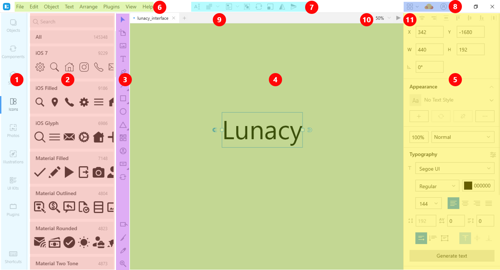

The interface consists of the following main elements.

1. The content tabs. Use them to switch between the:

    * List of objects
    * Document assets (<a href="https://docs.icons8.com/components" target="_blank">components</a>, layer and text <a href="https://docs.icons8.com/layerstyles/" target="_blank">styles</a>)
    * Built-in Lunacy <a href="https://docs.icons8.com/libraries/" target="_blank">libraries</a> of icons, photos and vector images, as well as collections of <a href="https://docs.icons8.com/libraries/#ui-kits" target="_blank">UI kits</a> and <a href="https://docs.icons8.com/plugins" target="_blank">plugins</a>
    * List of <a href="https://docs.icons8.com/shortcuts" target="_blank">shortcuts</a>
  
    To shrink the size of the content tabs panel, drag its right border to the left.

    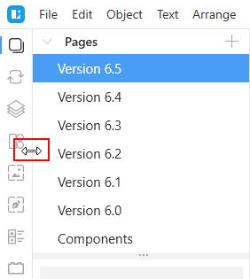

2. The left panel. Displays the content of the selected tab (1). You can temporarily hide the panel by clicking the current tab, using respective shortcuts (`Alt+1`...`Alt+8`, `Shift+F1`) or through the menu (**View** > **Left Panel**).

3. The **toolbar**. Features all the primary Lunacy tools. For details about tools, click <a href="https://docs.icons8.com/tools/" target="_blank">here</a>. If you need more space or prefer shortcuts you can toggle off the display of the toolbar through the menu (**View** > **Toolbar**).
4. The **canvas**. That is your working area. For details, read [below](#the-canvas).
5. The **Inspector** panel. Lets you see and adjust the properties of the selected object. The view of the Properties Inspector varies with the type of the selected object. For details, read [below](#the-inspector).
6. The **menu bar**. Holds the options and commands related to files, objects, editing, etc.
7. The **context toolbar**. The set of controls displayed on the context toolbar depends on the type of the currently selected object. Hover the cursor over a tool icon to see a pop-up explaining what the tool does.
8. The **action bar**. Features a set of buttons related mostly to display options described in the table below. To see the full set of buttons click .
    
    <table>
    <thead>
        <tr>
        <th>Button</th>
        <th>Description</th>
        <th>Keyboard shortcut/Menu option</th>
        </tr>
    </thead>
    <tbody>
        <tr>
        <td></td>
        <td> The <b>Show/Hide suggestions</b> button. Controls the display of the suggestions panel. For details, read <a href="https://docs.icons8.com/styling/#suggestions-panel">here</a> and <a href="https://docs.icons8.com/text/#suggestions-panel">here</a>.</td>
        <td><code>Ctrl + Space</code></td>
        </tr>
        <tr>
        <td></td>
        <td> The <b>Show/Hide rulers</b> button. Controls the display of rulers. For details, read <a href="https://docs.icons8.com/interface/#rulers-and-guides">below</a>.</td>
        <td><code>Ctrl + R</code></td>
        </tr>
        <tr>
        <td></td>
        <td>The <b>Layout</b> button. Controls the display of the layout grid. Available only when there is an artboard on the canvas. For details, read <a href="https://docs.icons8.com/interface/#layout-grid">here</a>.</td>
        <td><code>Ctrl + \</code></td>
        </tr>
        <tr>
        <td></td>
        <td>The <b>Show prototyping</b> button. Controls the display of <a href="https://docs.icons8.com/tools/#hotspot-tool" target="_blank">hotspots</a> and prototyping arrows.</td>
        <td><b>View > Prototyping</b></td>
        </tr>
        <tr>
        <td></td>
        <td>The <b>Show pixels on zoom</b> button. Enables the display of pixels when the zoom value exceeds 100. For details, read  <a href="https://docs.icons8.com/interface/#show-pixels-on-zoom">here</a>.</td>
        <td><b>View > Pixels on Zoom</b></td>
        </tr>
        <tr>
        <td></td>
        <td>The <b>Show grid</b> button. Enables the display of the square grid. For details, read <a href="https://docs.icons8.com/interface/#square-grid">here</a>.</td>
        <td><code>Ctrl+'</code></td>
        </tr>
        <tr>
        <td></td>
        <td>The <b>Enable dark mode</b> button. Turns on/off the night theme in the Lunacy interface.</td>
        <td><code>-</code></td>
        </tr>
        <tr>
        <td></td>
        <td>The <b>Sketch Cloud</b> button. Opens the Sketch Cloud panel. For details about working with Sketch Cloud in Lunacy, read <a href="https://docs.icons8.com/cloud/" target="_blank">here</a>.</td>
        <td><code>-</code></td>
        </tr>
        <tr>
        <td></td>
        <td>The <b>Missing fonts</b> button. Appears when the file you are working with includes fonts not installed on your computer. For details, read <a href="https://docs.icons8.com/text/#missing-fonts" target="_blank">here</a>.</td>
        <td><code>-</code></td>
        </tr>
        <tr>
        <td></td>
        <td>The <b>Notifications</b> button. Appears when you have a new notification from Lunacy. Opens the panel where you can view and manage Lunacy notifications.</td>
        <td><code>-</code></td>
        </tr>
    </tbody>
    </table>

9. The **file tabs panel**. Shows the tabs of currently open files. To switch between the files, just click the respective tab.
10. The **zoom control**. For details, read [below](#zooming-options).
11. The **Play** button. Starts the prototype previewer. For details about prototyping in Lunacy, read <a href="https://docs.icons8.com/prototyping" target="_blank">here</a>.

## Document pages

Each document can include any number of pages. You can keep all you work on a single page or split it into several pages by components, if the project is large. For instance, if you are designing a website, you can opt to keep the desktop and mobile versions on separate pages. Or you can duplicate a page to save a snapshot of your current work and continue working with the copy. In fact, the reasons for having multiple pages in a document are numerous and it is completely up to you to decide what approach to choose. The figure below shows a view of a page list. It appears above the objects list when the **Objects** content tab is selected.

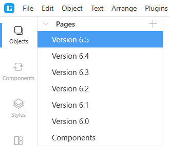

The operations that you can perform with document pages include:

* Adding pages
* Changing the order of pages
* Renaming pages
* Duplicating pages with their content
* Copying and pasting pages with their content between documents
* Deleting pages

To add a new page to the document:

1. Click the plus icon in the **Objects** panel.
2. Enter the name of the new page.
3. Press `Enter`.

To change the position of a page in the list, just drag it up or down to where you want it.

The rest of the operations are accessible through the context menu invoked by a right-click over the required page name.

<video autoplay="" muted="" loop="" playsinline="" width="auto" poster="/public/interface-pagesplaceholder.png" height="auto"><source src="/public/interface-pages65.mp4" type="video/mp4"></video>

There is also a special type of a page - the Components page. For details, read <a href="https://docs.icons8.com/components/#components-page" target="_blank">here</a>.

## Objects list

The objects list appears in left panel when you click the **Objects** content tab. It shows a tree of objects available on the current page. Lunacy automatically assigns names to objects and object groups as you create them, but you can rename them if you like. The figure below shows a view of an object list.

{:.is-big}
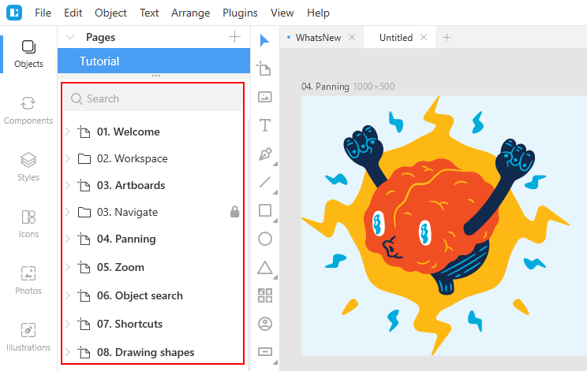

If the names of objects in the list appear truncated, you can change the width of the panel as shown below.

<video autoplay="" muted="" loop="" playsinline="" width="" poster="/public/interface-resizeleft.png" height="auto"><source src="/public/interface-resizeleft65.mp4" type="video/mp4"></video>

The operations that you can perform in the objects list include:

* **Selecting objects**. To select an object or object group, click its name in the objects list. As you do it, the selection frame appears around the object on the canvas. To select multiple items hold down the `Ctrl` or `Shift` keys and click.
* **Searching for objects**. To quickly find the required object start typing its name in the search field above the object list.
* **Arranging objects**. You can change the order of objects in the list by dragging them up or down.
* **Hiding objects**. You can temporarily hide the selected item from the canvas. You can hide objects, object groups or individual items within object groups. Select the item in the list and click the eye icon that will appear next to its name. You can also hide objects by using the `Ctrl+H` shortcut or the respective command on the context menu.
* **Locking objects**. By locking objects you can protect them from accidental edits. You cannot select a locked object on the canvas. But you still can select it through the objects list and edit its properties in the Inspector. You can also lock grouped objects or individual objects within a group. Select the object in the list and click the padlock icon that will appear next to its name. You can also lock objects by using the `Ctrl+L` shortcut or the respective command on the context menu.
* Other [basic operations](#context-menu) with objects available on the context menu.

<!--

<video autoplay="" muted="" loop="" playsinline="" width="auto" poster="/public/interface-objectlistplaceholder.png" height="auto"><source src="/public/interface-objectlist61.mp4" type="video/mp4"></video>

-->

To collapse all branches in the object tree use the `Ctrl + ~` shortcut.

**Tip:** Some projects, such as design systems, can house hundreds of objects on a single page. To quickly locate the required object on the canvas, find it by typing its name in the search field, select it in the objects list and then press `Ctrl + 2` (Fit to selection).

## [The Canvas](#the-canvas)

The canvas is your working area. It has no boundaries, so you can add objects wherever you want. But if you need to observe certain frames you can add [artboards](#artboards) to the canvas. Also, you can toggle on and off the display of [rulers](#rulers-and-guides) and [grids](#grids) on the canvas.

### Moving around the canvas

If your design takes a lot of space and does not fit the screen, you can use the scroll bars located on the right side and at the bottom of the screen.

Also, you can use the mouse wheel for scrolling the canvas. Just point the cursor anywhere over the canvas and rotate the wheel to scroll vertically. To scroll horizontally, hold down the `Shift` key and rotate the mouse wheel.

Another option to navigate the canvas is to hold down the `Space` key (the cursor will turn into a palm) and drag the canvas to where you need.

<video autoplay="" muted="" loop="" playsinline="" width="auto" poster="/public/interface-movingcanvas.png" height="auto"><source src="/public/interface-movingcanvas65.mp4" type="video/mp4"></video>

Also, read about the [zooming options](#zooming-options).

### [Artboards](#artboards)

Artboards are a special type of objects that allows you to divide the canvas into separate areas with different content. Artboards are optional but they come in handy when you’re designing for a certain screen size or device. To create an artboard, use the <a href="https://docs.icons8.com/tools/#artboard-tool" target="_blank">artboard tool</a>. In fact, it is the tool that Lunacy enables first when you create a new document. It allows you to create a custom size artboard or to select an option from the list that will appear on the right. This list features presets for popular devices, screen resolutions and social media templates (you can also add your custom presets to this list, see [below](#adding-custom-presets)).

To add an artboard:

1. Select the artboard tool on the toolbar or press `A`.
2. Click and drag to create a custom size artboard or select an option from the panel on the right (see the figure below).

{:.is-big}
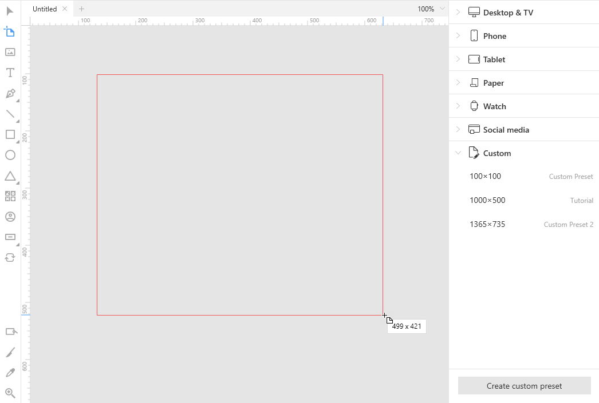

But even if you started your project without artboards, it is never too late to add them. Just drag the artboard tool over the objects that you want to put on an artboard.

The figure below shows how artboards appear in the **Objects** panel and a view of the Inspector with artboard settings and controls which differ a lot from those available in the [Inspector](#the-inspector) panels of other object types.

{:.is-big}
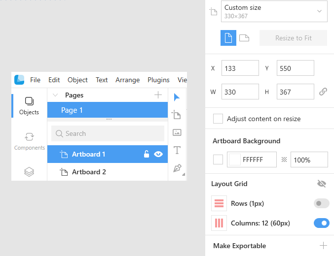

The table below provides a description of Inspector elements displayed for artboards.

<table>
  <thead>
    <tr>
      <th style="width: 270px;">Inspector element</th>
      <th>Description</th>
    </tr>
  </thead>
  <tbody>
    <tr>
      <td></td>
      <td><b>Preset sizes and orientation</b>
Use these controls to select the size of the artboard from one of the presets and change its orientation. The <b>Resize to Fit</b> button changes the size of an artboard to the size of the selection frame that you get when you select all objects on the given artboard.
</td>
    </tr>
    <tr>
      <td></td>
      <td><b>Position and size</b>
The <b>X</b> and <b>Y</b> controls show and allow you to manage the absolute position of the artboard on the canvas.
 
 The <b>W</b> and <b>H</b> controls, show and allow to change the width and height of the object. Click the links button, if you want to preserve aspect ratio when changing the size of the artboard.
</td>
    </tr>
    <tr>
      <td></td>
      <td><b>Adjust content on resize</b>
With this checkbox selected, when you change the size of the artboard, Lunacy will proportionally change the size of the objects on it. Read also about resizing constraints.
</td>
    </tr>
    <tr>
      <td></td>
      <td><b>Artboard background</b>
Use these controls to change the color and opacity of the artboard. Also, you can clear the <b>Include in export</b> checkbox, if you don't want to include the artboard into export results. In such a case, Lunacy will export only the objects available on the artboard.
</td>
    </tr>
    <tr>
      <td></td>
      <td><b>Layout grid settings</b>
This group of controls allows you to configure the settings of the layout grid. For details about layout grids, read <a href="https://docs.icons8.com/interface/#layout-grid">here</a>.
</td>
    </tr>
    <tr>
      <td></td>
      <td><b>Export controls</b>
Allow you to export the artboard and its content. For details about export in Lunacy, click <a href="https://docs.icons8.com/export" target="_blank">here</a>.
</td>
    </tr>
  </tbody>
</table>

#### Selecting and moving artboards

To select an empty artboard, you can click anywhere within the artboard. To select an artboard with objects on it, click the artboard's name.

Similarly, to move an empty artboard, click anywhere within the artboard and drag it to where you want it. To move an artboard with objects, click the artboard's name and drag.

<video autoplay="" muted="" loop="" playsinline="" width="auto" poster="/public/interface-moveartplaceholder.png" height="auto"><source src="/public/interface-moveart.mp4" type="video/mp4"></video>

Alternatively, you can select the required artboard by clicking its name in the **Objects** panel.

#### [Adding custom presets](#adding-custom-presets)

To add a custom artboard to presets:

1. Select the artboard tool on the toolbar or press `A`. The panel of artboard presets appears on the right.
2. At the bottom of the panel, click the **Create custom preset** button. Scroll the panel down if you don't see the button.
3. In the displayed dialog box, define the preset name and its dimensions in pixels.
4. Click **Save**. The group **Custom** appears in the panel of presets (see the figure below).

### [Rulers and guides](#rulers-and-guides)

Ruler and guides will help you position and align objects on the canvas. In Lunacy, rulers are enabled by default. They appear at the top and on the left side of the canvas. The default and the only measurement unit is pixels. To toggle the rulers off/on, use the `Ctrl+R` shortcut or do it through the menu bar (**View** > **Rulers**).  

To create a guide, click anywhere on a ruler and drag the guide onto the canvas to where you need it. Now you can position objects along the guide. Move an object close to the guide and note how it will snap to the guide.

<video autoplay="" muted="" loop="" playsinline="" width="auto" poster="/public/interface-guides.png" height="auto"><source src="/public/inteface-guides61.mp4" type="video/mp4"></video>

To relocate a guide, just drag it to another position or select it and use arrow keys to nudge it. If you don't need a guide, click to select it (hold down `Shift` to select multiple guides) and press `Delete`. Also, you can use the options from the pop-up menu invoked by a right-click over a ruler (see the figure below).

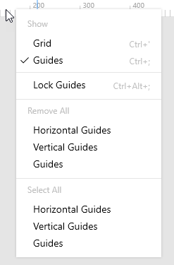

### [Grids](#grids)

There are two types of grids: square grid and layout grids. If necessary, you can display both of them at the same time.

#### [Square grid](#square-grid)

If there no artboards on the canvas, Lunacy displays the square grid directly on the canvas (to enable it, just click the **Show grid** button on the action bar). Otherwise, you can toggle on/off the display of the grid:

* For all artboards available on the canvas. For this, deselect all artboards and objects on the canvas (click over an empty area on the canvas or press `Esc`) and click the **Show grid** button on the action bar.
* Individually for each artboard. For this, select the required artboard or an object on it and click the **Show grid** button on the action bar.

To select the size of the grid cell, click the down arrowhead next to the button and choose one of the presets or define your custom size.

<video autoplay="" muted="" loop="" playsinline="" width="100%" poster="/public/interface-sqgridplaceholder.png" height="auto"><source src="/public/interface-sqgrid.mp4" type="video/mp4"></video>

#### [Layout grid](#layout-grid)

You can apply layout grids only to [artboards]((#artboards). If you have several artboards on a page, you can toggle on and off the display of layout grids for all or individually for each artboard. Also, each artboard can have its own settings of the layout grid (see the demo below).

<video autoplay="" muted="" loop="" playsinline="" width="100%" poster="/public/interface-layoutgridplaceholder.png" height="auto"><source src="/public/interface-layoutgridvid.mp4" type="video/mp4"></video>

### Measuring

#### Independent objects

To learn the distance between two objects on the canvas:

1. Select the first object.
2. Hover the cursor over the other object.
3. Press and hold `Alt`.

To learn the distance between an object and the borders of the artboard:

* Hover the cursor over the object, then press and hold `Alt`.
  
  OR
* Select an object, then hover the cursor over an empty area within the artboard and press and hold `Alt`.

<video autoplay="" muted="" loop="" playsinline="" width="auto" poster="/public/interface-measuringplaceholder.png" height="auto"><source src="/public/interface-measuring.mp4" type="video/mp4"></video>

For precise positioning of objects on the artboard or relative one another, proceed as follows:

1. Select one of the objects.
2. Point the cursor over an empty area or over the other object.
3. Holding down `Alt`, move the selected object using the arrow keys.

<video autoplay="" muted="" loop="" playsinline="" width="auto" poster="/public/interface-groupmeasure3ph.png" height="auto"><source src="/public/interface-groupmeasure3.mp4" type="video/mp4"></video>

#### Grouped objects

To measure the distance between a grouped object and another object (or grouped object) or between a grouped object and the borders of the artboard, proceed as described in the previous subsection.

To learn the distance between a member of a group and the borders of the group:

1. Point the cursor over the required group member.
2. Press and hold `Ctrl + Alt`. 

<video autoplay="" muted="" loop="" playsinline="" width="auto" poster="/public/interface-groupmeasure1ph.png" height="auto"><source src="/public/interface-groupmeasure1.mp4" type="video/mp4"></video>

To learn the distance between a member of a group and the borders of the artboard:

1. Select the group member.
2. Press and hold `Alt`.
3. Point the cursor anywhere beyond other group members.

To learn the distance between a member of a group and another member of the group or another object (group):

1. Select the first group member.
2. Press and hold `Alt`.
3. Point the cursor over the second group member/object(group).

To learn the distance between a member of a group and a member of another group:

1. Select the first group member.
2. Press and hold `Ctrl+Alt`.
3. Point the cursor over the member of the other group.

The next demo shows the above three procedures.

<video autoplay="" muted="" loop="" playsinline="" width="auto" poster="/public/interface-groupmeasure2ph.png" height="auto"><source src="/public/interface-groupmeasure2.mp4" type="video/mp4"></video>

### Zooming options

The easiest way to zoom to an object in Lunacy is to hold down the `Ctrl` key and rotate the mouse wheel. Similarly, you can hold down `Ctrl` and `Shift` keys. In such a case the speed of zooming will be slower (see the demo below).

<video autoplay="" muted="" loop="" playsinline="" width="auto" poster="/public/interface-zoomtoobjectplaceholder.png" height="auto"><source src="/public/interface-zoomtoobject61.mp4" type="video/mp4"></video>

For your convenience, when the zoom value exceeds 500, Lunacy starts displaying the pixel grid. There are two ways to disable this feature:

1. Through the menu (**View** > **Pixel grid**).
2. Deselect all objects on the canvas and clear the **Show pixel grid** checkbox that will appear in the Inspector.

For information about other zooming options, read below.

#### The Zoom control

The zoom control is found on the right of the file tab panel. To change the zoom value, you can:

* Enter the zoom value manually in the edit field.
* Hover the cursor over the zoom control edit field, wait a moment until the cursor turns into a double-headed arrow and then drag the cursor up or down.
* Click over the edit field of the zoom control and rotate the mouse wheel.

The demo below shows all these three methods.

<video autoplay="" muted="" loop="" playsinline="" width="auto" poster="/public/interface-zoomtoobjectplaceholder.png" height="auto"><source src="/public/interface-zoomctrl61.mp4" type="video/mp4"></video>

Alternatively, you can click the down arrowhead next to the zoom control and select one of the preset values or options on the displayed menu (see the figure below).

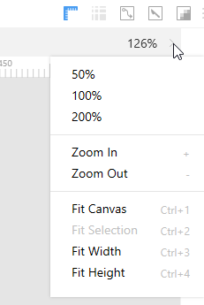

The table below explains the options on the menu.

<table>
  <thead>
    <tr>
      <th>Operation</th>
      <th>Description</th>
      <th style="width: 160px;">Keyboard shortcut</th>
    </tr>
  </thead>
  <tbody>
    <tr>
      <td>Zoom in/out</td>
      <td>Zooms the canvas in/out.</td>
      <td><code>+/-</code> or 
<code>Ctrl + "+/-"</code>
</td>
    </tr>
    <tr>
      <td>Zoom to 100%</td>
      <td>Sets the zoom value to 100%.</td>
      <td><code>Ctrl + 0</code></td>
    </tr>
    <tr>
      <td>Zoom to all objects</td>
      <td>Shows all the objects available on the page.</td>
      <td><code>Ctrl + 1</code></td>
    </tr>
    <tr>
      <td>Zoom to selection</td>
      <td>Zooms in and displays the selected object in the center of the screen.</td>
      <td><code>Ctrl + 2</code></td>
    </tr>
    <tr>
      <td>Zoom to fit width</td>
      <td>Zooms the canvas so that all the horizontally distributed objects fit the screen and you don't have to scroll the screen to the sides.</td>
      <td><code>Ctrl + 3</code></td>
    </tr>
    <tr>
      <td>Zoom to fit height</td>
      <td>Zooms the canvas so that all the vertically distributed objects fit the screen and you don't have to scroll the screen up or down.</td>
      <td><code>Ctrl + 4</code></td>
    </tr>
  </tbody>
</table>

The above options are also accessible through the **View** menu, see the figure below.

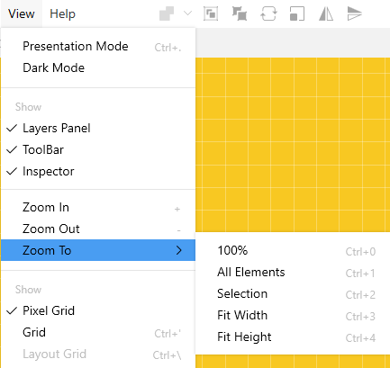

Also, for zooming and focusing you can use the <a href="https://docs.icons8.com/tools/#zoom-tool" target="_blank">zoom tool</a>.

#### [Show pixels on zoom](#show-pixels-on-zoom)

By default, Lunacy displays canvas in the vector mode. It means that all objects (except for rasters) will look perfect on the screen irrespective of the zoom value. But if you need to see individual pixels, you can use the *show pixels on zoom* feature. It enables the display of pixels when the zoom value exceeds 100. The figure below shows a view of the same object with the feature disabled (left) and enabled (right).

To toggle on/off the pixel mode, use the **Show pixels on zoom** button () or do it through the menu bar (**View** > **Pixels on Zoom**).

### Changing the canvas color

There are two ways to change the color of the canvas:

**Way 1**

1. Deselect all the objects on the canvas.
2. Use the **Workspace color** control that will appear in the Inspector.

**Way 2**

1. Deselect all the objects on the canvas.
2. Select the <a href="https://docs.icons8.com/tools/#eyedropper-tool" target="_blank">eyedropper tool</a>. 
3. Use the pallets that will appear in the left panel to select the new color.

<video autoplay="" muted="" loop="" playsinline="" width="100%" poster="/public/interface-canvascolorplaceholder.png" height="auto"><source src="/public/interface-canvascolor1356x730.mp4" type="video/mp4"></video>

## [The Inspector](#the-inspector)

The Inspector is the panel that appears on the right of the Lunacy interface. When you create a new document, the first thing you see on the right is not yet the Inspector but the panel of presets of the <a href="https://docs.icons8.com/tools/#artboard-tool" target="_blank">artboard tool</a>. Lunacy enables it by default upon creation of a new document. And only you add an artboard or add and select another object, the Property Inspector appears.

The set of controls and settings displayed in the Inspector varies with the type of object that you select on the canvas. Below is a description of Inspector elements common for almost all object types.

<table>
    <thead>
        <tr>
        <th style="width: 270px;">Inspector element</th>
        <th>Description</th>
        </tr>
    </thead>
    <tbody>
        <tr>
        <td></td>
        <td><b>Alignment and distribution controls</b>. Become available when you select two or more objects.</td>
        </tr>
        <tr>
        <td></td>
        <td><b>Opacity and blend mode settings</b>. Allow you to set the overall opacity of an object and its blending mode.</td>
        </tr>
        <tr>
        <td></td>
        <td><b>Object properties controls</b>. Allow you to adjust the position and size of the object, as well as its rotation angle, corner radius and number of vertices in stars and polygons. The set of displayed controls varies with the selected object.</td>
        </tr>
        <tr>
        <td></td>
        <td><b>Resizing constraints</b>. Appear when you select two or more objects, a group of objects or an object on an artboard. Serve to determine the behavior of objects upon resizing.</td>
        </tr>
        <tr>
        <td></td>
        <td>The <b>Prototyping</b> section features the settings related to prototyping.</td>
        </tr>
        <tr>
        <td></td>
        <td>The <b>Appearance</b> section allows you to apply <a href="https://docs.icons8.com/layerstyles" target="_blank">styles</a> to the selected object.</td>
        </tr>
        <tr>
        <td></td>
        <td><b>Styling options</b>. For details, read <a href="https://docs.icons8.com/styling" target="_blank">here</a>.</td>
        </tr>
        <tr>
        <td></td>
        <td><b>Export settings</b>. For details, read <a href="https://docs.icons8.com/export" target="_blank">here</a>.</td>
        </tr>
    </tbody>
</table>

When you select no objects on the canvas, the Inspector shows the following controls.

* **Workspace color**: Allows you to change the color of the canvas.
* **Show pixel grid**: Toggles on/off the display of the pixel grid when the zoom value exceeds 500.
* **Export project**: Allows you to export the whole project. For details, read <a href="https://docs.icons8.com/export" target="_blank">here</a>.

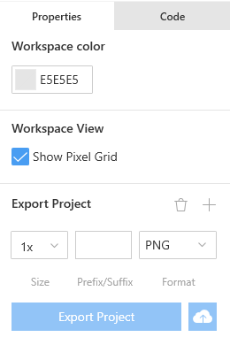

If you need more space, you can toggle on/off the display of the Inspector panel through the menu bar (**View** > **Inspector**).

### [Tips on working with the Inspector](#tips-on-working-with-the-inspector)

There are several ways to change values in the numeric fields of the Inspector. You can:

* Enter the new value manually (press `Enter` to submit).
* Click over the required field and rotate the mouse wheel to gradually increase or decrease the value.
* Hover the cursor over the required field, wait a moment until the cursor turns into a double-headed arrow and then drag the cursor up or down.
* Use math (press `Enter` to submit).

<video autoplay="" muted="" loop="" playsinline="" width="auto" poster="/public/interface-inspectortipsplaceholder.png" height="auto"><source src="/public/interface-inspectortips.mp4" type="video/mp4"></video>

## [The context menu](#the-context-menu)

The context menu is a pop-up list of commands and options for basic operations with objects. It appears when you right-click an object on the canvas. The set of items available on the context menu might slightly vary. It depends on the type of object that you right-click. Also, next to each item, the context menu shows respective shortcuts that you can use when you become more confident with Lunacy (see the figure below).  

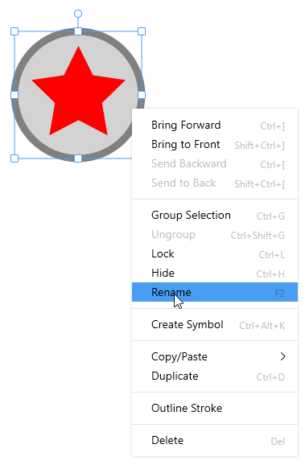

The table below gives an overview of context menu commands and options common for almost all object types.

<table>
  <thead>
      <tr>
        <th>Menu option</th>
        <th>Description</th>
      </tr>
  </thead>
  <tbody>
      <tr>
        <td><b>Bring Forward</b></td>
        <td>Moves the object one layer forward.</td>
      </tr>
      <tr>
        <td><b>Bring to Front</b></td>
        <td>Moves the object to the topmost layer.</td>
      </tr>
      <tr>
        <td><b>Send Backward</b></td>
        <td>Moves the object one layer back.</td>
      </tr>
      <tr>
        <td><b>Send to Back</b></td>
        <td>Moves the object to the backmost layer.</td>
      </tr>
      <tr>
        <td><b>Group Selection</b></td>
        <td>Groups two or more selected objects together. For details about grouping objects, read <a href="https://docs.icons8.com/objects/#grouping-objects" target="_blank">here</a>.</td>
      </tr>
      <tr>
        <td><b>Ungroup</b></td>
        <td>Splits the selected group into separate objects.</td>
      </tr>
      <tr>
        <td><b>Lock</b></td>
        <td>Locks the object from accidental edits. For details, read <a href="https://docs.icons8.com/interface/#objects-list">here</a>.</td>
      </tr>
      <tr>
        <td><b>Hide</b></td>
        <td>Temporarily hides the object from the canvas. For details, read <a href="https://docs.icons8.com/interface/#objects-list">here</a>.</td>
      </tr>
      <tr>
        <td><b>Rename</b></td>
        <td>Allows you to rename the selection in the object list.</td>
      </tr>
      <tr>
        <td><b>Copy/Paste</b></td>
        <td>Opens a submenu with copying/pasting options. For details, read <a href="https://docs.icons8.com/objects/#copy-and-paste-options" target="_blank">here</a>.</td>
      </tr>
      <tr>
        <td><b>Duplicate</b></td>
        <td>Creates a duplicate of the selected object. For details, read <a href="https://docs.icons8.com/objects/#duplicating-objects" target="_blank">here</a>.</td>
      </tr>
      <tr>
        <td><b>Delete</b></td>
        <td>Deletes the selected object.</td>
      </tr>
  </tbody>
</table>

When you right-click an empty area on the canvas or an artboard, the only command available on the context menu will be **Paste here**. The point where you right-click is the place where Lunacy will place the top-left selection handle of the object you paste.
