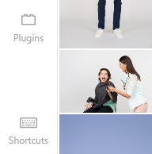
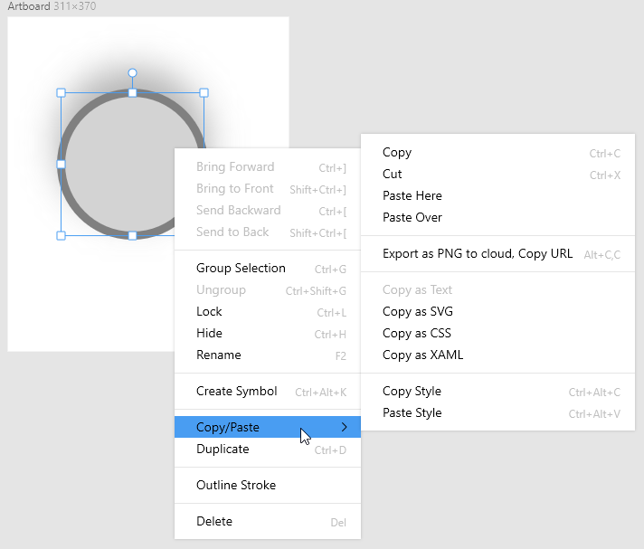
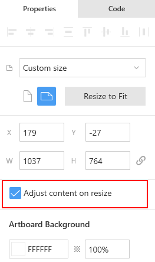
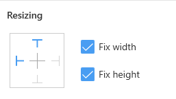
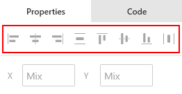
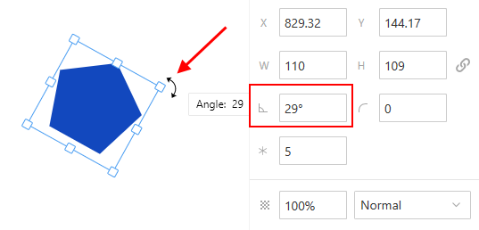

---
# Page settings
layout: default
keywords:
comments: false

# Hero section
title: Layers
description: Learn about basic operations with layers in Lunacy
icon: 'ungroup-objects'

# Micro navigation
micro_nav: false

# Page navigation
page_nav:
    next:
        content: Layer and text styles
        url: '/layerstyles'
    prev:
        content: Tools
        url: '/tools'
---

## Introduction

In Lunacy you will work with the following types of layers:

* <a href="https://lunacy.docs.icons8.com/interface/#frames" target="_blank">Frames</a>
* <a href="https://lunacy.docs.icons8.com/text/" target="_blank">Text layers</a>
* <a href="https://lunacy.docs.icons8.com/tools/#pen-tool" target="_blank">Vectors</a>
* <a href="https://lunacy.docs.icons8.com/tools/#shape-tools" target="_blank">Shapes</a>
* <a href="https://lunacy.docs.icons8.com/tools/#image-tool" target="_blank">Images</a>
* <a href="https://lunacy.docs.icons8.com/components/" target="_blank">Components and component instances</a>
* <a href="https://lunacy.docs.icons8.com/tools/#icon-tool" target="_blank">Icons</a> 
* <a href="https://lunacy.docs.icons8.com/tools/#hotspot-tool" target="_blank">Hotspots</a> 
* <a href="https://lunacy.docs.icons8.com/tools/#slice-tool" target="_blank">Slices</a> 

For specifics on working with each type of layers, follow the above links. This section provides an overview of basic operations common for all layer types.

## Adding layers

To add a layer to the canvas:

1. Enable the respective <a href="https://lunacy.docs.icons8.com/tools" target="_blank">tool</a> on the toolbar or with a shortcut (see the note below).
2. Click or click and drag over the area where you want to place the layer.

If you need to create a regular shape (for example, a circle or a square), hold down `Shift` while dragging.

That is the most common method used in all similar applications. When you use it, the point from where you start dragging becomes an angle of the shape, if it is a rectangle, or an angle of its selection frame, if it is anything else. If you want the starting point to become the center of the shape, hold down `Alt` while dragging and `Alt + Shift` to get a regular shape (see the demo below).

<video autoplay="" muted="" loop="" playsinline="" width="auto" poster="/public/objects-addingplaceholder.png" height="auto"><source src="/public/objects-adding.mp4" type="video/mp4"></video>

**Note:** To check out the shortcuts available in Lunacy, click the **Keyboard Shortcuts** button at the lower-left corner of the interface (this will open the shortcuts panel in Lunacy) or read <a href="https://lunacy.docs.icons8.com/shortcuts/" target="_blank">here</a>.

{:.image-info}
The Keyboard Shortcuts button

## Selecting layers

There are two ways to select layers in Lunacy.

**Way 1. Selecting layers in the Layer List**

To select an Layers through the **Layer List**, just find it in the list of layers and click it. To select multiple layers press down `Shift` or `Ctrl` while clicking.  

**Way 2. Selecting layers on the canvas**

To select a layer, use the select tool which gets enabled when no other tool is active. Just click the layer or click and drag over it.

To select multiple layers, hold down the `Shift` key and click the layers you want to select. Also, you can click and drag over these layers.

When you click or drag over a group of layers, you select the group. To select a certain layer within a group:

* Hold down the `Ctrl` key and click over the required layer.
  
  OR
* Click to select the group, then double-click to select the layer.

After you select an layer within a group, you can switch to other layer of that group by simply clicking them.

To quickly select all layers on the canvas, use the `Ctrl+A` shortcut.

For details about using the select tool and a demo, click <a href="https://lunacy.docs.icons8.com/tools/#select-tool" target="_blank">here</a>.

## Moving layers

To move a layer, just click and drag it. Make sure that the cursor is over the layer rather than over the empty space within the layer bounding box.

If you want to restrict movement to the X or Y axis, hold down `Shift` as you drag.

For precise positioning you can use the arrow keys. Each keystroke moves a layer by one pixel. Holding down `Shift` increases each step to 10 pixels (see also the <a href="https://lunacy.docs.icons8.com/interface/#measuring" target="_blank">Measuring</a> section).

<video autoplay="" muted="" loop="" playsinline="" width="100%" poster="/public/objects-movingplaceholder.png" height="auto"><source src="/public/objects-moving.mp4" type="video/mp4"></video>

Also, to adjust an layer's position on the canvas or frame, you can use the **X** and **Y** controls in the Inspector. If a layer is on the canvas, the figures in the **X** and **Y** fields show the absolute coordinates of the layers's top-left selection handle.

If the layer is a part of a frame, **X** and **Y**  display the coordinates of the layer's top-left selection handle relative to the frame's top-left corner. See the demo below and the <a href="https://lunacy.docs.icons8.com/interface/#tips-on-working-with-the-inspector" target="_blank">tips</a> on working with numeric fields in the Inspector.

<video autoplay="" muted="" loop="" playsinline="" width="auto" poster="/public/objects-moving1placeholder.png" height="auto"><source src="/public/objects-moving1.mp4" type="video/mp4"></video>

## Grouping layers

You can combine together multiple layers relating to the same design element and then move and resize them as a single layer. Also, layer grouping is a way to organize your **Layer List**, which in some projects can include hundreds of items or more. For this, you can create nested layer groups within other groups.

To create a group, select the layers that you want to group and click the **Group** button () on the context toolbar or press `Ctrl+G`.

To select a certain layer within the group:

* Hold down the `Ctrl` key and click over the required layer.
  
  OR
* Click to select the group, then double-click to select the layer.

After you select an layer within a group, you can switch to other layers of that group by simply clicking them. Alternatively, you can select layers through the **Layer List**. In some cases it may be more convenient. For instance, when handling fully overlapping layers.

You can move layers into or out of a group by dragging them in the **Layer List**.

<video autoplay="" muted="" loop="" playsinline="" width="100%" poster="/public/objects-groupingplaceholder.png" height="auto"><source src="/public/objects-grouping.mp4" type="video/mp4"></video>

To ungroup layers, select the group and click the **Ungroup** button () on the context toolbar or press `Ctrl+Shift+G`.

## Duplicating layers

To duplicate an layer, select it and press `Ctrl + D`. Alternatively, you can hold down `Alt`, select the layer and drag to where you want to place the duplicate.

Lunacy remembers the offset of the latest duplicate. So, if you press `Ctrl + D` shortly after you create a duplicate of an layer, Lunacy will add another duplicate with the same offset as the previous one (see the demo below).

<video autoplay="" muted="" loop="" playsinline="" width="auto" poster="/public/objects-duplicateplaceholder.png" height="auto"><source src="/public/objects-duplicate.mp4" type="video/mp4"></video>

And of course, you can use the **Duplicate** command and standard **Copy** and **Paste** options available on the context menu.

If you have generated content in the elements (like <a href="https://lunacy.docs.icons8.com/tools/#avatar-tool">avatars</a> or <a href="https://lunacy.docs.icons8.com/text/#text-generation-and-text-snippets">generated text</a>) you duplicate new generated data will appear in the copies (provided the <a href="https://lunacy.docs.icons8.com/tips/#auto-refresh">Auto refresh</a> option is enabled).

### Repeat grid

Another convenient way to duplicate elements is to use the **Repeat grid** feature. You you select two or more layers, drag the <embed type="image/svg+xml" alt="repeat_grid" src="https://cdn-eu.icons8.com/docs/Dko8QE6mZ06fz2gAGGUBbA/arkPFiXr3U-oF3BIzB96uQ.svg" width="20" /> near the lower-right corner of the bounding box to duplicate the elements in a grid.

<video autoplay="" muted="" loop="" playsinline="" width="100%" poster="/public/layers_repeat_grid.png" height="auto"><source src="/public/layers_repeat_grid.mp4" type="video/mp4"></video>

## Copy and Paste options

You can simply select a layer and use the standard `Ctrl+C` and `Ctrl+V` combination. This will create a copy of the layer right above the original.

Also, you can make use of other related options available on the context menu.

The table below provides a description of these options.

<table>
  <thead>
      <tr>
        <th>Menu option</th>
        <th>Description</th>
      </tr>
  </thead>
  <tbody>
      <tr>
        <td><b>Copy</b></td>
        <td>Copies the selection to the clipboard.</td>
      </tr>
      <tr>
        <td><b>Cut</b></td>
        <td>Cuts the selection from the canvas and copies it to the clipboard.</td>
      </tr>
      <tr>
        <td><b>Paste Here</b></td>
        <td>Pastes the content of the clipboard onto the canvas. The point where you right-click is the place where Lunacy will place the top-left selection handle of the layer you paste.</td>
      </tr>
      <tr>
        <td><b>Paste Over</b></td>
        <td>Pastes the content of the clipboard over the selected layer so that the top-left selection handle of the layer that you paste will have the same coordinates as the one of the selected layer.</td>
      </tr>
      <tr>
        <td><b>Export as PNG to cloud, Copy URL</b></td>
        <td>Exports the selection to the Icons8 cloud and copies the link to your clipboard. You can share this link with other people.</td>
      </tr>
      <tr>
        <td><b>Copy as Text</b></td>
        <td>Available for the text layers only. Copies the text content, not the layer and its properties.</td>
      </tr>
      <tr>
        <td><b>Copy as SVG/CSS/XAML</b></td>
        <td>These options allow you to copy the code of the selected layer in the required format.</td>
      </tr>
      <tr>
        <td><b>Copy style/Paste style</b></td>
        <td>These options allow you to copy the <a href="https://lunacy.docs.icons8.com/styling" target="_blank">styling properties</a> of the selected layer and apply them to another layer. See the demo below.</td>
      </tr>
  </tbody>
</table>

The demo below shows how you can copy and paste styling properties between layers.

<video autoplay="" muted="" loop="" playsinline="" width="auto" poster="/public/objects-copypasteplaceholder.png" height="auto"><source src="/public/objects-copypaste.mp4" type="video/mp4"></video>

## Resizing layers

There are several ways how you can resize layers:

* by dragging selection handles
* using the keyboard
* through the Inspector
* scaling

### Resizing a layer by dragging selection handles

To resize a layer, drag any of its selection handles as shown in the demo below. Use the handles on the sides, to change the layer's height or width. Use the corner handles to adjust the layer's height and width at the same time.  Hold down `Shift` while dragging to preserve the layer's aspect ratio.

<video autoplay="" muted="" loop="" playsinline="" width="auto" poster="/public/object-resizing1.png" height="auto"><source src="/public/object-resizing1.mp4" type="video/mp4"></video>

Also, you can hold down `Alt` while dragging to resize the layer from its center, rather than from the edge that you are dragging.

The `Alt+Shift+drag` combination is also possible to preserve the layer's aspect ratio.

### Resizing an layer using the keyboard

Select the layer and use the shortcuts `CTRL+ arrow keys` (by 1 pixel) or `CTRL+Shift + arrow keys` ( by 10 pixels).

<video autoplay="" muted="" loop="" playsinline="" width="auto" poster="/public/tips-keyresizeph.png" height="auto"><source src="/public/tips-keyresize.mp4" type="video/mp4"></video>

### Resizing a layer through the Inspector

Select the layer and use the **W** (width) and **H** (height) edit fields, when you need to define the exact size of an layer.

<video autoplay="" muted="" loop="" playsinline="" width="auto" poster="/public/object-resizing2.png" height="auto"><source src="/public/object-resizing2.mp4" type="video/mp4"></video>

Click the links button to preserve the layer's aspect ratio. With this button enabled, the change of a value in one of the boxes, will result in respective value adjustment in the second box.

Also, read <a href="https://lunacy.docs.icons8.com/interface/#tips-on-working-with-the-inspector" target="_blank">here</a> for some tips on working with numeric fields in the Inspector.

### Scaling layers

If you want to resize a layer with styling (borders, shadows, etc.), you should consider the scaling feature. Together with layer size, it will accordingly adjust the values of its styling properties.

To scale a layer:

1. Select the layer.
2. Click  on the toolbar (or press `K`) and drag the bounding box.

With the Scale tool selected, you can edit any of the settings (say, width) in the Inspector. Then press `Enter`, and Lunacy will scale all the other settings accordingly.

### Resizing constraints

Resizing constraints allow you to determine the behavior of a layer upon resizing of a group, component or a frame to which the layer belongs. This can be very useful, for example, when you need to design a user interface for different screen sizes or devices.

First of all, if you want layers on a frame to resize when you adjust the size of the frame:

1. Select the frame through the **Layer List** or by clicking its name on the canvas. The frame Inspector panel appears on the right.
2. In the Inspector, make sure that the **Adjust content on resize** checkbox is selected.

Also, you can configure individual resize behavior of each layer using the controls in the **Resizing** section of the Inspector.

These controls include:

* The **Pin to edge** control. Allows you to pin the layer to one or several edges of the frame or its parent, if the layer is a part of a group/component. So, when you resize the frame or the parent, Lunacy won't change the distance between the layer and the edges it is pinned to. Click the respective T-shaped buttons to pin the layer.
* The **Fix width** and **Fix size** checkboxes. Allow you to restrict the change of the layer's width or height upon resizing of the frame or the parent layer.

To better understand how all this works, see the demo below.

<video autoplay="" muted="" loop="" playsinline="" width="100%" poster="/public/objects-constraintsplaceholder.png" height="auto"><source src="/public/objects-constraints.mp4" type="video/mp4"></video>

## Aligning and distributing layers

To quickly align and distribute layers on the canvas, use the controls in the top row of the Inspector.

They become active only when you select two or more layers anywhere on the canvas, or when you select a single layer on a frame. In the latter case, Lunacy will align the layer relative to the bounds of the frame.

The table below provides a description of the controls.

<table>
  <thead>
    <tr>
      <th>Button</th>
      <th>Description</th>
      <th style="width: 130px;">Keyboard shortcut</th>
    </tr>
  </thead>
  <tbody>
    <tr>
      <td></td>
      <td><b>Align Left</b>. Aligns the selected layers to the left bound of their selection frame.</td>
      <td><code>Shift + Ctrl + &leftarrow;</code></td>
    </tr>
    <tr>
      <td></td>
      <td><b>Align Horizontally</b>. Horizontally centers the selected layers.</td>
      <td><code>Ctrl + Shift + -</code></td>
    </tr>
    <tr>
      <td></td>
      <td><b>Align Right</b>. Aligns the selected layers to the right bound of their selection frame.</td>
      <td><code>Shift + Ctrl + &rightarrow;</code></td>
    </tr>
    <tr>
      <td></td>
      <td><b>Distribute Vertical Spacing</b>. Evens vertical spacing between the selected layers. Note that the topmost and the lowermost layers in the selection always preserve their original position, while the layers between them adjust their position to ensure equal spacing.</td>
      <td><code>Shift + Ctrl + V</code></td>
    </tr>
    <tr>
      <td></td>
      <td><b>Align Top</b>. Aligns the selected layers to the top bound of their selection frame.</td>
      <td><code>Shift + Ctrl + &uparrow;</code></td>
    </tr>
    <tr>
      <td></td>
      <td><b>Align Vertically</b>. Vertically centers the selected layers.</td>
      <td><code>Ctrl + Shift + |</code></td>
    </tr>
    <tr>
      <td></td>
      <td><b>Align Bottom</b>. Aligns the selected layers to the bottom bound of their selection frame.</td>
      <td><code>Shift + Ctrl + &downarrow;</code></td>
    </tr>
    <tr>
      <td></td>
      <td><b>Distribute Horizontal Spacing</b>. Evens horizontal spacing between the selected layers. Note that the rightmost and the leftmost layers in the selection always preserve their original position, while the layers between them adjust their position to ensure equal spacing.</td>
      <td><code>Shift + Ctrl + H</code></td>
    </tr>
  </tbody>
</table>

To better understand how it all works, see the demo below.

<video autoplay="" muted="" loop="" playsinline="" width="100%" poster="/public/objects-aligndistrpaceholder.png" height="auto"><source src="/public/objects-aligndistr.mp4" type="video/mp4"></video>

### Smart distribute

You can quickly arrange multiple layers into nice grids with equal spacing between rows and columns.

For this:

1. Select the required layers.
2. Click the **Tidy up** button in the Inspector. The layers get re-arranged,red handles appear between rows and columns of the "grid".
3. Drag the red handles to adjust the spacing between rows and columns. Click the red circle in the center of an layers and drag to move it to another “grid cell”. See the demo below.

<video autoplay="" muted="" loop="" playsinline="" width="auto" poster="/public/objects-smartdistribph.png" height="auto"><source src="/public/objects-smartdistr.mp4" type="video/mp4"></video>

## Arranging layers along the Z-axis

### Auto Z-index

Lunacy automatically determines the order of layers (the Z-index) on the canvas depending on their size. For example, if you drag a smaller layer (that’s at the bottom of the layer list) over a larger one, Lunacy places the small layer on top.

<video autoplay="" muted="" loop="" playsinline="" width="100%" poster="/public/layers_auto_z_index.png" height="auto"><source src="/public/layers_auto_z_index.mp4" type="video/mp4"></video>

### Arranging layers using shortcuts and the Layer list

To position layers along the Z-axis manually, use the send/bring commands found on the context menu or their respective shortcuts. The commands are as follows:

* Bring Forward (`Ctrl + ]`). Moves the selected layer one step forward.
* Bring to Front (`Shift + Ctrl + ]`). Places the selected layer to the very front of the stack.
* Send Backward (`Ctrl + [`). Moves the selected layer one step backward.
* Send to Back (`Shift + Ctrl + [`). Places the selected layer to the very back of the stack.

The demo below shows how it works.

<video autoplay="" muted="" loop="" playsinline="" width="auto" poster="/public/objects-sendbringplaceholder.png" height="auto"><source src="/public/objects-sendbring.mp4" type="video/mp4"></video>

Also, you can do the same by dragging layers up and down relative one another in the layer list.

## Rotating layers

To rotate an layer:

1. Select the layer.
2. Hover the cursor somewhere near any corner selection. Wait a moment until the cursor turns into a bended double-headed arrow, then drag.
  
    OR

    In the Inspector, enter the required value in the rotation angle field and press `Enter`.

To quickly return the layer into its initial position:

* In the angle rotation field of the Inspector, type *0* and press `Enter` to submit.

## Flipping layers

To flip the selected layer, use the **Flip Horizontally** () and **Flip Vertically** () buttons that appear on the context toolbar.

<video autoplay="" muted="" loop="" playsinline="" width="auto" poster="/public/objects-flipplaceholder.png" height="auto"><source src="/public/objects-flip.mp4" type="video/mp4"></video>

Alternatively, you can use the following shortcuts:

* <code>Ctrl + &rightarrow;</code> or <code>Ctrl + &leftarrow;</code>  - horizontal flip.
* <code>Ctrl + &uparrow;</code> or <code>Ctrl + &downarrow;</code> - vertical flip.

Also, the **Flip Horizontally** and **Flip Vertically** commands are available on the **Layer** menu.

Another way to flip a layer is to drag selection handles as shown in the demo below.

<video autoplay="" muted="" loop="" playsinline="" width="auto" poster="/public/objects-flipplaceholder.png" height="auto"><source src="/public/objects-flip2.mp4" type="video/mp4"></video>

## Creating hyperlinks between layers

Create hyperlinks between the layers in your document (even if they're on different pages):

1. Select the target layer and press `Ctrl + L` / `⌘ + L` (or select **Copy/Paste as** > **Copy link** in the context menu).
2. Select that should lead to the target layer. 
3. Press `F2` to rename the layer, paste the target layer link from your clipboard, and press `Enter`. 
4. Hold down `Ctrl` / `⌘` and click the layer you renamed, and you’ll be redirected to the target layer.

<video autoplay="" muted="" loop="" playsinline="" width="100%" poster="/public/layers_hyperlinks.png" height="auto"><source src="/public/layers_hyperlinks.mp4" type="video/mp4"></video>

    
<strong>Note:</strong> If the layer you set as a starting point is locked, just click on it to be redirected.

