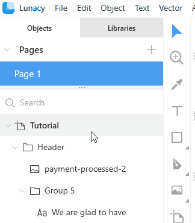
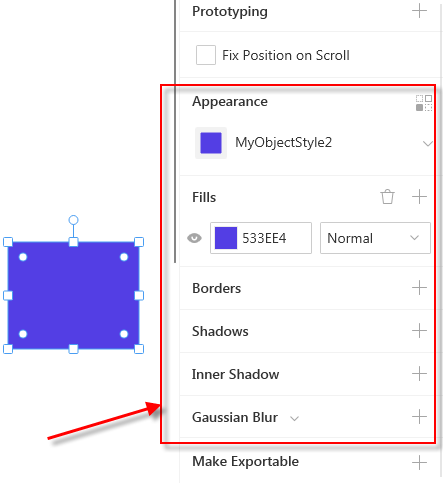
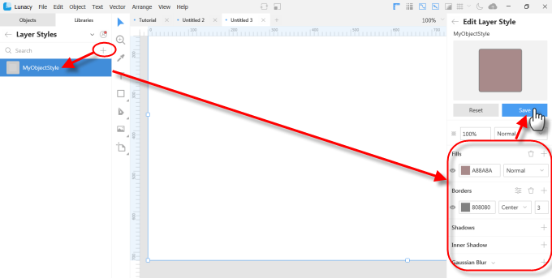
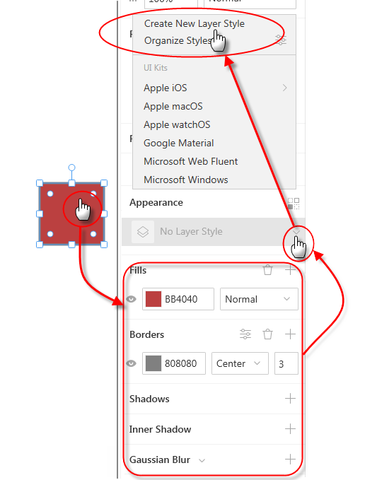
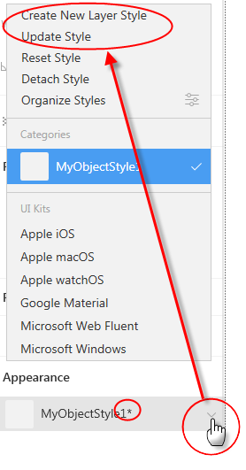
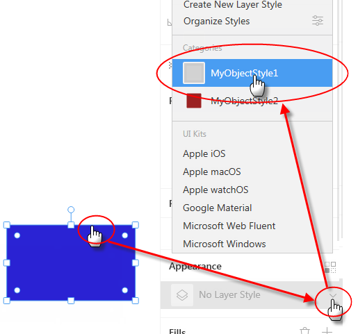
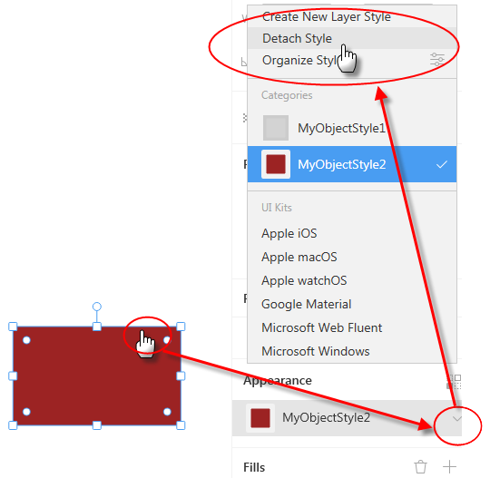
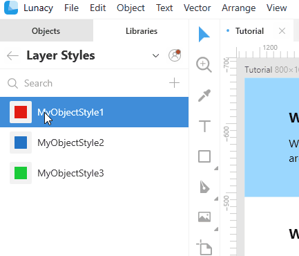
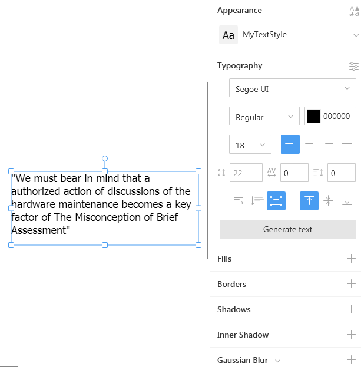

---
# Page settings
layout: default
keywords:
comments: false

# Hero section
title: Layer and text styles
description: Learn how to speed up your work with layer and text styles
icon: 'rich-text-converter'

# Micro navigation
micro_nav: false

# Page navigation
page_nav:
    next:
        content: Libraries
        url: '/libraries'
    prev:
        content: Styling
        url: '/styling'
---

Layer and text styles are predefined sets of layer and text properties that you can reuse in your designs. With the help of styles you can dramatically save your time and make your designs look more professional and consistent.  When you modify a style, the changes are immediately applied to all the objects using this style.

You will store your custom layer and text styles on the **Libraries** tab.

## [Layer styles](#layer-styles)

Layer style properties include:

* Fills
* Borders
* Shadows
* Inner shadow
* Gaussian blur

They appear in the Inspector when you select an object.

For details on styling properties, refer to the [Styling](https://docs.icons8.com/styling) section of our documentation.

### Adding a layer style

There are two ways of adding layer styles.

**Way 1.** By clicking the plus icon on the *Libraries* tab and defining all the required properties in the Inspector.

**Way 2.** By first defining the properties of an object and then saving them as a style.

The new style will appear on the *Libraries* panel on the left.

### Modifying a layer style

To modify a layer style, select an object using this style and make changes to its properties in the Inspector. You will note that when you change the style, all the objects using this style are instantly updated.

When you are done, you will see an asterisk next to the style name on the Inspector panel. It indicates that changes have been made to the style.

Click the down arrowhead next to the style name and select one of the following options on the menu:

* Update style: Saves the changes to the existing style
* Create New Layer Style: Saves the changes to a new style.

### Applying styles to objects

Click the required object and select the style you want to apply to it from the menu on the Inspector panel.

Optionally, after selecting the object you can right-click the required style on the left panel and click *Apply style to node* on the displayed menu.

### Detaching a style

Click the required object and select the *Detach style* command on the menu as shown below.

The appearance of the object remains the same, but it is no longer associated with the style and further changes to the style will not affect the object.

### Managing styles

You can arrange styles in the list to your liking, expand or collapse style blocks, rename and delete unnecessary styles. For this, right-click over a style block and select the respective command on the displayed menu.

## Text styles

Working with text styles is almost the same as with [Layer styles](#layer-styles). The only difference is that in addition to such properties as fills, shadows, etc., text styles also feature a set of typography properties that include font size, font family, line spacing and others.

See also the [Objects](https://docs.icons8.com/objects/#text) section for tips on working with text objects.
