---
# Page settings
layout: default
keywords:
comments: false

# Hero section
title: Libraries
description: How to make use of our built-in icons, photos, images and UI kits
icon: 'book-shelf'

# Micro navigation
micro_nav: false

# Page navigation
page_nav:
    next:
        content: Images
        url: '/images'
    prev:
        content: Layer and text styles
        url: '/layerstyles'
---

One of the cool things in Lunacy is Libraries. Libraries are collections of visual elements that you can add onto your designs in no time. These collections are accessible through the content tabs and include the following:

* Icons
* Photos
* Illustrations
* UI kits

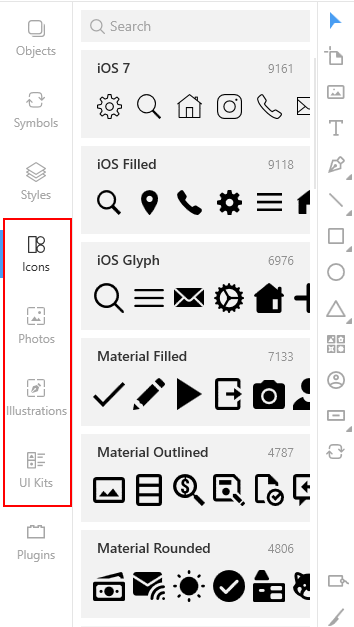

For your convenience, the items inside libraries (icons and vector illustrations) are organized by styles categories. Also, to find the required item, you can use the search field at the top of the left panel. Once you've found the item you like, just click it and drag onto the canvas. That's it!

<video autoplay="" muted="" loop="" playsinline="" width="auto" poster="/public/libraries-addingiconsph.png" height="auto"><source src="/public/libraries-addingicons.mp4" type="video/mp4"></video>

Now you can work with the item in the same way as with any other similar objects.

With some limitations you can use all the library items for free. Speaking in plain words, if you are using our app and content for free, please be honest. Your designs *must* include a link to the <a href="https://icons8.com" target="_blank">Icons8 website</a>, otherwise our lawyers get nervous and unhappy.

To be able to edit photos in high resolution or to convert icons and illustrations to vector you should subscribe to one of our <a href="https://icons8.com/pricing" target="_blank">paid plans</a>.

The sections below describe library-specific actions that you can perform with library items.

## Icons

The Lunacy icon library exceeds 140 thousand items which is more than enough even for the choosiest users. After installation your app will feature only free-to-use icons. To have the full library at hand, you should download it.

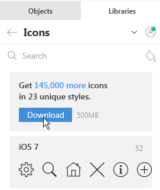

<!--

When working with icons you can select their:

* Initial size
* Color
* Opacity

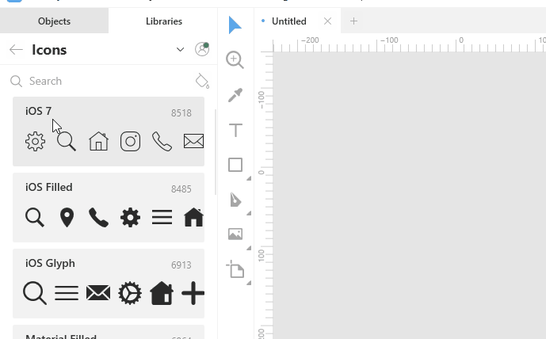

-->

## [Photos and masked photos](#photos-and-masked-photos)

When working with the photo libraries you can make use of such handy features as:

* Image replacement
* Searching for similar images

To **replace** an image on the canvas, drag an image from the library and hover it somewhere near the center of the current image. Wait a moment until the green mask and replacement icon appear, and then release the mouse button.

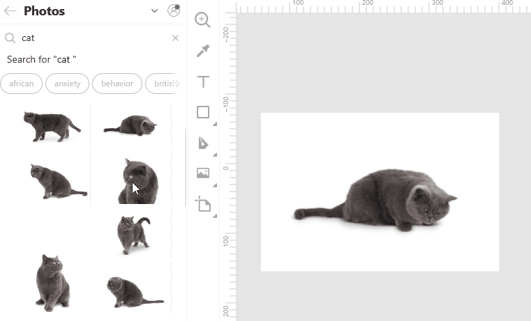

To **search** the library for images similar to the one you have on the canvas, right-click the image and select **Find similar** on the displayed menu.

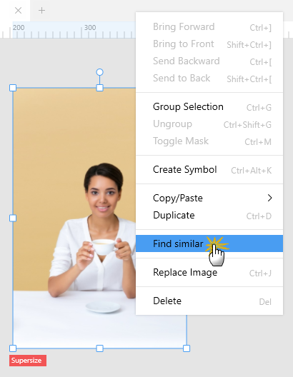

Lunacy will run through its photo library and display the best matches on the library panel.

## Illustrations

Illustrations is a collection of vector images for awesome web, mobile and UI designs. But if you are on a free plan, you will only be able to use library items as rasters.

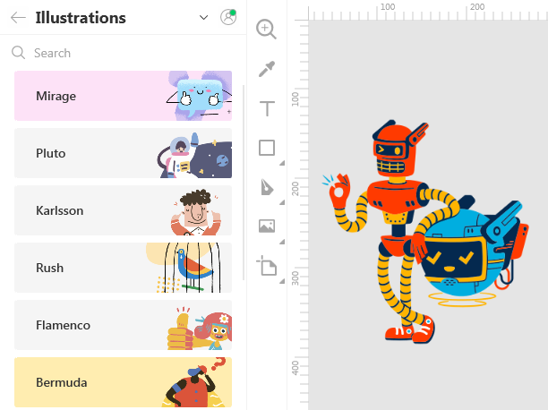

Like with [photos](#photos-and-masked-photos), when working with illustrations you can use the **replacement** and **find similar** features.

## UI kits

>**Tip:** To better understand the intent and how to use UI kits, we recommend that you first read the <a href="https://docs.icons8.com/components" target="_blank">Components</a> and <a href="https://docs.icons8.com/layerstyles" target="_blank">Layer and text styles</a> sections of our documentation.

With Lunacy you always have all popular UI kits at hand. They can be of great help when you are working on a project for a specific OS or device. You can quickly find the required components (buttons, menus, colors, etc.) and add them to your design.

### Preinstalled UI kits

Lunacy library includes the following UI kits:

* Apple macOS
* Apple watchOS
* Microsoft Windows
* Google Material
* Apple iOS
* Microsoft Web Fluent

In fact, UI kits are external .sketch files with ready-made <a href="https://docs.icons8.com/components" target="_blank">components</a>, <a href="https://docs.icons8.com/layerstyles/#layer-styles" target="_blank">layer styles</a> and <a href="https://docs.icons8.com/layerstyles/#text-styles" target="_blank">text styles</a>.

>**Tip:** If you're working with a large project and feel that your computer is slow, you can disable the UI kits that you don't currently need. This will spare some system resources. You can always enable UI kits later.

To disable/enable UI kits:

1. Click the settings button at the upper-right corner of the library panel.
2. Clear/select respective checkboxes.
3. Click the settings button once again to exit the settings mode.

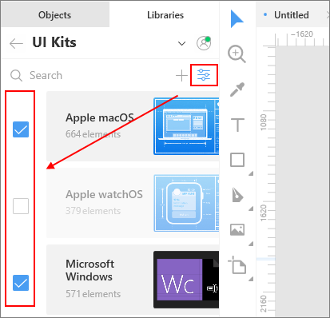

### Custom UI kits

You can create your own kits and save them for further use or share them with other people. For this, you should convert the components (UI elements, colors, typography) that you are going to reuse into components, layer and text styles, accordingly.

Also, you can add any other UI kits that you might find on the Internet or get from your team. The only requirement is that those *must* be .sketch files and they *must* include components.

To add a custom UI kit to the library:

1. Click the plus button at the upper-right corner of the library panel (see the figure below). The **Open** dialog box appears.
2. In the dialog box, select your .sketch file .
3. Click the **Open** button.

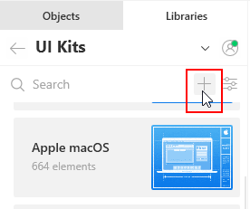

To delete a custom UI kit from the library:

1. Right-click the kit in the library panel.
2. On the displayed menu, select **Delete Library**.

You can also use the **Show in File Explorer** command, to learn the location of a UI kit file.

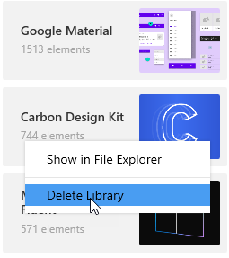

### Using UI kits

In general, the workflow with UI kits is as follows:

* In the left panel (on the **Objects** and **Libraries** tabs) you deal with components.
* In the right panel (the Inspector) you make use of layer and text styles.

#### Components

To add an item from a UI kit library to your project:

1. Find the required item. For this, you can browse the library categories or use the search. The search works both, globally, across all libraries, or inside a specific library, depending on where you are in the interface.
2. Click the **Paste to workspace** icon or just drop the item onto the canvas.

Like with other library items, you can replace the selected item on the canvas with the one from the library.

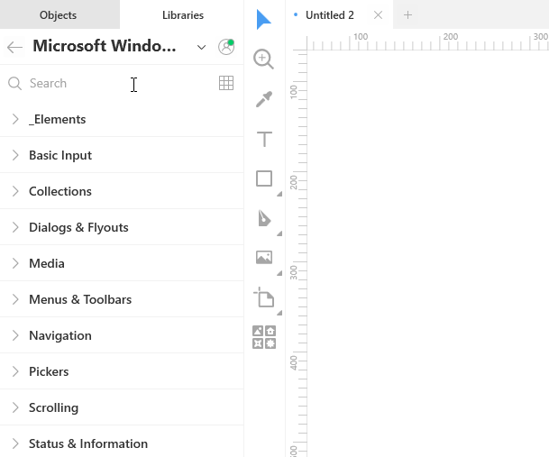

On the **Objects** tab, items from a UI kit library appear with the link icon in front of their names (see the figure below). It indicates that the object is an instance of a component from an external file. You cannot modify such objects, except for the size and overrides. To get more control over a library item, consider the following commands accessible on the context menu or menus invoked from the menu bar and the Inspector:

* **Detach from Components**: Converts the selected instance into a layered object.
* **Detach from Library**: Adds the main component of the selected instance to the document assets, i.e. to the Components page. After you detach a component from the library, you can work with it as with all other components in your project.
* **Restore instance size**: Restores the original size of the selected instance.  

{:.is-big}
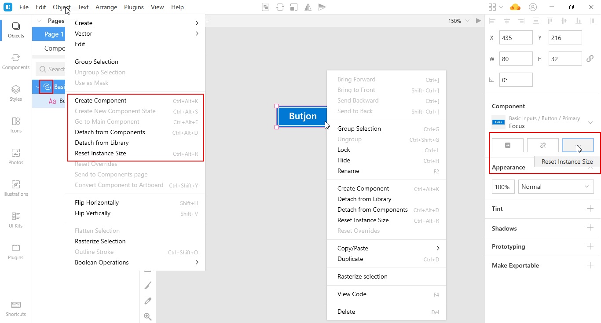

#### Layer and text styles

For more information on how to use layer and text styles from UI kits, read <a href="https://docs.icons8.com/layerstyles/#external-styles" target="_blank">here</a>.

