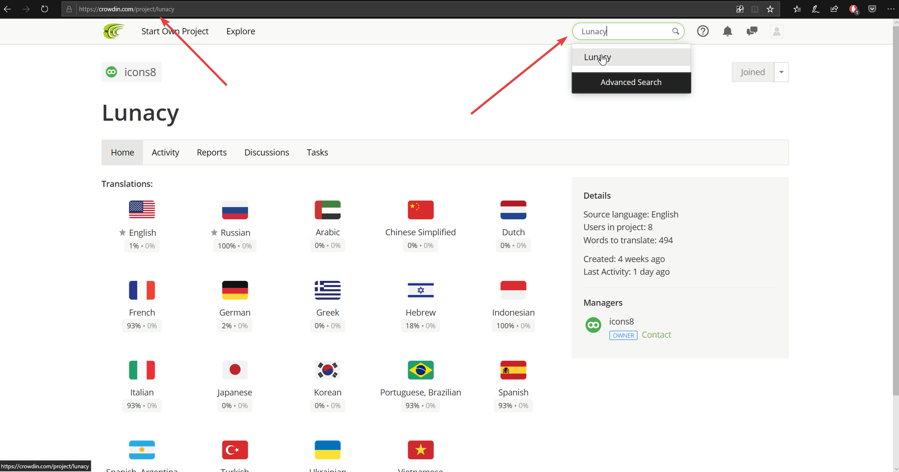
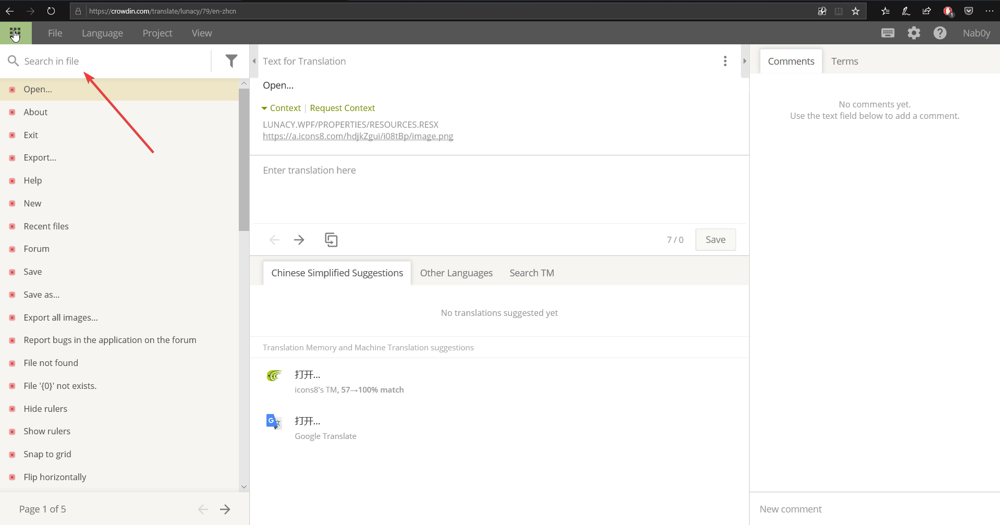
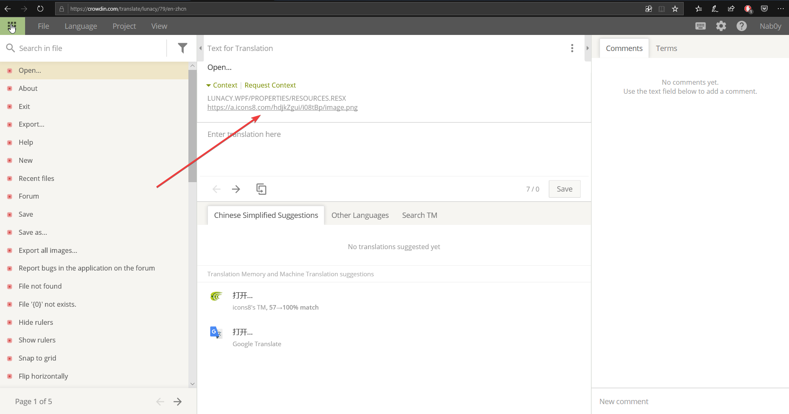

---
# Page settings
layout: default
keywords:
comments: false

# Hero section
title: Localization
description: Help us improve the translation of Lunacy
icon: 'translation'

# Micro navigation
micro_nav: false

# Page navigation
page_nav:
    next:
        content: Support
        url: '/support'
    prev:
        content: Shortcuts
        url: '/shortcuts'
---

## Editing or Translating an Existing Language

To edit a language that Lunacy already supports, use a service called [Crowdin](https://crowdin.com/project/lunacy). 

1. You'll need to sign up or log in to your account.

2. To find our project, use search or follow the [direct link](https://crowdin.com/project/lunacy).

3. Choose the language which you want to edit or translate.

4. Search for a string in question.

5. Useful: there are the screenshots that show where this string is located.

## Adding a New Language

If you want to add a new language but it's not in our Crowdin project, drop us an email to lunacy@icons8.com. We will add it to Сrowdin; after we're done with translation, we'll include it in the next release of Lunacy.
