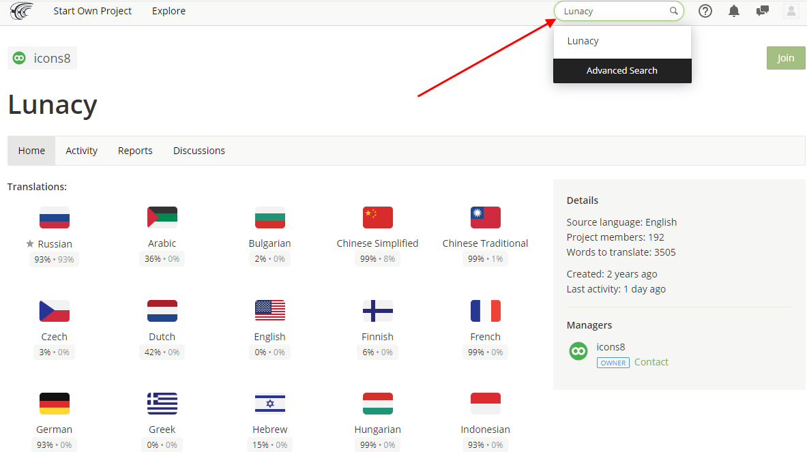
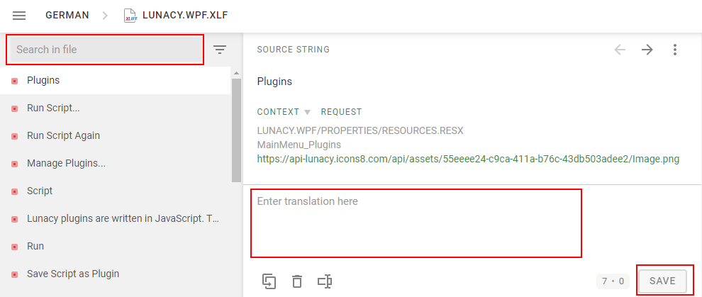
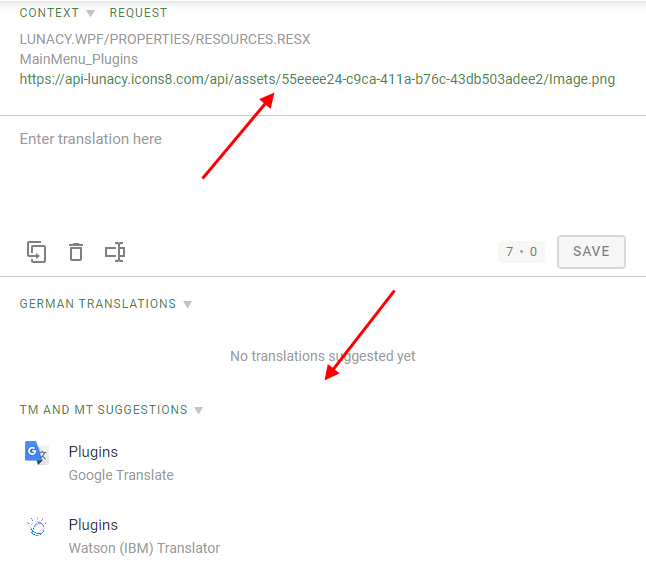

---
# Page settings
layout: default
keywords:
comments: false

# Hero section
title: Localization
description: Help us localize Lunacy to your language
icon: 'translation'

# Micro navigation
micro_nav: false

# Page navigation
page_nav:
    next:
        content: FAQ and Сontacts
        url: '/support'
    prev:
        content: Shortcuts
        url: '/shortcuts'
---

We have a great team of Lunacy enthusiasts helping us with localization of the app interface. Big thanks to them for helping other users who are not comfortable with English. If you also wish to contribute to localization of Lunacy to your language, join us at [Crowdin](https://crowdin.com/project/lunacy), a platform for collaborative translation.

## Improving an existing localization

1. Sign up to Crowdin or log in if you already have an account.

2. To find our project, use the search field or follow the <a href="https://crowdin.com/project/lunacy" target="_blank">direct link</a>.

    {:.is-big}
    

3. Choose the language you want to contribute to.
4. Select a file for translation:

    * *Lunacy.Wpf.xlf* - the main file with stings from the Lunacy interface.
    * *LunacyMicrosoftStore.csv* - the file with strings that appear on the Lunacy page in Microsoft Store.

    {:.is-big}
    

    Files that need translation have progress of less than 100%. Click a filename. The Editor page appears.

5. In the Editor, untranslated strings as a rule are at the top of the list in the left panel. If you are looking for a specific string, use the search field.

    {:.is-big}
    

6. Select a string, type your translation and click **Save**.
7. Repeat Steps 5 and 6 as needed.

**Tip:** When necessary, check out screenshots that show where this or that string belongs (click the link above the working area). Also, you might find helpful suggestions from translation memory and other sources. You will see them below the working area.

{:.is-big}

See also <a href="https://support.crowdin.com/online-editor/" target="_blank">Crowdin docs</a>.
 

## Your language is not in the list?

If you want to add a new language which is not in our Crowdin project yet, drop us an email at lunacy@icons8.com. We will add it to Сrowdin. After the translation is complete and verified, we'll include it in one of upcoming releases.
