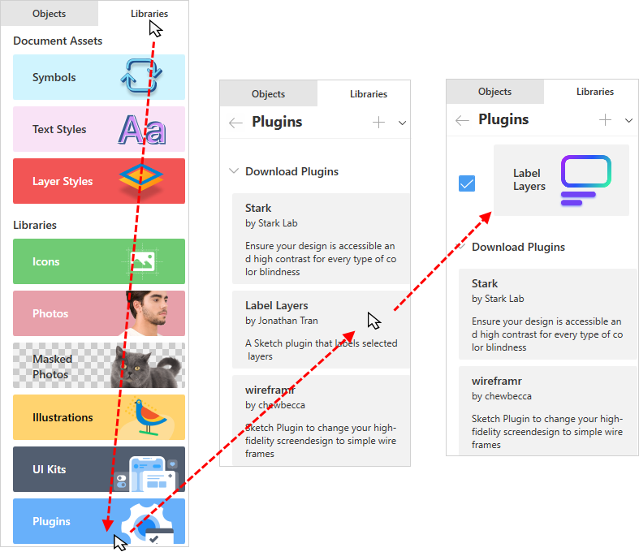
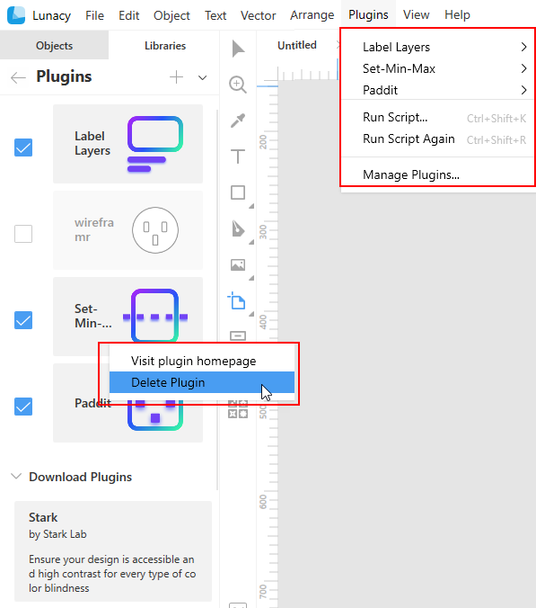
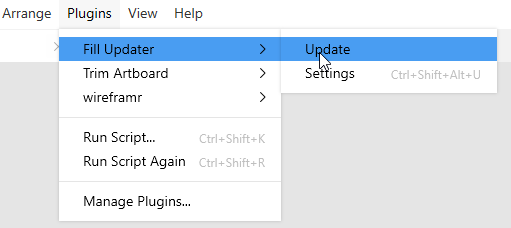

---
# Page settings
layout: default
keywords:
comments: false

# Hero section
title: Plugins
description: Extend Lunacy functionality
icon: 'plugin'

# Micro navigation
micro_nav: false

# Page navigation
page_nav:
    next:
        content: Shortcuts
        url: '/shortcuts'
    prev:
        content: Prototyping
        url: '/prototyping'
---

## Overview

In v.6 we introduced the support of Sketch plugins extending the app functionality. Please note that Lunacy supports only the latest JavaScript version of the <a href="https://developer.sketch.com/reference/api/" target="_blank">Sketch API</a>. Also, with limitations it supports:

* Sketch Utilities (except for polyfill fetch) 
* Some most frequent Objective C Objects

Lunacy does not and will never  support:

* Objective C preprocessor
* OSX Compiled components
* Access to the Cocoa UI

As of now, there is no way to say for sure whether this or that Sketch plugin downloaded from the internet will work in Lunacy. But there is a special panel in Lunacy where you can download plugins approved by our team. We will regularly update the content of the panel.

You can also write and run you own scripts directly in Lunacy and save them as plugins.

If you've written a plugin of your own and want to share it with other users, you can email us a link to the project GitHub page at lunacy@icons8.com. If we approve your plugin, it will soon appear in the panel of recommended plugins.

## Installing plugins

There are two ways of installing plugins:

1. You can install a plugin from the Lunacy library. This guarantees that it will work.
2. You can download a plugin from the internet and install it, but there are chances that it won't run in Lunacy for the reasons described above.

**Way 1.**

1. Open the **Libraries** tab.
2. Click **Plugins**.
3. In the download section of the **Plugins** panel, click over the required item.
4. Wait until the plugin appears in the list of installed plugins.

**Way 2.**

1. Download the required plugin from the internet. For example, at the <a href="https://www.sketch.com/extensions/" target="_blank">Sketch extensions</a> page.
2. Open the **Libraries** tab.
3. Click **Plugins**.
4. Click the plus icon at the top of the **Plugins** panel. The **Select folder...** dialog box appears.
5. Browse to the plugin folder (it should have the .sketchplugin suffix) and click **Select folder**.
6. Wait until the plugin appears in the list of installed plugins.

## The Plugins panel

The **Plugins** panel shows the list of currently installed plugins. You can:

* Temporary disable plugins by clearing the checkboxes next to them. Disabled plugins do not appear on the **Plugins** menu (see below).
* Uninstall plugins. For this, right-click over the plugin that you no longer need, then click **Delete plugin** on the context menu.
* Install a plugin from the list of recommended plugins.

## Using plugins

To run a plugin, open the **Plugins** menu and select the required plugin and an action (see the figure below).

In addition to the list of enabled plugins this menu features the following commands:

* **Manage plugins**. Opens the **Plugins** panel on the left where you can install, enable, disable or uninstall plugins.
* **Run script** (`Ctrl+Shift+K`). Opens the code editor where you can write your own script, run it and save to the plugins panel. For this, when the script is ready, click **Save script as plugin**, enter its name in the displayed text field box and click the **Save script as plugin** once again  (see the figure below).
* **Run script again** (`Ctrl+Shift+R`). You can use this command to run the script currently entered in the code editor without opening the editor itself.

[//]: # (removed the unique features section - maybe we should recreate it as a set of links)
[//]: # (# Unique Features)
