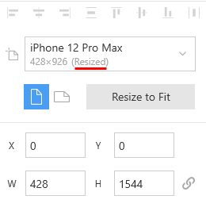
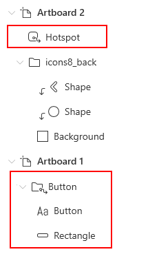
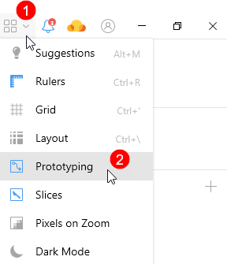
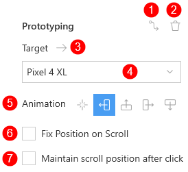
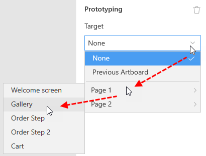
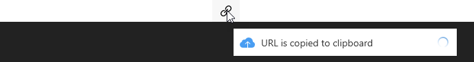

---
# Page settings
layout: default
keywords:
comments: false

# Hero section
title: Prototyping
description: Learn how to build prototypes in Lunacy
icon: 'tree-structure'

# Micro navigation
micro_nav: false

# Page navigation
page_nav:
    next:
        content: Tips and Tricks
        url: '/tips'
    prev:
        content: Sketch Cloud
        url: '/cloud'
---

<!--

## Introduction

You can build prototypes to test and polish UX of your designs before sending them to development.

In the current version of Lunacy preview of prototypes takes place in Sketch Cloud. So, to be able to upload and preview your prototypes you will need a Sketch Cloud account.

-->

## How it works

You can build prototypes to test and polish UX of your designs before sending them to development.

Prototyping is based on artboards. If you are planning to add prototyping to your project, **the use of artboards is a must**.

The easiest way to create a prototype is to add a link between two artboards. The procedure is as follows:

1. On the first artboard, select an object the user will interact with (say, a button).
2. In the Inspector panel, click + in the **Prototyping** section. A prototyping link appears.
3. Point the cursor over the second artboard and click to set the link. To define the target artboard you can also use the **Target** dropdown list in the **Prototyping** section (see the demo below).

That's it. A primitive prototype is ready. To make it a bit more usable, we will repeat the above steps and create a control that will return the user from Artboard 1 to Artboard 2 (see the demo in the next subsection).

## Previewing prototypes

To preview a prototype, select an artboard you want to start with and click  in the upper-right corner of the interface. The preview window will show up.

<video autoplay="" muted="" loop="" playsinline="" width="100%" poster="/public/proto-procedureph.png" height="auto"><source src="/public/proto-procedure.mp4" type="video/mp4"></video>

In a similar fashion you can link your artboards in the desired navigation sequence and preview your design in action.

## Scrollable prototypes

To create a scrollable prototype, you should select an artboard from Artboard Presets and resize it **vertically**. Alternatively, you can create a custom preset and then vertically resize it. For details, about artboards presets and custom presets, click <a href="https://docs.icons8.com/interface/#artboards" target="_blank">here</a>.

Resized artboards appear with the word *Resized* in the Inspector as shown in the figure below. Prototypes based on non-resized artboards won't scroll.

## [Hotspots](#hotspots)

You can also use hotspots to create links between artboards. These are a special type of objects that allows you to create interactive zones anywhere on artboards.

Also, hotspots come in handy when the size of an element that you want to make clickable or tappable is too small for convenient use. By adding a hotspot you can enlarge interactive area around the object.

Moreover, you can use hotspots as parts of <a href="https://docs.icons8.com/components/" target="_blank">components</a> and override their targets as needed.

To add a hotspot you can:

* Use the <a href="https://docs.icons8.com/tools/#hotspot-tool" target="_blank">hotspot tool</a>.
* Select a linked object, then click  in the **Prototyping** section of the Inspector. This creates a hotspot of the same size as of the selection frame around the object. You can resize it by dragging handles, if necessary.

The demo below show both these methods.

<video autoplay="" muted="" loop="" playsinline="" width="100%" poster="/public/proto-hotspotph.png" height="auto"><source src="/public/proto-hotspot.mp4" type="video/mp4"></video>

The next figure shows how hotspots and linked objects appear in the **Objects** panel.

To hide/show hotspots and prototyping links on the canvas, use the **Prototyping** button on the action bar.

To delete a hotspot, select it and press`Del`.

## [Prototyping controls](#prototyping-controls)

The figure below shows the controls that appear in the **Prototyping** section when you select a linked object or a hotspot.

1. This icon appears only when you select a linked object. A click over the icon creates a hotspot over the object. See the [Hotspots](#hotspots) section above.
2. The trash can icon. Discards prototyping setting for the selected object/Deletes the selected hotspot.
3. A click over the arrow will bring you to the artboard which is set as target for the selected object.
4. Use this drop-down list box to set the target artboard for the selected object (see the figure below). It shows the list of all artboards available in the document. If you have several pages in your document, the artboards will be organized by pages. It is OK, if interlinked artboards are on different pages. Also, the list features two more options:

    * None - sets the zero target.
    * Previous artboard - a click over the object with this option selected will bring you back to the previous view.

    

5. These controls allow you to choose how the target artboard will show up on the screen during the preview.
6. Select this checkbox, if you want the selected object to preserve its position when you scroll the screen (for instance, a floating button).
7. With this checkbox selected, scrollable artboards will preserve their position during preview of the prototype. When you get back to the artboard, it will be in the same position as you've left it.

    With the clear checkbox, the artboard will always return to the top.

## Sharing prototypes

You can easily share prototypes with your teammates and customers.

For this:

1. Click  in the upper-right corner of the interface. The preview window shows up.
2. Click the chain link icon at the top of the window.

That's it. The link gets copied to your clipboard and you can send it to your recipients.

<!--
## Previewing prototypes in Sketch Cloud

You can also preview prototypes in Sketch Cloud. For this, you need to upload your document to Sketch Cloud:

1. Click the Sketch Cloud icon on the action bar. Log into your Cloud account, if necessary.
2. In the Sketch Cloud panel, click **Upload document**. Wait a bit until Cloud processing is complete.
3. Select the artboard from which you want to start preview.
4. Click the play button that will appear at the top bar.

All the above steps are shown in the demo below.

<video autoplay="" muted="" loop="" playsinline="" width="100%" poster="/public/proto-demoph.png" height="auto"><source src="/public/proto-demo1.mp4" type="video/mp4"></video>

**Note:** When you upload your file to Sketch Cloud, you create a new independent file which *will not* synchronize with its parent that you store on your computer. So, make sure that you edit one and the same file. You can always download the Cloud file to you computer or upload a new version of the local copy to the Cloud. For details about working with Sketch Cloud from Lunacy, read <a href="https://docs.icons8.com/cloud/" target="_blank">here</a>.

-->
