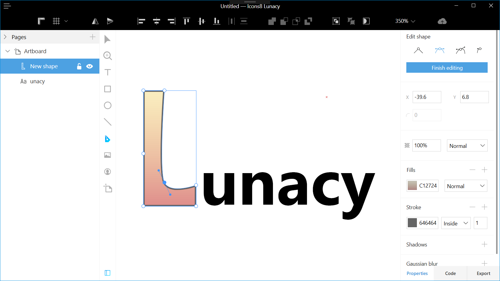

---
# Page settings
layout: default
keywords:
comments: false

# Hero section
title: Release History
description: New features and fixes for each version of Lunacy
icon: 'activity-history'

# Micro navigation
left_menu_off: false
release_note:
    - title: Version 6
      url: 'version-6'
    - title: Version 5
      url: 'version-5'
    - title: Version 4
      url: 'version-4'
    - title: Version 3
      url: 'version-3'
    - title: Version 2
      url: 'version-2'
    - title: Version 1
      url: 'version-1'

page_nav:
    prev:
        content: FAQ and Сontacts
        url: '/support'

---

# Version 6

## 6.6

*RELEASED December 01, 2020*

Download from the <a href="https://www.microsoft.com/store/apps/9pnlmkkpcljj?ocid=badge" target="_blank">Microsoft Store</a> or click [here](https://desktop.icons8.com/lunacy/LunacySetup_6.6.0.exe) to get the Installer.

### New features

#### Fonts Embedding

Now you can embed fonts into your document before sharing it with other people. This ensures that text objects will look exactly as you designed them everywhere even if a computer doesn't have all the right fonts.

To use this feature, click **Text > Fonts Embedding** on the menu bar. In the displayed dialog box, select the required fonts and click the **Embed fonts** button.

**Note:** By embedding a font you confirm that you have a proper license that allows you to distribute the font.

### Improvements

* Now you can rename Components (ex-Symbols) and Styles right in the Inspector.
* Minor prototyping improvements.
* Now the main Lunacy window opens almost twice faster than in the previous versions.
* Some minor UI improvements.

### Fixed bugs

* An issue with Alt codes input
* Numerous minor fixes.

## 6.5

*RELEASED November 17, 2020*

Download from the <a href="https://www.microsoft.com/store/apps/9pnlmkkpcljj?ocid=badge" target="_blank">Microsoft Store</a> or click [here](https://desktop.icons8.com/lunacy/LunacySetup_6.5.0.exe) to get the Installer.

### New features

#### Smooth corners

Now you can create shapes with perfectly smooth corners like in Apple interfaces and products.
To switch between round (default) and smooth corners, click  next to the corner radius field in the Inspector.                      
The figure below shows the difference between smooth (red) and round (blue) corners.

#### Export presets

Now you can save your export settings for further use. To open the **Export Preset Editor**, click the settings button in the **Export** section of the Inspector, then select **Create** preset on the menu.
The settings menu now also features export presets for iOS and Android.

### Improvements

* We renamed Symbols to Components for easier onboarding of Figma, XD and other users.
* Lunacy API regional split for USA, Europe and China for better connectivity.
* Improved prototypes upload speed.
* Ability to Check for Updates from the Main Menu (**Help > Check For Updates**).
* Some minor UI improvements.

### Fixed bugs

* Numerous minor fixes.

## 6.4

*RELEASED November 02, 2020*

Download from the <a href="https://www.microsoft.com/store/apps/9pnlmkkpcljj?ocid=badge" target="_blank">Microsoft Store</a> or click [here](https://desktop.icons8.com/lunacy/LunacySetup_6.4.0.exe) to get the Installer.

### New features

#### Prototype Preview

In the previous versions, to preview a prototype, you had to upload a document to Sketch Cloud. Now you can do it right within Lunacy even without an internet connection.

Moreover, we added the support for scrollable artboards in prototypes.

To run the prototype previewer, select an artboard you want to start with and click the Play button in the upper-right corner of the interface. A new window will open next to Lunacy.

Also, you can instantly upload your prototypes to our Cloud and share them with other people. Just click the chain link button at the top of the preview window and send the link to your teammate or customer. 
For details, click <a href="https://docs.icons8.com/prototyping/" target="_blank">here</a>.

#### Avatar tool

We integrated the avatar tool with the <a href="https://generated.photos/" target="_blank">generated.photos</a> project. Now you can select between the photos of real-life models (default) and photos of people generated by AI. In the latter case, you can choose the desired gender, age, ethnicity, and hair color of a model. Then click **Generate avatar** and enjoy the magic!

**Note:** You need an internet connection to be able to use this feature.

Also, now you can refresh multiple avatars at a time. For this, select several avatars and press `Shift+R` or click **Generate avatar** in the Inspector.

<video autoplay="" muted="" loop="" playsinline="" width="auto" poster="/public/rn-newavatarph.png" height="auto"><source src="/public/rn-newavatar.mp4" type="video/mp4"></video>

And as a cherry on top, now you can create avatars from any shapes. For this, select a shape, then enable the Avatar tool and click **Generate avatar** in the Inspector (see the demo below).

<video autoplay="" muted="" loop="" playsinline="" width="auto" poster="/public/rn-newavatar2ph.png" height="auto"><source src="/public/rn-newavatar2-1.mp4" type="video/mp4"></video>

#### Image Upscaler

Another cool feature of this release is the integration with the <a href="https://icons8.com/upscaler" target="_blank">Icons8 Image Upscaler</a>. Now, when you resize an image, Lunacy will offer you to enhance the image using our state-of-the-art AI.

**Note:** The feature is available only to users with a paid subscription.

### Improvements

* Grids and Layouts improvements
* Mouse cursors: scaling and positioning improvements
* The dots for adjusting corner radius now show up only when you hover the cursor over an object.

### Fixed bugs

* Distance indicator issues
* Color picker issues
* Typography issues
* Other minor fixes and improvements

## 6.3.1 Hotfix

*RELEASED October 26, 2020*

Download from the <a href="https://www.microsoft.com/store/apps/9pnlmkkpcljj?ocid=badge" target="_blank">Microsoft Store</a> or click [here](https://desktop.icons8.com/lunacy/LunacySetup_6.3.1.exe) to get the Installer.

### Fixed issues

* A Sketch Cloud authorization issue.
* The issue with the Lunacy logo size in the Windows Start menu. 

## 6.3

*RELEASED October 16, 2020*

Download from the <a href="https://www.microsoft.com/store/apps/9pnlmkkpcljj?ocid=badge" target="_blank">Microsoft Store</a> or click [here](https://desktop.icons8.com/lunacy/LunacySetup_6.3.0.exe) to get the Installer.

### New features

#### Opening and saving files

Now you can use Lunacy to open and save files in SVG and popular image formats (PNG, JPEG, etc.). When saving such a file, Lunacy creates a .sketch copy next to the file so that you can return to editing it later.

#### Redesigned welcome window

Lunacy v.6.3 brings in a new redesigned welcome window.

### Improvements

* Rendering performance increased almost twice.
* Memory usage improvements.
* Added the support of the Plus Darker and Plus Lighter blend modes.
* Now you can use the Non-Zero and Even-Odd rules to fill shapes  with overlapping paths.
* A new style of tooltips that appear near bounding boxes when you manipulate an object.
* The **Reset Size** button now appears below symbol instances whose size differs from that of the main symbol.
* Removed the nozzle scaling feature due to incompatibility with Sketch.

### Fixed bugs

* Numerous memory leak fixes.
* Other minor fixes and improvements.

## 6.2

*RELEASED September 23, 2020*

Download from the <a href="https://www.microsoft.com/store/apps/9pnlmkkpcljj?ocid=badge" target="_blank">Microsoft Store</a> or click [here](https://desktop.icons8.com/lunacy/LunacySetup_6.2.exe) to get the Installer.

### Improvements

#### Photos and Illustrations

Photos and vector images now open way faster. Also, the libraries have got improved filters.

#### Line tool

The Line tool has got coordinates settings in the Inspector. Also,  now the Line tool snaps line origin points to half pixels to draw pixel perfect lines. Like in Sketch.

{:.image-info}
Before v.6.2 (left) and Starting from v.6.2 (right)

#### Styles and symbols

Now you can:

* Group and ungroup items in the style and symbol libraries.
* Detach styles from UI kits. Detached items become document styles and appear on the **Styles** tab. You can detach multiple items at a time.
* Select several objects with identical styling settings and save their settings as a style.
* Apply context menu commands to several items selected in the Styles or Symbols libraries. For example, you can copy multiple styles between documents or duplicate several symbols at a time.

### Fixed bugs

* Prototyping and artboard issues
* Issues with masks
* Sketch cloud issues
* Color picker and eyedropper issues

## 6.1

*RELEASED September 02, 2020*

Download from the <a href="https://www.microsoft.com/store/apps/9pnlmkkpcljj?ocid=badge" target="_blank">Microsoft Store</a> or click [here](https://desktop.icons8.com/lunacy/LunacySetup_6.1.0.exe) to get the Installer.

### New features

#### Redesigned left panel

Lunacy 6.1 comes with a new look of the left panel. It has become easier to switch between the Objects list and the Libraries (Symbols, Styles, Icons, etc.).

To minimize the left panel, click the icon of the currently open section or use a respective shortcut (`Alt+1`, `Alt+2`, ... `Alt+8`).       

Also, we revised the order of tools on the toolbar.

The video below presents these and some other changes introduced in v.6.1.

<video play="no" controls="controls" muted="" loop="" playsinline="" width="100%" poster="/public/rn-61videoph.png" height="auto"><source src="/public/Lunacy61.mp4" type="video/mp4"></video>

#### Snapping: Pen

The Pen tool has become a lot easier to use. Now when you draw a path, Lunacy snaps new points to horizontal and vertical lines that can be drawn through the point you are going to add and existing points. Also new points snap to:

* existing segments and their centers
* guides
* grids and layouts

<video autoplay="" muted="" loop="" playsinline="" width="auto" poster="/public/rn-pensnapph.png" height="auto"><source src="/public/rn-pensnap.mp4" type="video/mp4"></video>

#### Snapping: Color Picker
Now when you adjust a linear or radial gradient by moving a color point, Lunacy snaps the point to the borders and midlines of the shape's bounding box.

<video autoplay="" muted="" loop="" playsinline="" width="auto" poster="/public/rn-colorsnapph.png" height="auto"><source src="/public/rn-colorsnap.mp4" type="video/mp4"></video>

Also, you can hold down Shift to get a perfectly vertical, horizontal or 45-degree diagonal gradient.

### Improvements

* Now you can toggle the suggestions panel using the `Ctrl+Space` shortcut or the bulb button on the action bar.
* The ability to globally set icons color and size was removed. Now you can apply colors (tints) to icons individually through the suggestions panel.
* Now symbol instances can have different states (hovered, pressed, etc.)
* Added the Swap at Original Size option to the symbol settings in the Inspector. With this option enabled (default), when you swap a symbol, the selected instance will resize to fit the original size of the new symbol.
* The license pop-up window will no longer disturb you. Now license proposals appear in the suggestions panel.
* The Code panel tab is no longer available in the Inspector. To display the panel, use the View menu, context menu or the `F4` hotkey.
* Search fields improvements. Now all content filters appear in the search fields.
* Tips with links to our docs now show up when you hover the cursor over some section names in the Inspector (**Appearance**, **Symbols**, **Tints**, and some other).
* Now you can copy-paste text and layer styles between open documents.
* The Convert to Outlines feature now supports combined glyphs.
* Now you can rename your projects right on the file tabs panel. Just double-click the project tab, enter a new name and press `Enter`.
* IME Text input improvements. Chinese and Korean now work fine. Input in other languages will perform a lot better.
* New icon for .sketch files association in the Windows Explorer
* Improved performance of the .sketch file opening and saving procedures.                                      

### Fixed bugs

* The artboards' Resize to Fit feature now works a lot better, like in Sketch.
* The dash pattern option in border settings now works like in Sketch (2 fields instead of 4).
* The issue with color boxes showing HEX values even when the fill type was other than solid.
* Currency symbols in generated texts now go in front of digits
* Typography issues
* Prototyping issues
* Suggestions issues
* Other minor fixes

## 6.0

*RELEASED August 04, 2020*

Download from the [Microsoft Store](https://www.microsoft.com/store/apps/9pnlmkkpcljj?ocid=badge) or the [Installer](https://desktop.icons8.com/lunacy/LunacySetup_6.0.0.exe)

### New features

#### Support for Sketch plugins (Beta)

Lunacy v.6 brings the support for Sketch plugins. Please note that Lunacy supports only the latest JavaScript version of the <a href="https://developer.sketch.com/reference/api/" target="_blank">Sketch API</a>. Also, with limitations it supports:

* Sketch Utilities (except for polyfill fetch)
* Some most frequent Objective C Objects

Lunacy does not and will never support:

* Objective C preprocessor
* OSX Compiled components
* Access to the Cocoa UI

As of now, there is no way to say for sure whether this or that Sketch plugin downloaded from the internet will work in Lunacy. But we've added is a  special panel where you can download plugins verified and approved by our team. We will regularly update the content of the panel.

Now you can also write and run you own scripts directly in Lunacy and save them as plugins.

If you've written a plugin of your own and want to share it with other users, you can email us a link to the project GitHub page at lunacy@icons8.com.

For details about working with plugins in Lunacy, read <a href="https://docs.icons8.com/plugins/" target="_blank">here</a>.

#### Tint Overrides

In the previous version we added tints. This version comes with tint overrides. They can be handy, for instance, when you are designing tabs or panels with elements that can have different states expressed through different colors.

Note that before using tint overrides you should add default tints.

When you apply an override, the reset button appears in the **Tint** section of the Inspector. Use this button to remove the override.

For details and a demo, click <a href="https://docs.icons8.com/styling/#tint-overrides" target="_blank">here</a>.

#### Snap to spacing

We've added another great feature that will help you quickly arrange objects on the canvas.

Now when you have two or more vertically or horizontally distributed objects and you drag another object close to them, Lunacy snaps the object and shows a pink area when the spacing between the object you drag is the same as one of the spacings between the other objects. See the demo below.

<video autoplay="" muted="" loop="" playsinline="" width="auto" poster="/public/snapping-spacingph.png" height="auto"><source src="/public/snapping-spacing1.mp4" type="video/mp4"></video>

To disable snapping, hold down `Ctrl` while dragging.

### Improvements

* The button that allows you to log into your Icons8 account now appears on the action bar in the upper-right corner of the screen.
* Support of the Sketch artboard state logic: resized state and scrollable prototypes.
* Now when you delete a master symbol that has instances, Lunacy will ask you to confirm your intent.
* A new way of switching to the text editing mode: enable the text tool (press `T` or select it on the toolbar) and click over the text that you want to edit.
* The suggestions panel now also appears when you work with stars, polygons, triangles, lines and arrows, provided that you've created them with respective tools.

### Fixed bugs

* The issue with high scrolling speed of the object list scrolled with a touchpad.
* Prototyping issues.
* Color picker issues.
* Vector tool issues.

# Version 5

Version 5 takes Lunacy out of beta (better stability and performance), provides full support for Sketch files, and adds many useful new features.

## 5.9

*RELEASED July 03, 2020*

Download from the [Microsoft Store](https://www.microsoft.com/store/apps/9pnlmkkpcljj?ocid=badge) or the [Installer](https://desktop.icons8.com/lunacy/LunacySetup_5.9.0.exe)

### New features

#### Suggestions panel

Now when you select a shape, an open path or a text you will see a panel with suggestions of styling options based on your previous actions and choices. In case you've just started using Lunacy, the panel will provide some preset styles.
You can:
* Scroll the content of each panel column (except for font size).
* Resize the panel and its columns.
* Move it up or down by dragging the handle in the top-left corner of the panel. Lunacy remembers the position of the panel individually for each object. 
* Manage the content of the panel. Right-click over the panel to invoke the context menu and see the options.
* Disable the panel through **View** > **Suggestions**.

The figure below shows views of suggestions panel for a shape and a text.

For details about using the panels, read <a href="https://docs.icons8.com/styling/#suggestions-panel" target="_blank">here</a> and <a href="https://docs.icons8.com/text/#suggestions-panel" target="_blank">here</a>.

#### Tints
Tints are a quick and easy way to apply a color to grouped objects and symbol instances. They are particularly useful when you need to adjust the color of a semi-filled object or a complex icon.

The **Tints** section appears in the Inspector only when you select a group object or a symbol.

Unlike other styling options, you can apply only one tint to an object.

#### GUI tools

We've added a set of tools that allows you to quickly add basic GUI controls that include:

* Drop-down lists
* Buttons
* Text fields
* Checkboxes
* Radio buttons and
* Toggles

When you select a control added with any of these tools, you see the suggestions panel that allows you to:
1. Change the type of the control.
2. Select the style of the control.
3. Select the control state.

To edit the appearance of a control, use the <a href="https://docs.icons8.com/components/#editing-main-components" target="_blank">symbol editor</a>.

#### Symbol tool

The symbol tool allows you to quickly create mockups of interfaces by adding placeholder symbols and then replacing them with required GUI elements.

* To draw a placeholder symbol just select the Symbol tool and drag over the required area. Placeholder symbols appear as pink rectangles with the question mark.

* To replace a placeholder symbol, select it and use the suggestions panel that will appear.    
* You can also use use symbols from the Symbols page. For this, enable the tool, then go to the Symbols page and click the required Symbol. The same applies to symbols from UI kits.
* When the Symbol tool is enabled, you can press the `C` and `Shift+C` hotkeys to switch between the symbols that you've used earlier and quickly add them onto the canvas.
* If you want your custom symbols to appear on the suggestions panel, you should properly tag them in the Inspector. For this, click  in the **Symbol** section of the Inspector and select a proper category.

#### Text formatting

Text formatting has become a way easier. You no longer need to select a word or the whole text to make it bold, italicized or whatever.

Just set the caret inside a word or at the end of the text and apply the required formatting. In the latter case, the formatting will be applied to the whole text.

### Improvements

* The Icon tool also has its suggestions panel now. Currently it shows your latest 16 icons. The panel does not appear, when you open the Icons Library.
* Text alignment magnets now also appear upon selection of multiple text objects.
* Newly-added text objects now inherit the style of the previous text.
* Now you can edit the layout grid for several artboards at the same time.
* Now you can tag symbol types for better symbol suggestions.

### Fixed bugs

* Artboard layout issues
* Resize issues
* Prototyping issues
* Undo/Redo issues

## 5.8

_RELEASED June 16, 2020_

Download from the [Microsoft Store](https://www.microsoft.com/store/apps/9pnlmkkpcljj?ocid=badge) or the [Installer](https://desktop.icons8.com/lunacy/LunacySetup_5.8.0.exe)

### New features

#### Symbol editor

You no longer need to switch to the Symbols page to edit masters.  Just select an instance of the symbol you want to edit and press `Enter` or click the **Edit symbol** button on the context tool bar.

For details and a demo, click <a href="https://docs.icons8.com/components/#editing-main-components" target="_blank">here</a>.

#### Smart distribute

Now you can quickly arrange multiple objects into nice grids with equal spacing between rows and columns.

For this, select the objects and click the **Tidy up** button in the Inspector. Then drag the red handles that will appear between the "rows" and "columns". Click the red circle in the center of an object and drag to move it to another grid "cell". For details and a demo, click <a href="https://docs.icons8.com/objects/#smart-distribute" target="_blank">here</a>.

#### Artboard presets

Now you can save your frequently used custom artboards to presets. Enable the Artboard tool and click **Create custom preset** at the bottom of the presets panel.

#### Inverse gradients

Now you can invert gradients with a single button click in the Color Picker.

### Improvements

- Better snapping indication.
- A click over an icon in the Library now activates the Icon Tool with this icon selected.
- A click over a photo or illustration in the Library now activates the Image Tool with this image selected.
- Better emoji support.
- Improved support of the Sketch chequerboard pattern. The pattern is now available in image fill presets of the Color Picker.
- Improved support of the Sketch format.
- Now you can underline and strikethrough a text at the same time.

## 5.7
_RELEASED May 28, 2020_  

Download from the [Microsoft Store](https://www.microsoft.com/store/apps/9pnlmkkpcljj?ocid=badge) or the [Installer](https://desktop.icons8.com/lunacy/LunacySetup_5.7.0.exe)

### Improvements
- Improved SVG import
- Ability to collapse and expand resizing and appearance inspectors
- Bigger active zones and smaller size for magnets
- Ability to autoresize text boxes on the canvas by clicking on the boarders of a text box

### Bug Fix
- Fixed typography issues
- Fixed shared styles issues
- Fixed undo-redo issues
- Fixed clipping issues
- Fixed symbols scaling issues
- Fixed selection issues

## 5.6.1 hotfix
_RELEASED May 21, 2020_  

Download from the [Microsoft Store](https://www.microsoft.com/store/apps/9pnlmkkpcljj?ocid=badge) or the [Installer](https://desktop.icons8.com/lunacy/LunacySetup_5.6.1.exe)

### Bug Fix
- Symbol creation bug fixed
- Resize to fit artboard bug fixed

## 5.6
_RELEASED May 18, 2020_  

Download from the [Microsoft Store](https://www.microsoft.com/store/apps/9pnlmkkpcljj?ocid=badge) or the [Installer](https://desktop.icons8.com/lunacy/LunacySetup_5.6.0.exe)

### Features
- Notifications Panel
- The naming of items in Color Picker
- Resize elements with Ctrl+Arrows

### Improvements
- Improved UI of Appearance Inspector
- Improved UI of Symbol Inspector
- Minor UI improvements of Style Suggestions
- Improved Navigation in Libraries
- Magnets are supporting Justify 

### Bug Fix
- Fixed typography issues
- Fixed copy-paste issues
- Fixed undo-redo issues
- Fixed icon tool issues
- Fixed tree elements issues
- Fixed snapping issues
- Fixed selection issues

## 5.5
_RELEASED April 30, 2020_  

Download from the [Microsoft Store](https://www.microsoft.com/store/apps/9pnlmkkpcljj?ocid=badge) or the [Installer](https://desktop.icons8.com/lunacy/LunacySetup_5.5.0.exe)

### Improvements
- Panning performance improvements
- Selection performance improvements
- Object rotation now works by Ctrl+Drag on selection corners
- Paste Here and Paste Over options available in the menus
- Text Edit caret is now visible on almost any background.
- Ability to duplicate Symbols from Symbols panel
- Ability to duplicate Shared Styles from Shared Styles panels
- Ability to Zoom to Selection

### Bug Fixes
- Fixed a lot of Undo/Redo issues
- Fixed selection issues
- Fixed performance issues
- Fixed a lot of resize issues
- Fixed some Sketch Cloud issues
- Fixed color picker issues
- Fixed paste issues
- Fixed export issues

## 5.4
_RELEASED April 15, 2020_  

Download from the [Microsoft Store](https://www.microsoft.com/store/apps/9pnlmkkpcljj?ocid=badge) or the [Installer](https://desktop.icons8.com/lunacy/LunacySetup_5.4.0.exe)

### Features
- Sketch Cloud Libraries
- Sketch Cloud Versions
- Sketch Cloud Access management for Files and Teams
- Ability to preview prototyping on Sketch Cloud
- Align Magnets for Typography
- Ability to Sign in to Icons8 via Google, GitHub and Facebook account

### Improvements
- Ability to change an icon of icon element
- Ability to Zoom to object
- Improved rulers rendering performance
- License expire status in account details

### Bug Fixes
- Fixed undo redo issues
- Fixed Mixed fields issues
- Fixed export issues
- Fixed symbols issues
- Fixed some effects rendering issues

## 5.3.1 hotfix
_RELEASED March 26, 2020_  

Download from the [Microsoft Store](https://www.microsoft.com/store/apps/9pnlmkkpcljj?ocid=badge) or the [Installer](https://desktop.icons8.com/lunacy/LunacySetup_5.3.1.exe)

### Bug Fixes
- Critical bugs fixed

## 5.3
_RELEASED March 25, 2020_  

Download from the [Microsoft Store](https://www.microsoft.com/store/apps/9pnlmkkpcljj?ocid=badge) or the [Installer](https://desktop.icons8.com/lunacy/LunacySetup_5.3.0.exe)

### Features
- Sketch Cloud integration:
    - Profile, Teams, Projects, Sharing - this release
    - Libraries, Prototyping Preview in Cloud - will be in the next release
    - Comments, Manage Versions, Notifications, Access Management - will be in the future

### Improvements
- Ability to rename element using F2 hotkey
- Ability to lock/hide element from context menu
- Minor performance optimizations
- Ability to enable/disable generated text data refresh on duplicate of text element
- Ability to select all guidelines
- Ctrl+P to Print - export selected artboard to the PDF and open it
- Ability to clear recent list
- Better way to make a flow connection - like in sketch

### Bug Fixes
- Fixed group edit issues
- Fixed flip issues
- Fixed Vector Tool issues
- Fixed resizing issues
- Fixed snapping issues
- Fixed typography issues

## 5.2
_RELEASED March 02, 2020_  

Download from the [Microsoft Store](https://www.microsoft.com/store/apps/9pnlmkkpcljj?ocid=badge) or the [Installer](https://desktop.icons8.com/lunacy/LunacySetup_5.2.0.exe)

### Features
- New Rendering Engine (input lag reduced, performance improved)
- Icon Tool
- Superscript and Subscript for Typography
- Ability to connect / disconnect your UIKits
- Sign In to Icons8 with Microsoft Account

### Improvements
- Ability to delete uploaded files from the Lunacy server
- Previous Uploads URLs stored in the Cloud export panel
- Ability to apply Text or Layer Style to a selected object
- Ability to swap a selected Symbol from symbols panel
- Ability to hide some panels via the Main Menu
- Ability to remove all guidelines via the context menu on rulers
- Ability to lock guidelines on the workspace
- Text Generation UI improvements
- Improved constraints math
- Drop image replace highlight on the target object
- Left Panel width saved between app 

### Bug Fixes
- Fixed some minor bugs

## 5.1.1 hotfix
_RELEASED February 19, 2020_  

Download from the [Microsoft Store](https://www.microsoft.com/store/apps/9pnlmkkpcljj?ocid=badge) or the [Installer](https://desktop.icons8.com/lunacy/LunacySetup_5.1.1.exe)

### Bug Fixes
- Fixed crashes

## 5.1
_RELEASED February 12, 2020_  

Download from the [Microsoft Store](https://www.microsoft.com/store/apps/9pnlmkkpcljj?ocid=badge) or the [Installer](https://desktop.icons8.com/lunacy/LunacySetup_5.1.0.exe)

### Features
- AI Background Removal for images
- Hotspot Overrides
- Disable Snapping by holding Ctrl when moving objects
- Title Case in Typography
- Artboard Orientation Switcher and resize it to fit the content

### Improvements
- Ability to delete uploaded files from the Lunacy server
- Previous Uploads URLs stored in the Cloud export panel
- Ability to apply Text or Layer Style to a selected object
- Ability to swap a selected Symbol from symbols panel
- Ability to hide some panels via the Main Menu
- Ability to remove all guidelines via the context menu on rulers
- Ability to lock guidelines on the workspace
- Text Generation UI improvements
- Improved constraints math
- Drop image replace highlight on the target object
- Left Panel width saved between app launches

### Bug Fixes
- Fixed some SVG import issues
- Fixed some typography issues
- Fixed some undo/redo issues
- Fixed some crashes
- Fixed incorrect masks on sketch file resave
- Fixed some flatten issues

## 5.0.2 hotfix
_RELEASED January 28, 2020_

Download from the [Microsoft Store](https://www.microsoft.com/store/apps/9pnlmkkpcljj?ocid=badge) or the [Installer](https://desktop.icons8.com/lunacy/LunacySetup_5.0.2.exe)

### Bug Fixes
- Fixed text preview quality in the floating style panel
- Fixed shift selection
- Fixed eyedropper zoom colors
- Fixed artboard names and layouts

## 5.0.1 hotfix
_RELEASED January 25, 2020_

Download from the [Microsoft Store](https://www.microsoft.com/store/apps/9pnlmkkpcljj?ocid=badge) or the [Installer](https://desktop.icons8.com/lunacy/LunacySetup_5.0.1.exe)

### Bug Fixes
- Fixed some critical bugs and crashes obtained by crash reports from our users

## 5.0
_RELEASED January 24, 2020_

Download from the [Microsoft Store](https://www.microsoft.com/store/apps/9pnlmkkpcljj?ocid=badge) or the [Installer](https://desktop.icons8.com/lunacy/LunacySetup_5.0.0.exe)

### Features
- What's new information inside Lunacy
- Basic Tutorial on the first Lunacy Launch
- Ability to buy a single icon, photo or illustration for 1$
- Ability to supersize a stock photo
- Outline Stroke
- Microsoft Pen Support
- Persian language support (thanks 0amir1 and everyone who helped)

### Improvements
- Huge CPU rendering performance improvement
- GPU rendering input lag minimized
- Minor UI improvements
- Ability to on/off UI kits
- Ability to paste some images via drag-drop
- Element selection improvements on a canvas
- Ability to close tab via Middle Click
- Ability to paste SVG file from Clipboard text data
- Autosave feature will no longer interrupt editing experience
- Autosave indication
- Image Tool single and multi-drop improvements
- Prototyping connections rendering improvement
- Smooth scrolling and zoom via mouse wheel
- Slice SVG export

### Bug Fixes
- Fixed some overrides issues
- Fixed prototyping issues, improved some interactions
- Fixed some find similar issues
- Fixed duplicate crashes
- Fixed some SVG import issues

# Version 4

Version 4 comes with GPU rendering support and Icons8 content integration.

## 4.9
_RELEASED December 26, 2019_

Download from the [Microsoft Store](https://www.microsoft.com/store/apps/9pnlmkkpcljj?ocid=badge) or the [Installer](https://desktop.icons8.com/lunacy/LunacySetup_4.9.0.exe)

### Features
- Missing Fonts Replace
- Eyedropper Tool
- Export Selected as PNG to Cloud via Ctrl+C,C hotkey

### Improvements
- Minor UI improvements
- New app version installer auto-downloading
- Double click in library item to import content to the canvas
- Google Fonts caching with offline access
- Ability to select locked elements from elements tree
- Create Text/Layer Style button will create a style from the selected element
- New cursors for corner radius, duplication, etc.
- Icons improvements

### Bug Fixes
- Fixed some crashes
- Fixed hotspot and slice rotation
- Fixed fields issues
- Fixed scale issues
- Fixed move issues
- Fixed resize issues
- Fixed flatten issues
- Fixed some symbols issues

## 4.8.1 hotfix
_RELEASED December 10, 2019_

Download from the [Microsoft Store](https://www.microsoft.com/store/apps/9pnlmkkpcljj?ocid=badge) or the [Installer](https://desktop.icons8.com/lunacy/LunacySetup_4.8.1.exe)

### Bug Fixes
- Fixed image crop causing app crash
- Fixed some issues recieved by user reports

## 4.8
_RELEASED December 9, 2019_

Download from the [Microsoft Store](https://www.microsoft.com/store/apps/9pnlmkkpcljj?ocid=badge) or the [Installer](https://desktop.icons8.com/lunacy/LunacySetup_4.8.0.exe)

### Features
- Image Crop
- Pixel Preview
- Sketch format node export support
- Text Generation snippets
- Slice Tool
- Hotspot Tool
- Hungarian language support (thanks Levente Szíjártó)

### Improvements
- New UI for Top Bar, Main Menu, Libraries and Export 
- Ability to show/hide overrides and slices
- Ability to open recent projects from Add Tab button
- Reset Overrides button added to the right panel

### Bug Fixes
- Fixed scale issues
- Fixed some undo/redo issues
- Fixed group resize issues
- Fixed multiple groups transformation issues
- Fixed Dark Mode issues
- Fixed sketch format issues
- Fixed slice and hotspot issues
- Fixed grid issues
- Fixed Go To Master Symbol issues

## 4.7
_RELEASED November 24, 2019_

Download from the [Microsoft Store](https://www.microsoft.com/store/apps/9pnlmkkpcljj?ocid=badge) or the [Installer](https://desktop.icons8.com/lunacy/LunacySetup_4.7.0.exe)

### Features
- Dark Mode
- Text Styles
- Layer Styles
- Ability to override text and layer styles
- Smart Dragging. If you will drag background element - foreground element will drag with it
- Style Suggestions - Lunacy will suggest you previously used styles
- Smart Text Insertion. Press T to insert text into selected shape

### Improvements
- Improved pan/scrolling experience
- Improved file load speed
- Improved app close speed
- Bool operations will work more like Sketch
- Border Options mixed content handling
- Improved sketch format compatibility
- Ability to add element from a library via double click

### Bug Fixes
- Fixed prototyping issues
- Fixed move from/to artboard issues
- Fixed background blur issues
- Fixed export issues
- Fixed document palette issues
- Fixed stability issues

## 4.6.1 hotfix
_RELEASED November 3, 2019_

Download from the [Microsoft Store](https://www.microsoft.com/store/apps/9pnlmkkpcljj?ocid=badge) or the [Installer](https://desktop.icons8.com/lunacy/LunacySetup_4.6.1.exe)

### Bug Fixes
- Fixed scroll bars issue and some attached issues

## 4.6
_RELEASED November 1, 2019_

Download from the [Microsoft Store](https://www.microsoft.com/store/apps/9pnlmkkpcljj?ocid=badge) or the [Installer](https://desktop.icons8.com/lunacy/LunacySetup_4.6.0.exe)

### Features
- Sketch Prototyping Format support. You can see, edit and save files with prototyping. Preview is not implemented.
- Added Korean language support (thanks JK Jeong)

### Improvements
- Dramatical rendering performance increase
- Tips with corner radius and angle value on a canvas
- Improved text scaling algorithm

### Bug Fixes
- Fixed scale issues
- Fixed resize issues
- Fixed undo/redo issues
- Fixed a lot of crashes

## 4.5
_RELEASED October 23, 2019_

Download from the [Microsoft Store](https://www.microsoft.com/store/apps/9pnlmkkpcljj?ocid=badge) or the [Installer](https://desktop.icons8.com/lunacy/LunacySetup_4.5.0.exe)

### Features
- Image Adjust - ability to change hue/saturation/brightness/contrast of image
- Background blur
- New fonts dropdown with filters, previews and recent items
- Ability to scale elements
- New drawing primitives: star, polygon, cornered rectangle, arrow

### Improvements
- Dramatical rendering performance increase
- App launch speed minor improvement
- Ability to use a flatten tool on multiple shapes to union and flatten them
- Ability to close other tabs and close all but this tab via tabs context menu
- Toolbar UI improvement
- Ability to override symbol instance to nothing
- Document palette will be saved inside the project file

### Bug Fixes
- Fixed vectors bounding box size
- Fixed Color Picker eye dropper for gradients
- Fixed a lot of issues related to resizing, undo/redo, symbols, typography etc.

## 4.4.1 hotfix
_RELEASED October 9, 2019_

Download from the [Microsoft Store](https://www.microsoft.com/store/apps/9pnlmkkpcljj?ocid=badge) or the [Installer](https://desktop.icons8.com/lunacy/LunacySetup_4.4.1.exe)

### Bug Fixes
- Fix copy paste and duplicate error

## 4.4
_RELEASED October 8, 2019_

Download from the [Microsoft Store](https://www.microsoft.com/store/apps/9pnlmkkpcljj?ocid=badge) or the [Installer](https://desktop.icons8.com/lunacy/LunacySetup_4.4.0.exe)

### Features
- Tabs - open some projects in a single window
- New auto-size support for Text (horizontal/vertical)

### Improvements
- Added ability to apply masks to the symbol instances
- Improved performance of copy-paste
- Items numbering. Example: Vector, Vector 2, Vector 3.
- Improved rendering of corner radius on vector shapes
- Icons8 license from Microsoft Store now synchronized with Icons8 websites and Pichon app 
- Minor UI improvements

### Bug Fixes
- Fix project state change on page selection
- Fixed window size on a small resolution/large scale desktops
- Fixed foreign symbols behaviors
- Fixed text change issues
- Fixed some undo/redo problems
- Fixed a lot of crashes and errors

## 4.3
_RELEASED September 25, 2019_

Download from the [Microsoft Store](https://www.microsoft.com/store/apps/9pnlmkkpcljj?ocid=badge) or the [Installer](https://desktop.icons8.com/lunacy/LunacySetup_4.3.0.exe)

### Features
- Pencil Tool
- Image Tool Multi Import

### Improvements
- Ability to reset overrides for specific objects
- Wider zone for lines selection
- Some new Tools Shortcuts

### Bug Fixes
- Fixed blur property visibility
- Fixed complex masks behaviours
- Fixed some undo/redo issues
- Fixed groups bounds update
- Fixed some app freezes
- Fixed a lot of crashes and errors

## 4.2
_RELEASED September 12, 2019_

Download from the [Microsoft Store](https://www.microsoft.com/store/apps/9pnlmkkpcljj?ocid=badge) or the [Installer](https://desktop.icons8.com/lunacy/LunacySetup_4.2.0.exe)

### Features
- Symbols Overrides  
— Nested Symbols  
— Text   
— Images
- Main Window Menu
- Welcome Window
- Dummy Text Generation
- Shortcuts Panel

### Improvements
- Ability to select symbols from UI kits in the right panel
- Minor performance improvement
- Minor UI improvements

### Bug Fixes
- Fixed issues of groups and masks layout calculation
- Fixed inner shadow rendering
- More undo/redo fixes
- Fixed sketch compatibility issues of text nodes
- Fixed symbols issues
- Fixed line editor
- Fixed some vector tool issues

## 4.1
_RELEASED August 20, 2019_

Download from the [Microsoft Store](https://www.microsoft.com/store/apps/9pnlmkkpcljj?ocid=badge) or the [Installer](https://desktop.icons8.com/lunacy/LunacySetup_4.1.0.exe)

### Features
- UI Kits 
- Rich boolean operations
- Symbols inspector - right panel UI to swap a symbol
- Export to PDF, JPEG, WEBP, BMP, ICO, GIF, TIFF file formats
- Import of JPEG, WEBP, BMP, ICO, GIF file formats
- Ability to flatten selection
- Ability to rasterize selection

### Improvements
- Improved sketch file load speed
- Improved sketch format compatibility
- Improved effects on images
- When exporting to our cloud, we export PDF files now
- Improved snapping
- Ability to see symbol preview on mouseover
- Ability to rename and set destination symbol page
- Ability to detach symbol instance
- Ability to reset symbol size
- Ability to set a page as Master Symbol Page via context menu
- Symbols multiselection and multi drag-drop
- Improved layer selection via double click and ctrl+click
- Fast tabs navigation via Alt+1, Alt+2, ..., Alt+6
- Typography now supports special chars of Poland language
- Improved objects editing via multi-select
- Improved fonts detection
- Ability to change the style for a group
- Ability to refresh avatar
- Ability to replace the image
- Ability to change corner radius in vector tool
- Auto-closing of the path in vector tool
- Ability to use text as a mask
- Ability to copy tree elements with Alt+Drag
- Ability to duplicate, copy and paste pages
- Memorizing format in color picker
- Export scale values are expanded, added an ability to create custom ones
- Ability to lock and hide artboards
- Improved duplicates placing - depends on grid size now
- Minor UI improvements
- Color string format HEX/RGB is now saving in color picker

### Bug Fixes
- Fixed vector tool issues
- Fixed undo/redo issues
- Fixed typography issues
- Fixed symbol issues
- Fixed file saving issues
- Fixed corner radius issues
- Fixed crashes
- Fixed images and illustrations import
- Fixed translations

## 4.0.3 hotfix
_RELEASED June 26, 2019_

Download from the [Microsoft Store](https://www.microsoft.com/store/apps/9pnlmkkpcljj?ocid=badge) or the [Installer](https://desktop.icons8.com/lunacy/LunacySetup_4.0.3.exe)

### Bug Fixes
- Fixed all crashes, we have received via report system
- Fixed OutOfMemory issues, by the cost of memory usage
- Fixed some problems with Vector Tool, Text, Copy&Paste

## 4.0.2 hotfix
_RELEASED June 19, 2019_

Download from the [Microsoft Store](https://www.microsoft.com/store/apps/9pnlmkkpcljj?ocid=badge) or the [Installer](https://desktop.icons8.com/lunacy/LunacySetup_4.0.2.exe)

### Bug Fixes
- Fixed all crashes, we have received via report system

## 4.0
_RELEASED June 17, 2019_

Download from the [Microsoft Store](https://www.microsoft.com/store/apps/9pnlmkkpcljj?ocid=badge) or the [Installer](https://desktop.icons8.com/lunacy/LunacySetup_4.0.1.exe)

### Features
- GPU rendering 
- [Ouch! SVG Illustrations](https://icons8.com/ouch/) content integration
- [Moose Photos](https://photos.icons8.com/) content integration
- Project shadow copy - a feature that will keep your unsaved progress in emergencies
- New report system - now you can report a problem from Lunacy
- Convert text to outline path
- Ability to set the workspace color

### Improvements
- Significant increase in performance when working with large files
- Reduced RAM usage
- Improved effects rendering
- Improved text undo operations sensitivity
- Improved hover selection rendering over elements
- Added 200 new avatars

### Bug Fixes
- Fixed grouped elements selection with double click
- Fixed flips not changing object orientation 
- Fixed flips for the path
- Fixed fills for images
- Fixed effects rotation and flips
- Fixed artboard resize
- Fixed symbols bugs

# Version 3

One of the substantial improvements introduced in Version 3 was the full-scale editor. Version 3 was launched in March, though it took us a few months to actually make it more or less complete. During these months of work, our team efforts were mainly focused on fixing bugs, improving performance, and implementing the remaining features such as gradients, guidelines, etc.

## 3.16
_RELEASED May 15, 2019_  

Download from the [Microsoft Store](https://www.microsoft.com/store/apps/9pnlmkkpcljj?ocid=badge) or the [Installer](https://desktop.icons8.com/lunacy/LunacySetup_3.16.4.exe)

### Features
- [**Integration with icons8 Icons**](https://a.icons8.com/rMVfffrk/5VZTPr/5.png)
- [**Justify alignment**](https://a.icons8.com/kYXYbXkT/DlMKIw/5.png) in text
- Editing [**multiple**](https://a.icons8.com/kYXYbXkT/76YGL7/5.png) text blocks
- [**Search**](https://a.icons8.com/kYXYbXkT/1V7ayC/5.png) by document structure
- Enabling and disabling effects
- [**Size indicator**](https://a.icons8.com/uhasognU/zsNqjK/image.png) near creating or editing object
- Window position and state saving
- Added new interface language: Serbian (Latin)

### Improvements
- Improved of export and import to **SVG**
- Improved work with the parameter Line height in the text
- Improved horizontal tabulation support in text
- Improved correctness of drawing effects for text
- Added update font weights when changing font family
- Added the ability to apply shortcuts to text without entering edit mode
- Improved the use of styles in the text on shortcuts Ctrl+B, Ctrl+I
- [Added new shortcuts for text](http://docs.icons8.com/shortcuts/#text-editing)
- Display CSS for several selected objects
- The ability to apply Paragraph spacing to the selected paragraph in the text
- While adding objects if an element inside group is selected, new object is created inside the same group
- Improved work with mixed content in the text and object transformations
- Added new templates for artboards
- Improved work with distance lines (alt behaviour)
- Added possibility to move points of editing object with arrow keys
- Improved work with zoom field and grid settings
- Corrected window size and panel state saving
- Corrected vector tool Esc behaviour 

### Bug Fixes
- Fixed the error of exporting objects with long names to a local file
- Fixed the problem of selecting artboards by title
- Fixed most errors of working with text
- Fixed inner shadow rendering
- Fixed properties and effects view in right panel
- Fixed problem with ghost artboard frames after removing page with them from project or just changing it
- Some undo behaviour fixes
- Fixed some issues with selection in tree 
- Fixed UI bugs including some buttons behaviours, cursors changings etc
- And many other bugs were fixed

## 3.15.3
_RELEASED March 7, 2019_  

Download from the [Microsoft Store](https://www.microsoft.com/store/apps/9pnlmkkpcljj?ocid=badge), the [Installer](https://desktop.icons8.com/lunacy/LunacySetup_3.15.3.exe), or [Portable](https://desktop.icons8.com/lunacy/LunacyPortable_3.15.3.zip)

### Bug Fixes
- Fixed various problems with input fields
- Fixed problem with editing text in Symbols instance
- Fixed problem with loading Google fonts
- Fixed problem of switching interface language for Installer version
- Fixed problem of incorrect saving of some sketch files
- Fixed the problem of rewriting the font parameter for text blocks having the missing font

## 3.15
_RELEASED February 15, 2019_  

Download from the [Microsoft Store](https://www.microsoft.com/store/apps/9pnlmkkpcljj?ocid=badge), the [Installer](https://desktop.icons8.com/lunacy/LunacySetup_3.15.2.exe), or [Portable](https://desktop.icons8.com/lunacy/LunacyPortable_3.15.2.zip)

### Features
- Ability to add more settings for the stroke: [**Folds, Caps, Nozzles**](https://a.icons8.com/mwlQoYtb/F3iscZ/image.png)
- Added [**acrylic effect**](https://a.icons8.com/ccYVnZUh/LiOFMS/image.png) for application Window (supported from Windows 10 1803 version)
- Added feature to [**underline**](https://a.icons8.com/acSkXaER/jVOEMz/image.png) text
- Added font support with the [**Stretch**](https://a.icons8.com/acSkXaER/X91VbE/image.png) parameter
- Added ability to change the transparency of objects using the keys 1-9
- Added new interface language: Turkish

### Improvements
- Added **correct line editor**
- Updated [**Symbols panel**](https://a.icons8.com/QQhXVZYO/bAcczk/image.png) design
- Improved [**header cropping**](https://a.icons8.com/TQffnlXP/0mj7cr/image.png) at Artboards
- Added the ability to change the order of pages in the page list
- Improved export to XAML. Exported more objects
- Improved animation. Now when saving a file it no longer blocks the application(moved to taskbar)
- Improved CSS builder. Now it does not display a parameter if it has a default value
- Reduced input field sensitivity

### Bug Fixes
- Fixed fonts reading error
- Fixed snappin
- Fixed bugs with flip of objects
- Fixed import of some svg files
- Fixed most errors of working with vector tool
- Reduced application freezing when selecting multiple objects
- Fixed errors of working with select tool
- Fixed rotation angle error and object visibility
- Fixed reading of some sketch files
- And many other bugs were fixed

## 3.14
_RELEASED December 21, 2018_  

Download from the [Microsoft Store](https://www.microsoft.com/store/apps/9pnlmkkpcljj?ocid=badge), the [Installer](https://desktop.icons8.com/lunacy/LunacySetup_3.14.exe), or [Portable](https://desktop.icons8.com/lunacy/LunacyPortable_3.14.zip)

### Features
- The **Grids** is configured for the [workspace](https://a.icons8.com/2TdZnnJc/6Wy1Kf/image.png) and for [artboard separately](https://a.icons8.com/cjiWecVu/1MMsGf/image.png)
- [**Layouts**](https://a.icons8.com/inMb0Spa/EB0kao/image.png) for artboards
- **Automatic font switching** for text block when typing languages (Chinese, Korean, Japanese, etc.)
- [Presentation mode](https://a.icons8.com/inMb0Spa/mzb96T/image.png) **(Ctrl + .)**
- The ability to [**apply effects to images**](https://a.icons8.com/2TdZnnJc/B9ouCF/image.png)
- The ability to [**copy / paste layer style**](https://a.icons8.com/oVWbeead/xEzCR0/image.png)
- Interface languages added:  
— Portuguese  
— Chinese  
— Deutsch  
— Japanese  
— Polish  
### Improvements
- Improved **export to XAML**
- Corrected display of Japanese, Chinese, Korean characters in artboard title
- Improved Symbols items behavior when the size of the left panel is changing
- Reduced ruler size
- Added the ability to collapse all items in the tree **(Ctrl + ~)**
- The distance between the original object and its copy is displayed while copying the object with Alt pressed 
- List building behavior changed. Creation of a marker is ignored when moving to the next line with Shift or Ctrl pressed
- The ruler adapts to the selected objects
- Added the ability to move guides using the arrows on the keyboard
- Optimized opening speed of some files
- Added the ability to use the grid in increments of 1 pixel.
- Expanded area on the border of the artboard on which it can be selected
- If a file is not saved in the window title, an asterisk (\*) will be displayed
- When exporting a single object to a file, you can change the name of the file being exported.
- The state of the left panel is remembered after the application is closed
### Bug Fixes
- Fixed most errors of working with text
- Fixed errors when opening many sketch files
- Fixed most errors of working with symbols
- Fixed most errors of working with artboards
- Fixed most errors of working with effects
- Fixed most errors of importing images
- Fixed interface behavior error
- Fixed most errors with selection of objects
- Fixed most errors with duplication of objects through Alt
- Fixed most errors of working with guidelines
- And many other minor bugs are fixed

*The ability to save to the .lunacy format is disabled. No further support is planned for this format. You will be able to open .luancy format and resave it to the .sketch format.*

Here's the fantastic review of our features. A designer called Kavin Prasath recorded a review of the features that we've introduced in the last 7 months:
<iframe width="560" height="315" src="https://www.youtube.com/embed/a6X0qtjpZiI?start=53" frameborder="0" allow="accelerometer; autoplay; encrypted-media; gyroscope; picture-in-picture" allowfullscreen></iframe>

## 3.13
_RELEASED October 26, 2018_  

Download from the [Microsoft Store](https://www.microsoft.com/store/apps/9pnlmkkpcljj?ocid=badge), the [Installer](https://desktop.icons8.com/lunacy/LunacySetup_3.13.exe), or [Portable](https://desktop.icons8.com/lunacy/LunacyPortable_3.13.zip)

### Features
- Added support for sketch files created in **version 52**
- Added support for reading foreign symbols
- **Multilingual interface.**  
Languages:  
— English  
— Spanish  
— Indonesian  
— Italian  
— French  
— Russian  
— Ukrainian    
**[Help us improve the translation of Lunacy for other languages](http://docs.icons8.com/localization/)**  
### Improvements
- Added **Return to Instance** symbol button 
- Added functionality to change and delete symbols from symbols panel
### Bug Fixes
- Fixed app crash bug caused by deselecting test blocks
- Fixed a bug related to text alignment in text blocks caused by building lists
- Fixed app crash bug caused by removing symbols
- Fixed a bug related to applying the blur effect while the stroke effect is active
- Fixed a bug related to displaying a set of effects in the inspector while selecting several dissimilar objects

## 3.12
_RELEASED October 19, 2018_  

Download from the [Microsoft Store](https://www.microsoft.com/store/apps/9pnlmkkpcljj?ocid=badge), the [Installer](https://desktop.icons8.com/lunacy/LunacySetup_3.12.exe), or [Portable](https://desktop.icons8.com/lunacy/LunacyPortable_3.12.zip)

### Features
- Added functionality to work with **Symbols** (beta)
- Added **Override symbol** context menu item for nested symbols
- Added functionality to build **Lists in text**
- Added **Fill** and **Stroke** effects for text
- Added **Interal Shadow** effect
- Added **Guidelines**

### Improvements

- Added functionality **to enter text** into a text block of such languages as: Japanese, Chinese, Korean
- Improved performance of Undo / Redo operations
- Accelerated processing of large images
- Added automatic hide of the left panel
- Improved navigation. Now, when an item is selected in the tree, arrow buttons there is a capability to move selected item within working area rather that navigating along the tree.
- Improved saving experience. A progress ring animation is displayed now while saving files
- Font size can be changed now by 10 with Shift pressed
- When saving an empty project, the .sketch extension is used now as default, instead of .lunacy
- When loading / saving files, the last position of the workspace is used
- Added additional features for the Line tool
- Improved support for reading sketch files

### Bug Fixes

- Fixed bugs related to duplication and dragging objects
- Fixed color preview in borderes. Now, color preview in borders displays gradients instead of displaying solid color of the first stop as it was before
- Fixed bug that caused app crash when saving an empty file in .sketch format
- Fixed bug related to redrawing of object effects while blur effect is active
- Fixed bug while moving objects in edit mode
- Fixed bug related to situations when applied effects are clipped while exporting to PNG
- Fixed errors associated with reading of some Sketch files that caused crashes in previous versions
- Various minor fixes

## 3.11

Download from the [Microsoft Store](https://www.microsoft.com/store/apps/9pnlmkkpcljj?ocid=badge), the [Installer](https://desktop.icons8.com/lunacy/LunacySetup_3.11.exe), or [Portable](https://desktop.icons8.com/lunacy/LunacyPortable_3.11.zip)

### Features

- Added dash patterns option for lines and borders
- Added social media section to artboard presets

### Bug Fixes

- Fixed functionality to select locked objects
- Fixed pattern fill behavior for various pattern types
- Fixed the error caused by clicking to locked group 
- Fixed a bug related conversion of symbol objects into artboards while saving into sketch format
- Fixed erroneous scrollbar behavior on properties tab

### Improvements

- Improved Lunacy to Reaper interaction format
- Improved object size manipulation. Now, you can change an object size symmetrically with Alt key pressed
- Improved thumbs visibility. Now, resize thumbs visibility changed depending on selection bounds size and viewport zoom
- Improved text editing functionality. Now it's possible to change styles and type text at the same time
- Improved the precision in shape editing. A snapping step in the amount of 0.5 px for vertices in shape editing is reached

## 3.10

Download from the [Windows Store](https://www.microsoft.com/store/apps/9pnlmkkpcljj?ocid=badge), the [Installer](https://desktop.icons8.com/lunacy/LunacySetup_3.10.exe), or [Portable](https://desktop.icons8.com/lunacy/LunacyPortable_3.10.zip)

### Features

- Added auto-resize of text
- Added strikethrough text option
- Added report a bug feature to the menu
- Added ability to import .svg files with the use of Image Tool
- Added scrollbars function to the workspace
- Added ability to create new window for the new document while the current document is been changing
- Added Undo-Redo for the corner-radius changes

### Bug Fixes

- Fixed bugs associated with displaying content of .sketch files
- Fixed the order and position of the elements after copying/pasting while using keyboard shortcuts, context menu and - - -duplication
- Fixed colour autoselection. Now, after opening the gradients in the color picker the first slider is active
- Fixed behavior of the rounding radius on rectangles. It is not decreasing anymore while size of a figure is decreasing
- Fixed Undo-Redo function for Send Backward/Send-to-back operations
- Fixed Undo-Redo function for creating artboards from templates
- Fixed the bug associated with the app crashing in the case when exported file names contained inappropriate elements: symbols, quotes, slashes, etc.
- Fixed the bug related to the case when the order of elements was broken while grouping objects
- Fixed corners rounding behaviour. Now, the input field for the roundings of the corners doesn’t disappear in case if not all of the corners have the same value
- Removed unnecessary files generated in AppData folder

### Improvements

- Improved functionality of typography panel
- Added license agreement (EULA) and Privacy policy to the About window
- Added minor changes to the design of the menu and the About window
- The export panel has been redesigned: all the export options are located in the same place now
- Improved color picker design. Now, color picker redesigned to be more compact
- Improved expaned panel behaviour. Now, expanded pages panel size can be changed

## 3.9.1 Hotfix

Download from the [Windows Store](https://www.microsoft.com/store/apps/9pnlmkkpcljj?ocid=badge), the [Installer](https://desktop.icons8.com/lunacy/LunacySetup_3.9.1.exe), or [Portable](https://desktop.icons8.com/lunacy/LunacyPortable_3.9.1.zip)

### Bug Fixes

- Fixed space key malfunctioning in text edit mode
- Fixed scaling issue of resizing thumbs

## 3.9

Download from the [Windows Store](https://www.microsoft.com/store/apps/9pnlmkkpcljj?ocid=badge), the [Installer](https://desktop.icons8.com/lunacy/LunacySetup_3.9.exe), or [Portable](https://desktop.icons8.com/lunacy/LunacyPortable_3.9.zip)

### Features

- Added shadow spread support
- Updated behavior of zoom tool. Now, double click to zoom tool button sets zoom to 100%
- Each object now highlights by a separate frame when several objects are selected
- Now you can reset an image to its original size with the link on the right panel
- Letter spacing and paragraph spacing support in text blocks

### Bug Fixes

- Several bugs in the text editor have been fixed
- Text style and weight change error have been resolved
- Color picker closing bug have been fixed
- Duplicated font names are transferred in dropdown list
- Selection frame disappearing after opening some sketch files have been resolved
- Fixed bug related to the malfunctioning of undo/redo for multiple selected objects while moving by arrow keys
- Sticking in scroll mode have been fixed
- Minor bugs have been fixed

### Improvements

- Better support for text blocks in sketch files have been achieved
- Initial window size now is being changed depending on screen scale and size
- Snapping support for objects outside of artboards have been introduced
- Image overrides and opacity support for symbol objects have been added

## 3.8

Download from the [Windows Store](https://www.microsoft.com/store/apps/9pnlmkkpcljj?ocid=badge), the [Installer](https://desktop.icons8.com/lunacy/LunacySetup_3.8.exe), or [Portable](https://desktop.icons8.com/lunacy/LunacyPortable_3.8.zip)

### Features

- Vector tool! You can create and edit the polygons and Bezier curves. 

- [Help!](https://docs.icons8.com) 
- Symbols: we’ve just started to provide the basic functionality for saving symbols in output files! Expect the extended set of operations with symbols in the upcoming releases.
- Added functionality to add, delete, and rename pages.
- Added vertical alignment for text
- Lowercase and UPPERCASE parameters are now fully supported in the .sketch files now (in previous version there was ability to read, but not to save them)
- Added constraints for the objects on an artboard (in previous version these constraints could only be applied to groups)
- Introduced new setting to artboards named as "Adjust content on resize". When enabled, objects could be moved; otherwise - cropped.

### Bug Fixes

- Horizontal scroll is fixed! Sorry for breaking it in the last release.
- If an object partially crosses an artboard, it's nested in the artboard now
- Uploading to the cloud fixed
- Crash fixed when an object had the dimensions of less than 1 px
- Crash fixed when you delete an object while moving it
- Other weird crashes 
- When you delete an artboard with a grid, the grid deletes too now

### Improvements

- We save the window size on exit and restore it on start
- On small screens, the window opens full size
- Uploading to the cloud shows the progress now
- The grid button is disabled when there are no artboards on the screen
- On the first install, the list of recent files doesn't show empty now

## 3.7

Download from the [Installer](https://desktop.icons8.com/lunacy/LunacySetup_3.7.exe), or [Portable](https://desktop.icons8.com/lunacy/LunacyPortable_3.7.zip)

### New Features
 
- You can rearrange the gradient stops now
- Corner radius thumbs for rectangles
- Text transformation support: upper case, lower case, normal
- Export projects to [Sketch the Ripper](https://icons8.com/articles/sketch-ripper-free-tool-rip-sketch-file-contents/)
- Zoom to area tool

### Improvements

- Top panel layout changed
- Property panel's tab selectors moved to the bottom
- Show distance indicator, when moving objects with  `Alt` + an arrow key

### Bugs Fixed

- Fixed bug, when the click event didn't fire when behind the invisible or masked objects
- Minor bug fixes

## 3.6

Download the [Installer](https://desktop.icons8.com/lunacy/LunacySetup_3.6.exe) or [Portable](https://desktop.icons8.com/lunacy/LunacyPortable_3.6.zip)

### New Features

- Linear and radial gradient editors
- Dragging images from the desktop into shapes as image-fill
- Support of sketch files converted from PSD by third-party service
- More [hotkeys](/man/hot-keys)

### Improvements

- Internal optimizations and refactoring
- Better sketch export support

### Bugs Fixes

- Minor bug fixes

## 3.5

Download the [Installer](https://desktop.icons8.com/lunacy/LunacySetup_3.5.exe) or [Portable](https://desktop.icons8.com/lunacy/LunacyPortable_3.5.zip)

### New Features

- Objects render cache (performance improvements, CPU usage decreased)

### Improvements

- Workspace changes the background color from white to light-gray when artboard added
- Resize artboard from top crops content instead of moving it

### Bugs Fixes

- Image loading from sketch file fixed
- Export images fix
- Minor bug fixes

## 3.4
Download the [Installer](https://desktop.icons8.com/lunacy/LunacySetup_3.4.exe) or [Portable](https://desktop.icons8.com/lunacy/LunacyPortable_3.4.zip)

### New Features

- Sketch v50 format support
- Math in numeric text fields

### Bugs Fixes

- Folder structure fix
- Loading from explorer fix

## 3.3

Download the [Installer](https://desktop.icons8.com/lunacy/LunacySetup_3.3.exe) or [Portable](https://desktop.icons8.com/lunacy/LunacyPortable_3.3.zip)

### New Features

- Blur and shadow effects support
- New Avatar tool, which adds random avatar images in one click
- Hotkey for toggling rulers: Ctr+R
- Animation, when select artboard preset

### Improvements

- Styles and colors of UI controls have a more consistent style
- Icons updated
- Removed object properties when artboard tool is active
- System fonts and Google Fonts have a single list sorted by name now

### Bugs Fixes

- Closing the main menu by clicking outside of it
- Sketch file loading error when it has extended text objects with inline styles
- File name fix on "Save as" dialog
- Fixed object renaming in the layer tree
- Text alignment resets when other properties change
- Increased color precision when loading and save sketch files

## 3.2
Download the [Installer](https://desktop.icons8.com/lunacy/LunacySetup_3.2.exe) or [Portable](https://desktop.icons8.com/lunacy/LunacyPortable_3.2.zip)

### New Features

- UI for initial shadow support
- Saving the state of rulers from the last session
- Hotkeys have tooltips now
- Undo/Redo support for text line-height property
- Shape override in symbols
- Nested symbols support
- Blend mode support for objects
- Flip(mirror) object tool

### Improvements

- Guide and distance lines restyled
- Scroll to the first object when selecting another page
- New icons for flip tool

### Bug Fixes

- Right panel layout fixes in the scroll-view mode
- The weight of the text resets after selecting another text object
- Constraint calculations fixed
- The height of text calculates correctly now
- Default boolean operations in combined shapes perform correctly now
- After resizing a group member,  we drop it  out of its group
- The typeface resets after select text object
- Fixed preview image aspect radio when saving to sketch
- Performance improvements
- Art-board grid tuned

## 3.1
Download the [Installer](https://desktop.icons8.com/lunacy/LunacySetup_3.1.exe) or [Portable](https://desktop.icons8.com/lunacy/LunacyPortable_3.1.zip)

### New Features

- Cursor sizes changed depend on dpi of display
- Escape key can close color picker
- Copy paste between lunacy windows

### Improvements

- PNG compression on export assets
- New document created with empty page
- Improved Export assets to CDN
- Improved selection behavior
- A new object is created over to the selected object, instead of on top of the layers list

### Bug Fixes

- Resize frame not updated after select art-board preset
- Auto-size was disabled when text object duplicated or copied
- Fixed SVG export (tags sometimes wasn't closed properly)
- Decreased fonts loading time
- Fixed shadow and blur effects support loaded from sketch file

# Version 2

We've [presented](https://www.producthunt.com/posts/icons8-lunacy-2-0) this version middle 2017. Lunacy version 2 didn't allow editing and served as a handoff tool. It allowed to view the documents, copy the CSS code, and export assets. 

# Version 1

After the meticulous testing with all kinds of Sketch files, we've launched Lunacy as a .sketch viewer. Two weeks after, version 43 came, completely changing the format. We had to rework it from scratch.
