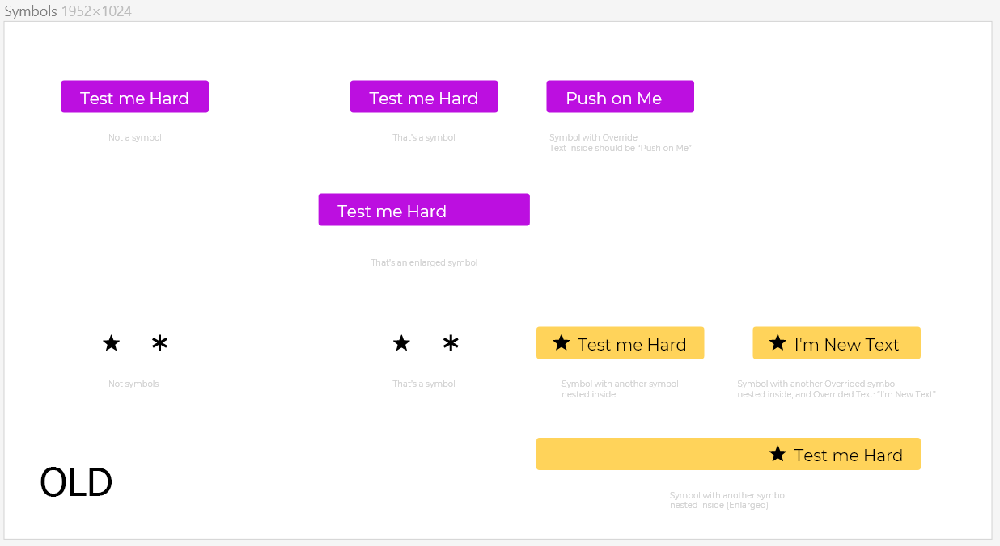
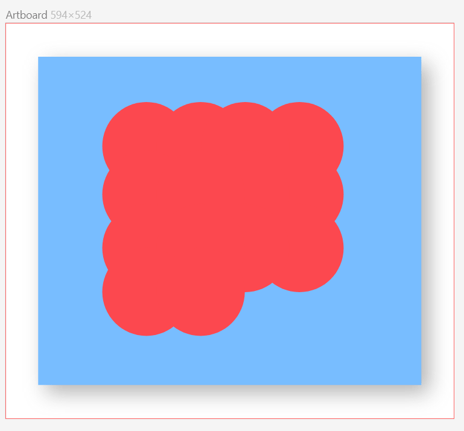

## Download
---
 [Offline installer](https://desktop.icons8.com/lunacy/LunacySetup_3.2.exe)

 [Get from windows store](https://www.microsoft.com/store/apps/9pnlmkkpcljj?ocid=badge)

 [Portable (no installer)](https://desktop.icons8.com/lunacy/LunacyPortable_3.2.zip)

*Ensure [that VC++ redistributable 2015](https://www.microsoft.com/en-us/download/details.aspx?id=48145)
and [Net framework 4.6.1](
https://www.microsoft.com/en-us/download/details.aspx?id=49981) is installed on your machine*

## Changes
---

### Add

- UI for initial shadow support
- saving state of rulers from last session
- hotkeys now shown in tooltips
- Undo/Redo support for text line height property
- shape override in symbols
- nested symbols support
- blend mode support for objects
- flip(mirror) object tool

### Change

- guide and distance lines restyled
- scroll to first object when select another page
- new icons for flip tool

### Bug fix

- right panel layout fixes in scroll-view mode
- weight of text was broken after first select of text object
- constraint calculations fixed
- text objects height calculation fixed
- default Boolean operations in combined shapes fixed in sketch files [image]
- after group member resized it was dropped out of it's group
- typeface was reset after select text object
- fixed preview image aspect radio when saving to sketch
- performance improvements
- art-board grid tuned

---
## Symbols and constraints support

## Blend modes support

