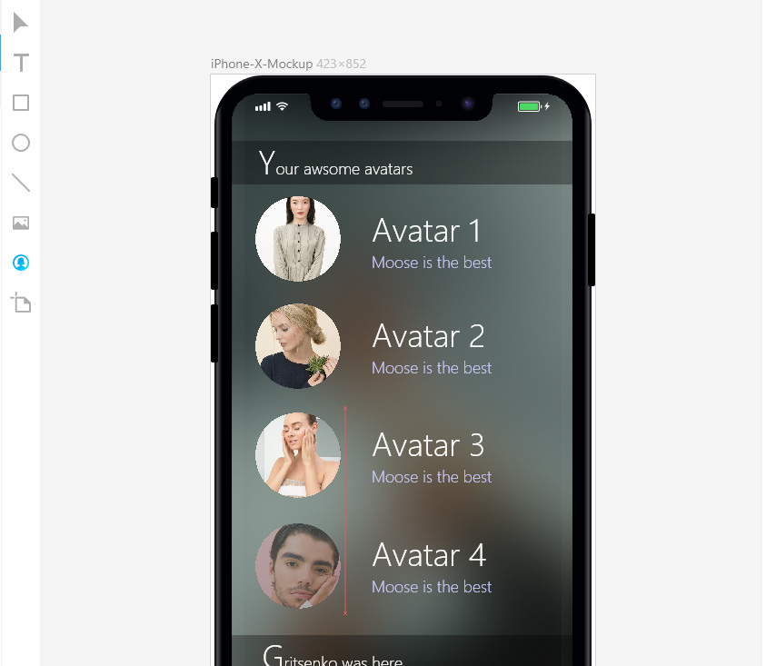
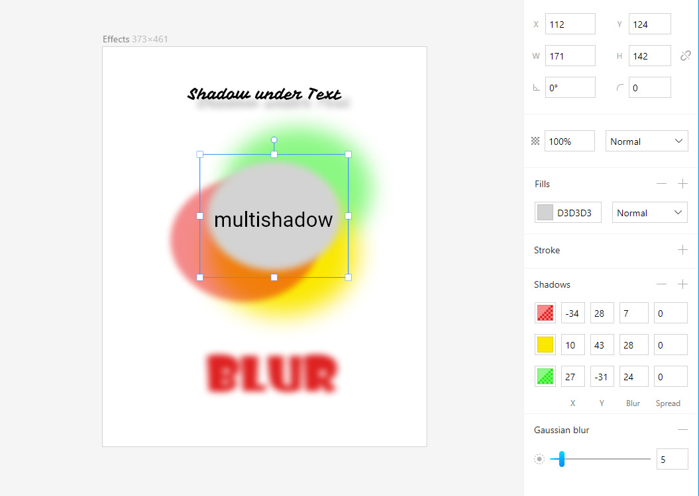

## Download
---
 [Offline installer](https://desktop.icons8.com/lunacy/LunacySetup_3.3.exe)

 [Get from windows store](https://www.microsoft.com/store/apps/9pnlmkkpcljj?ocid=badge)

 [Portable (no installer)](https://desktop.icons8.com/lunacy/LunacyPortable_3.3.zip)

*Ensure [that VC++ redistributable 2015](https://www.microsoft.com/en-us/download/details.aspx?id=48145)
and [Net framework 4.6.1](
https://www.microsoft.com/en-us/download/details.aspx?id=49981) is installed on your machine*

## Changes
---

### Added

- sketch v50 format support
- math in numeric text fields
- blur and shadow effects support
- new Avatar tool, which add random avatar images in one click
- hotkey for toggling rulers: `Ctrl`+R
- animation, when select artboard preset

### Changed

- styles and colors of UI controls became more consistent
- icons updated
- removed object properties when artboard tool is active
- fonts from different sources are sorted by name in fonts dropdown list

### Bugs fixed

- closing main menu by clicking outside of it
- sketch file loading error when it has long text objects with inline styles
- file name fix on "Save as" dialog
- fixed object renaming in layer tree
- text alignment was reset when other properties was changed
- increased color precision when loading and save sketch files

---
## New Avatar tool

## Effect editors

