---
# Page settings
layout: default
keywords:
comments: false

# Hero section
title: Styling
description: Learn about tools that will help you create your unique style
icon: 'design'

# Micro navigation
micro_nav: false

# Page navigation
page_nav:
    next:
        content: Components
        url: '/components'
    prev:
        content: Text
        url: '/text'
---

## Introduction

Styling options that you can apply to layers in Lunacy include:

* Fills (solid, gradient and image fills)
* Borders
* Outer shadows
* Inner shadows
* Blurs (Gaussian and background)

They appear in the Inspector when you select layer. A combination of styling options applied to a layer is called a layer style. You can save layer styles for further use (read <a href="https://docs.icons8.com/layerstyles/" target="_blank">here</a> for details).

You can apply styling options to all <a href="https://docs.icons8.com/layers/#introduction" target="_blank">types of layers</a>, except for technical ones (such as artboards, hotspots and slices). However, the only option applicable to group layers and components is the outer shadow.

In addition to the above, text layers feature typography settings, such as font, font size, line spacing, etc. Combined with the common styling options (or without them) they make up <a href="https://docs.icons8.com/layerstyles/#text-styles" target="_blank">text styles</a>.

The details about using each of the options you will find in the sections below. But first of all let us review some common things.

## Adding, deleting, and managing styling options

To apply a fill, border or any other styling to a layer:

1. Select the required layer.
2. Click the + button next to the respective styling section in the Inspector. A row of controls appears.
3. Use these controls to define the required styling parameters (see the demo below).

<video autoplay="" muted="" loop="" playsinline="" width="auto" poster="/public/styling-commondemoph1.png" height="auto"><source src="/public/styling-commondemo2.mp4" type="video/mp4"></video>

The things that you should know:

* Each layer can have multiple styling options of the same type (except for blurs). For instance, you can apply an image fill to a layer and a semi-transparent solid fill on top of it. Also, a layer can have several borders or shadows. Just click the + icon to add another row of settings.

* You can drag these rows of settings up and down to adjust the position of their instances on the canvas.

* You can temporarily disable some of the settings, by clicking the eye icon.

* To delete a row of settings, select it and click the trash icon.

All these things are shown in the next demo. It presents a layer with a single fill and three borders.

<video autoplay="" muted="" loop="" playsinline="" width="auto" poster="/public/styling-commondemoph2.png" height="auto"><source src="/public/styling-commondemo4.mp4" type="video/mp4"></video>

## [Color controls](#color-controls)

Color controls appear in all styling sections (except for blurs) and serve for defining the color of the selected layer or its borders or shadows.

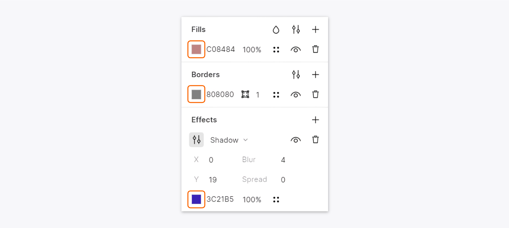

You can:

* Click the color box and use the [color picker](#color-picker).
* Manually enter or paste the HEX value of the required solid fill.
* Copy the HEX, RGBA, HSB, or HLS value of the current solid fill. For this, right-click over the text box and select the required option on the displayed menu as shown in the figure below.

The last two options do not apply to shadows as they don't have the color text box.

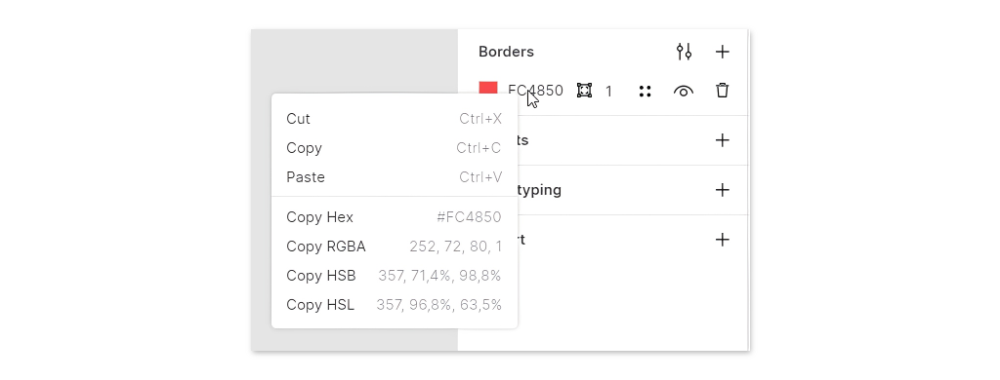

## [Color picker](#color-picker)

To open the color picker, click the color box in the styling section you are working with.

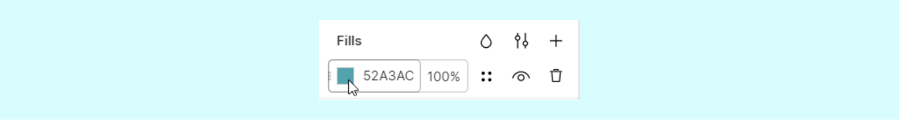

The figure below shows a view of the color picker invoked from the fills section.

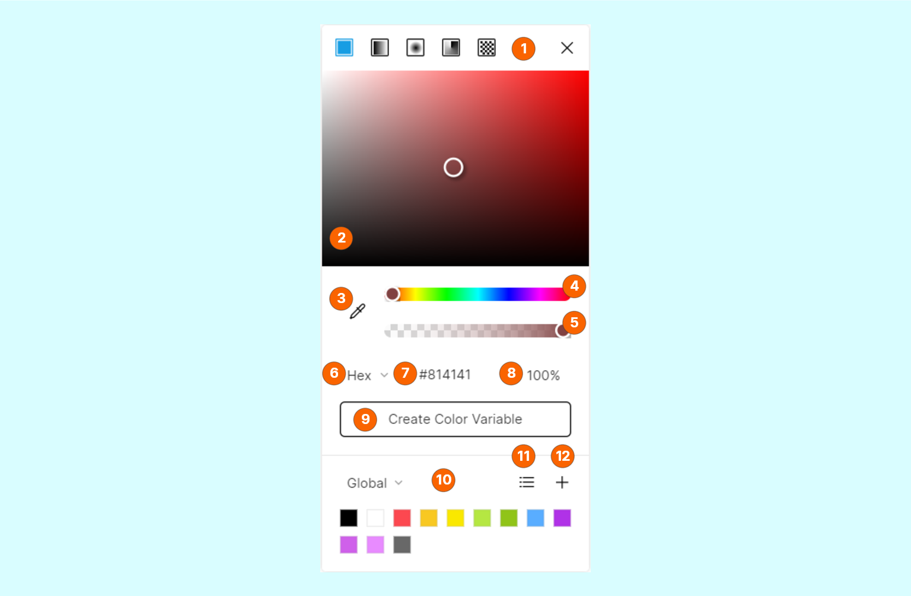

It features the following controls:

1. Fill type buttons. Available on the fill and border color pickers only.
2. Color selection box. That is where you will select colors.
3. The eyedropper tool. For details about using it, read <a href="https://docs.icons8.com/tools/#eyedropper-tool" target="_blank">here</a>.
4. Color selection bar. Allows you to quickly navigate through colors.
5. Opacity bar.
6. The color code selector. Displays the code of the currently selected color:
    * **HEX**
    * **RGB**
    * **HSB**
    * **HSL**
7. The color code entry field.
8. The opacity entry field.
9. This button invokes the color variable editing mode.
10. The panel of preset colors. To speed up your work with colors, you can save them for further use and select them directly from this panel. There are two types of preset colors:
    * **Global** colors appear on the color picker in all documents.
    * **Document** colors belong only to the current document.
    
    To switch between the panels of global and document colors click the panel name. To delete a preset, right-click over it, then select **Remove** on the displayed menu.
11. Use this button to switch the panel of presets between the list and grid view. In the list view, you can give names to colors: right-click a color and select **Rename** on the displayed menu (see the demo below).
12. Use this button to add the currently selected color to **Global** or **Document** presets.

<video autoplay="" muted="" loop="" playsinline="" width="auto" poster="/public/styling-pickerph1.png" height="auto"><source src="/public/styling-picker1.mp4" type="video/mp4"></video>

## [Color variables](#color-variables)

Color variables let you efficiently manage colors in your documents and instantly recolor all the layers using the same color variable. You can apply color variables to [fills](#fills), [borders](#borders), and [shadows](#shadows).

In the Inspector, color variables appear as colored circles (), while regular fills, border and shadow colors appear as colored rectangles ().

To create a color variable:

1.	Select a layer.
2.	Invoke the Color Picker from the Inspector.
3.	Set the required color.
4.	Click **Create Color Variable**.

To apply an existing color variable, select a layer, click  in the Inspector, then select the required color variable.

To edit a color variable, click over the colored circle in the Inspector, then click  > **Edit variable**.

To detach a layer from a color variable, select the layer, then click  in the Inspector.

## [Fills](#fills)

There are three major types of fills:

1. Solid fills (default).
2. Gradient fills that can be:
    * Linear
    * Radial 
    * Angular
3. Image fills.

The figure below shows a view of settings in the **Fills** section.

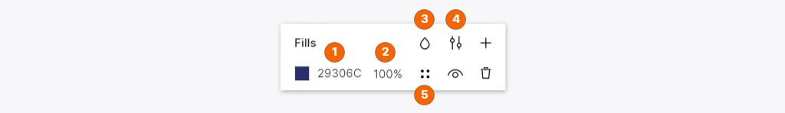

The section features the following controls:

1. The [color control](#color-controls) for setting fills.
2. The opacity control.
3. The blend mode control. Blend modes determine, in case of multiple fills, how the top fill blends with the fill underneath. Understanding blend modes is mainly a matter of practice and experimenting, but if you need some theory, you can read it <a href="https://en.wikipedia.org/wiki/Blend_modes" target="_blank">here</a>.
4. This button opens the panel where you can select between the *<a href="https://en.wikipedia.org/wiki/Nonzero-rule" target="_blank">Non-Zero</a>* and *<a href="https://en.wikipedia.org/wiki/Even–odd_rule" target="_blank">Even-Odd</a>* options for filling overlapping paths.
5. This button opens a list of [color variables](#color-variables) 

### Solid fills

To define a solid fill:

* Click the color box in the color control and use the [color picker](#color-picker) to define the required color.

  OR
* Type or paste the HEX code of the required color in the edit field and press `Enter`.
 
### Gradients

Gradients are combinations of two or more colors blended into each other within the same fill layer.

To add a gradient fill:

1. In the **Fills** section of the Inspector, click the color box. The [color picker](#color-picker) appears.
2. At the top of the color picker click one the following buttons (1) to select the gradient type:

    *  - linear
    *  - radial
    *  - angular

    As you do it, the gradient bar (2) with two handles gets displayed in the color picker. Also, you will see a gradient control with two color points (3) over the layer. The appearance of the gradient control depends on the selected gradient type. The next figure shows a linear gradient (see also the demos below).

    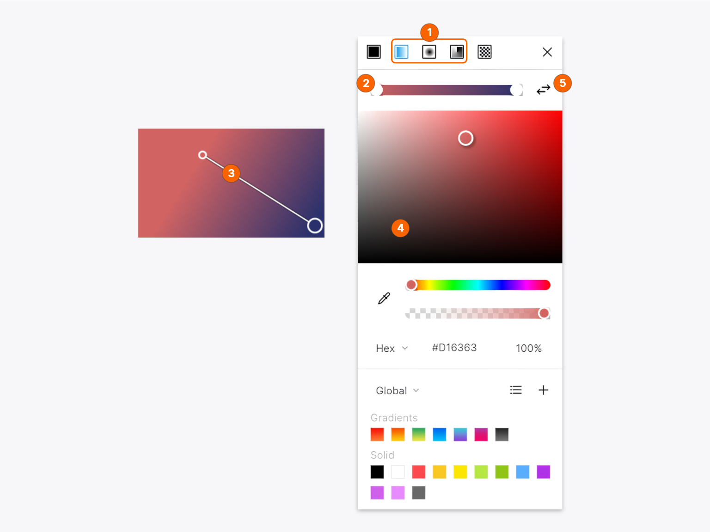

3. Use the gradient control and/or the gradient bar to get the desired effect. The handles on the gradient bar correspond to color points over the layer. Actions applicable to all types of gradients:

    * To change the color of a color point click it (or its respective handle on the gradient bar), and select the required color in the color selection box (4).  
    * To add a color to a gradient, just click over the gradient bar  or the gradient control. To adjust the color position move the handles or color points.
    * To delete a color, point the cursor over the respective color point or handle and press `Del`.

4. (optional) To save a gradient to presets, select the preset type (*Global* or *Document*) and click the plus icon.
5. (optional) To invert a gradient use the button (5) next to the gradient bar.
6. Close the color picker when you are done.

#### Linear gradients

The demo below shows what you can do when adding a linear gradient.

<video autoplay="" muted="" loop="" playsinline="" width="auto" poster="/public/styling-lineargradph2.png" height="auto"><source src="/public/styling-lineargrad2.mp4" type="video/mp4"></video>

#### Radial gradients

When you select the radial type, the gradient control becomes a radius of a circle. You can:

* Select the edge color point to change the size of the circle.
* Select the center color point and drag it to reposition the origin of the gradient.
* Drag the square handles on the edge of the circle to resize or reshape it into an ellipse.

<video autoplay="" muted="" loop="" playsinline="" width="auto" poster="/public/styling-radialgradph3.png" height="auto"><source src="/public/styling-radialgrad3.mp4" type="video/mp4"></video>

#### Angular gradients

When you select the angular type, the gradient control takes the form of a circle with color points sitting on its edge. Drag the points around the circle to get the desired gradient. Add some extra color points, if needed.

<video autoplay="" muted="" loop="" playsinline="" width="auto" poster="/public/styling-angularph2.png" height="auto"><source src="/public/styling-angular2.mp4" type="video/mp4"></video>

### Image fills

To create an image fill:

1. Click the color box.
2. In the top bar of the color picker, click .
3. Click **Choose image**.
4. In the displayed dialog box, select the required image on your computer and click **Open**. See also the tip below.
5. Use the drop-down list below the **Choose image** button to select the fill method:
    
     * **Fill**. Adjusts the image size to the layer's width.
     * **Fit**. Adjusts the image size  to fit the layer's height.
     * **Stretch**.  Stretches the image for it to fit the layer's height and width.
     * **Tile**. Tiles the image to fit the layer. The size of tiles is adjustable (see the demo below).
6. Close the color picker, when you are through.

<video autoplay="" muted="" loop="" playsinline="" width="auto" poster="/public/styling-imagefillph1.png" height="auto"><source src="/public/styling-imagefill2.mp4" type="video/mp4"></video>

    
<strong>Tip:</strong> You can also create an image fill by holding down <b>Ctrl</b> (<b>⌘</b>) and dropping an image from your desktop or from the Lunacy library on to the layer as shown in the demo below.
 
As a matter of fact, what the <a href="https://docs.icons8.com/tools/#avatar-tool" target="_blank">avatar tool</a> does is that it creates rounded rectangles with image fills, where images are random photos of people.

    
For more tips and tricks, click <a href="https://docs.icons8.com/tips/" target="_blank">here</a>.

<video autoplay="" muted="" loop="" playsinline="" width="100%" poster="/public/styling-addimagefillph.png" height="auto"><source src="/public/styling-addimagefill1.mp4" type="video/mp4"></video>

## [Borders](#borders)

As the name of this styling section suggests, here you will manage the appearance of borders in shapes. But it is also the place where you will define the color, thickness and other parameters of lines, curves, arrows and other open paths.

The figure below shows a view of settings in the **Borders** section.

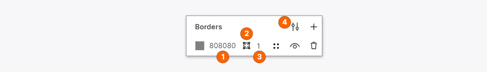

The section features the following controls:

1. The [color control](#color-controls) for setting border colors. You can apply both solid and gradient fills to borders.
2. The border position control. Available for closed paths (shapes) only. You can choose between the inside, outside or center (default) of the outline. The difference between these options is shown in the figure below. The only option available for open paths (lines, arrows, curves, etc.) is the *center*.
3. The borders thickness control. Sets the thickness of a border or an open path in pixels.
4. This icon opens the advanced border settings (see the next section).

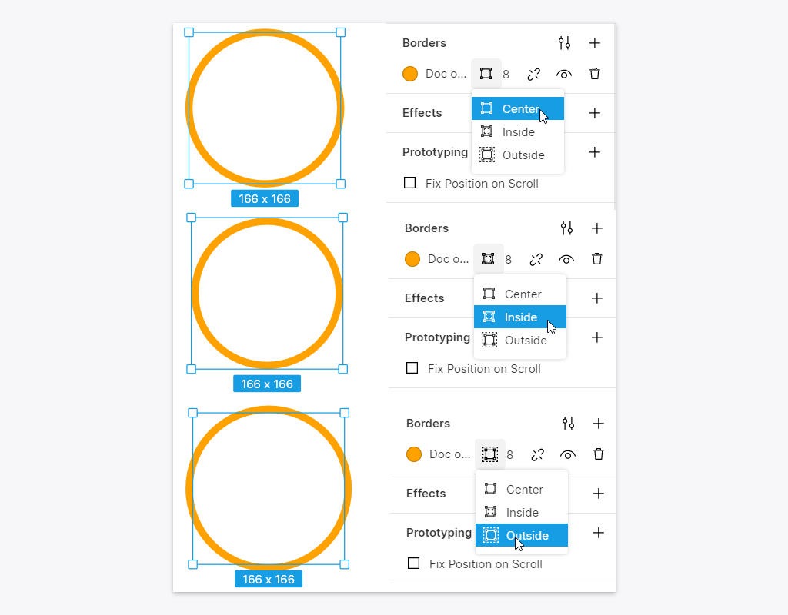

{:.image-info}
From top to bottom: center, inside, and outside borders

### Advanced border settings

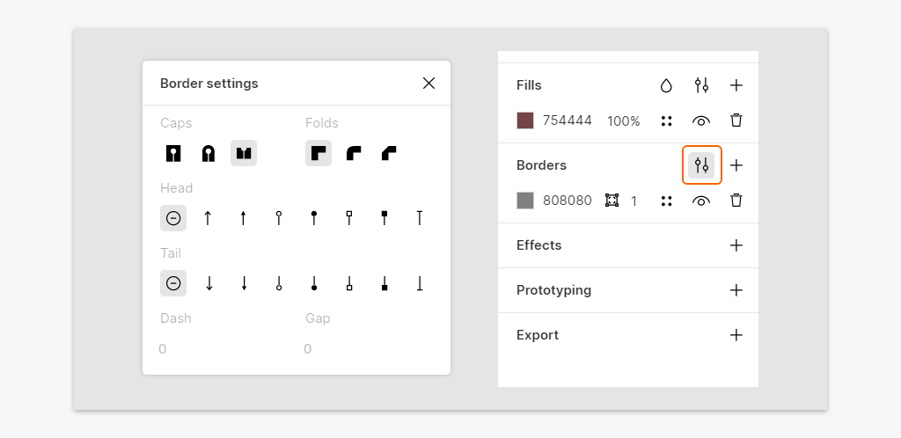

The advanced border settings include:

* **Caps**. Use these controls to define the shape of endings of open paths: no endings, round or square (see the demo below). The settings are applicable to paths drawn with the Line, Arrow, and Vector tools.
* **Folds**. Use these controls to adjust the appearance of corners of paths drawn with the Vector tool. Also, they work with arrow heads and tails.

<video autoplay="" muted="" loop="" playsinline="" width="auto" poster="/public/styling-capsfoldsph1.png" height="auto"><source src="/public/styling-capsfolds1.mp4" type="video/mp4"></video>

* **Head** and **Tail**. Use these controls to define the appearance of endings of open paths drawn with the Line, Arrow, and Vector tools.

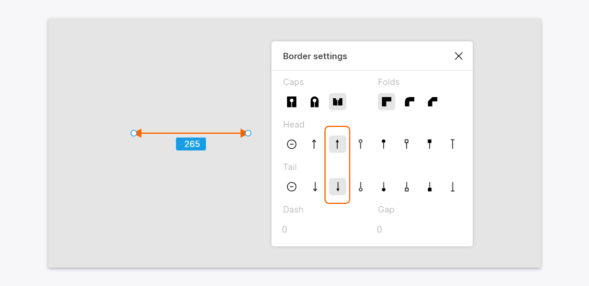

* **Dash** and **Gap**. Use these controls to create dashed lines or borders. Define the length of dashes and gaps between them in respective edit boxes. To restore a solid line/border, set all the values to *0*.

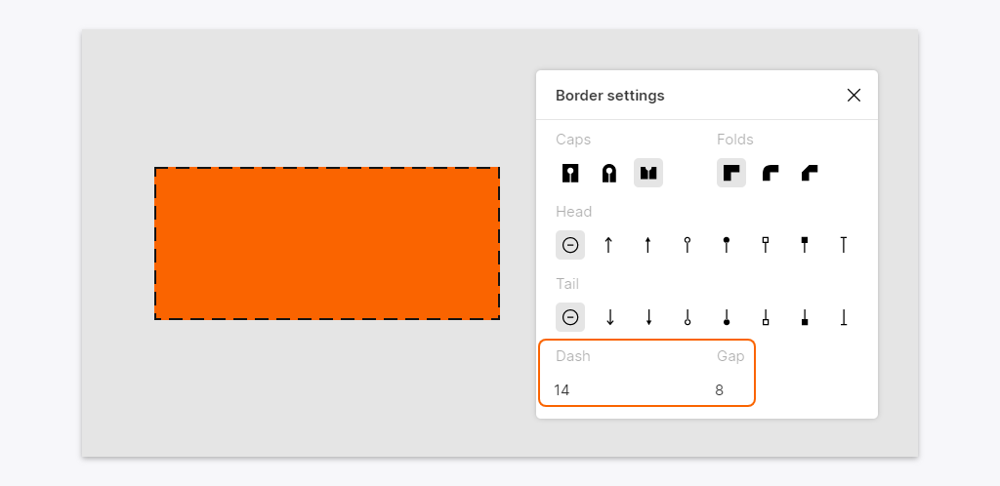

## Effects

Use the **Effects** section of the Inspector when you want to add shadows or blurs:

1. Click `+` next to the section name.
2. From the drop-down lost select the required effect.
3. Click  and set the required values.

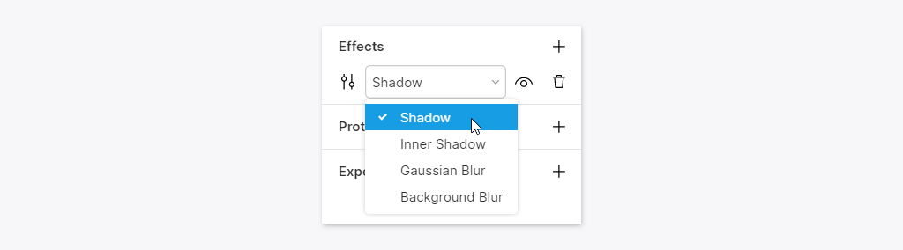

For details about shadows and blurs, read below.

### [Shadows](#shadows)

You can apply outer and inner shadows to layers. Both these types have the same controls that include color, X and Y offsets, blur and spread. There can be multiple shadows of the same type.

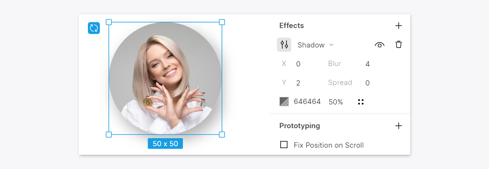

### Blurs

Lunacy provides two types of blurs:

* **Gaussian** - blurs the selected layer.
* **Background** - blurs the layer underneath the selected layer. To see the background blur effect, you should delete or hide the fill of the selected layer or set its fill opacity to less than 100%. When working with this type of blur, in addition to the blur value you can also adjust the saturation of the blurred layer.

<!--

To switch between blur types, click the down arrowhead next to a blur name and select the required option.

-->

In the demo below, we first applied a Gaussian blur to an image, removed it and then applied a background blur to a rectangle above the image.

<video autoplay="" muted="" loop="" playsinline="" width="100%" poster="/public/styling-blursph1.png" height="auto"><source src="/public/styling-blurs2.mp4" type="video/mp4"></video>

    
<strong>Note:</strong> Blur is quite a demanding effect in terms of computing resources. Avoid excessive use of blurs within a document. For this reason, we limited the maximum blur value that you can set using the slider to <i>50</i>. However, manually you can set values up to <i>10,000</i>.

## Applying styling options to multiple layers

You can apply styling options to multiple selected layers at the same time. If you see the *Click + to replace mixed content* caption under any of the options, it means that the selected layers have different settings for this option. A click over the plus icon will replace current settings with new ones common for all selected layers. In the figure below, this caption appears under the **Fills** section.

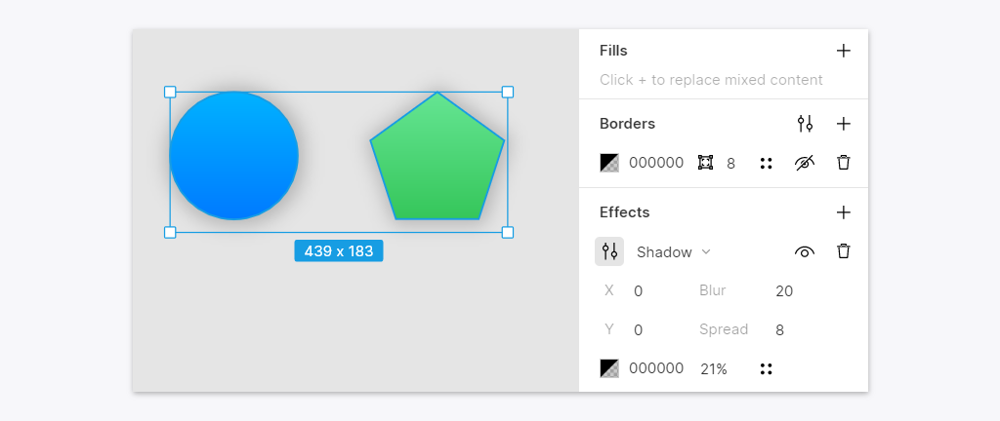

## Tints

Tints are a quick and easy way to apply a color to grouped layers and component instances. They are particularly useful when you need to adjust the color of a semi-filled layer or a complex icon (see the demo below).

<video autoplay="" muted="" loop="" playsinline="" width="auto" poster="/public/styling-tintsph2.png" height="auto"><source src="/public/styling-tints2.mp4" type="video/mp4"></video>

The **Tints** section appears in the Inspector only when you select a group layer or a component.

Unlike other styling options, you can apply only one tint to a layer.

### Tint overrides

Tint overrides can be handy, for instance, when you are designing tabs or panels with elements that can have different states expressed through different colors.

    
<strong>Note:</strong> Before using tint overrides you should add default tints.

The demo below shows three instances of the same component. We first applied a tint override to a nested element, then switched to the <a href="https://docs.icons8.com/components/#editing-main-components" target="_blank">component edit mode</a> and modified the default tint. In the latter case, the change applied only to the instances without the override.

<video autoplay="" muted="" loop="" playsinline="" width="auto" poster="/public/tintoverridesph3.png" height="auto"><source src="/public/tintoverrides3.mp4" type="video/mp4"></video>

When you apply an override, the reset button appears in the **Tint** section of the Inspector. Use this button to remove the override.

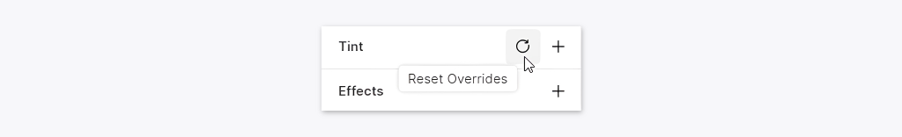

For details about overrides, read <a href="https://docs.icons8.com/components/#overrides" target="_blank">here</a>.

<!--

## Suggestions panel

The suggestions panel appears when you select a shape or an open path. It displays suggestions of styling options based on your previous actions and choices. In case you've just started using Lunacy, the panel will provide some preset styles.

Also, the list of suggested options depends on the background: Lunacy excludes options that would be scarcely visible against the current background.

A view of the panel is shown in the figure below.

It features a set of independently scrollable columns that include:

* **Layer styles** (1). Each style is a combination of two or more styling options (fills, borders, shadows and blurs).
* **Fill styles** (2). A collection of fills. If you don't see the required color, double-click over any of the suggested colors. It opens the Color Picker where you can select a color of your choice.
* **Border styles** (3). A collection of border and outline styles.
* **Effect styles** (4). A collection of inner and outer shadows and blurs. Unlike the other columns, the content of this column does not change.
* **Corner radius** (5). Available for rectangles only. Values appear in the ascending order. If you don't see the required value, double-click over any of the values, type the required one and press `Enter` to submit.
* **Background**. Disabled by default. Sets the color of the object overlapped by at least of 50% percent of the surface of the selection. If you don't see the required color, double-click over any of the suggested colors. It opens the Color Picker where you can select a color of your choice.

### Changing the position of the panel

If you want to change the position of the suggestions panel, click the handle at the top-left corner of the panel and drag it up or down. Lunacy remembers the position of the panel individually for each object.

<video autoplay="" muted="" loop="" playsinline="" width="auto" poster="/public/sugg-positionph.png" height="auto"><source src="/public/sugg-position.mp4" type="video/mp4"></video>

### Resizing the panel

You can resize the panel to your liking by dragging its lower and right borders. Note that dragging by the right border extends the right-most column, while dragging by the lower-right corner of the panel extends the left-most column of the panel.

To change the size of other columns, hover the cursor between two columns and drag to the right or left when the cursor turns into a double-headed arrow (see the demo below).

<video autoplay="" muted="" loop="" playsinline="" width="auto" poster="/public/sugg-resizeph.png" height="auto"><source src="/public/sugg-resize.mp4" type="video/mp4"></video>

### Managing the content of the panel

A right-click over the suggestions panel invokes a context menu that allows you to:

* Pin your favorite items to the top of the list. Pinned items appear with a dark triangle at the lower-right corner.
* Delete items that you no longer need or will never use. For this, use the **Don't show this again** command.
* Hide/show some of the columns by clearing/selecting the respective option on the menu (see the figure below).

### Disabling the panel

To disable the suggestions panel, use the `Ctrl+Space` shortcut or click the bulb button on the action bar (see the figure below).

Also, you can unselect the **Suggestions** option in the **View** menu.

-->
