---
# Page settings
layout: default
keywords:
comments: false

# Hero section
title: Styling
description: Learn about tools that will help you create your unique style
icon: 'design'

# Micro navigation
micro_nav: false

# Page navigation
page_nav:
    next:
        content: Export
        url: '/export'
    prev:
        content: Objects
        url: '/objects'
---

You can change the styling options for each object in your document. All styling properties for your objects are available in the Inspector. If you decide to remove styling from an object, you need to select the object and hit the ‘-‘ button.

## Color Picker

Choose and save colors.

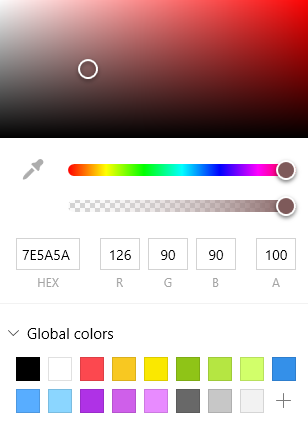

## Gradients

Create and edit gradients.

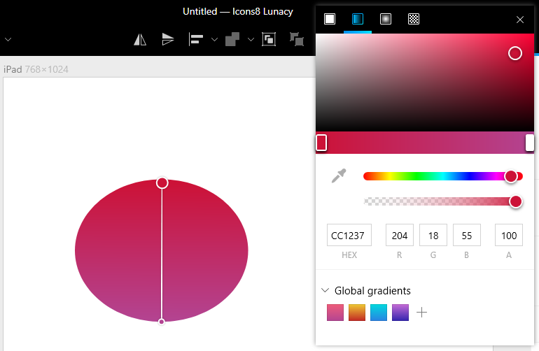

The following types of gradients are supported in Lunacy:

* Linear gradient

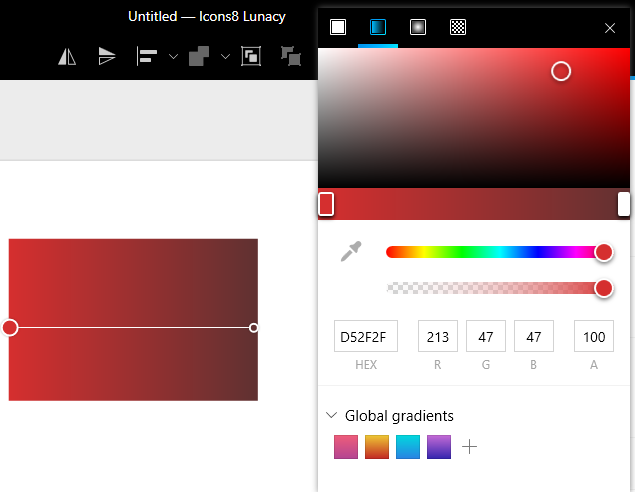

* Radial gradient

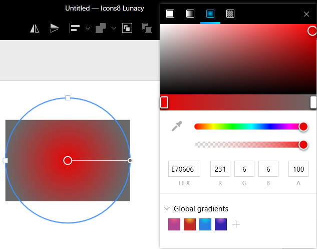

## Effects

Effects each need more explanation. Combining effects. Blending modes.

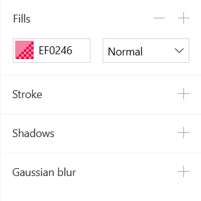

## Shadows

When Shadow is enabled for the object, it will cast the shadow outside of the shape. You can define the shadow’s X and Y position, as well as blur, radius, spread and color.

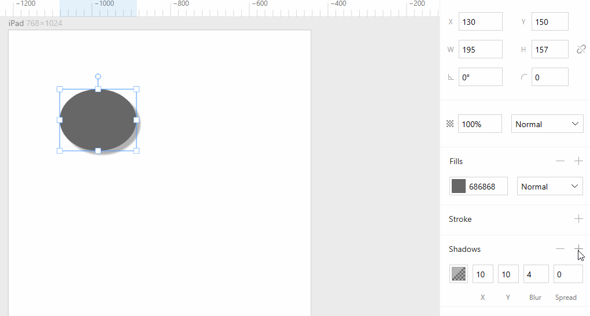

## Strokes

All objects, with the exception of text layers, can contain strokes. These can all have various thicknesses, colors and blending modes.

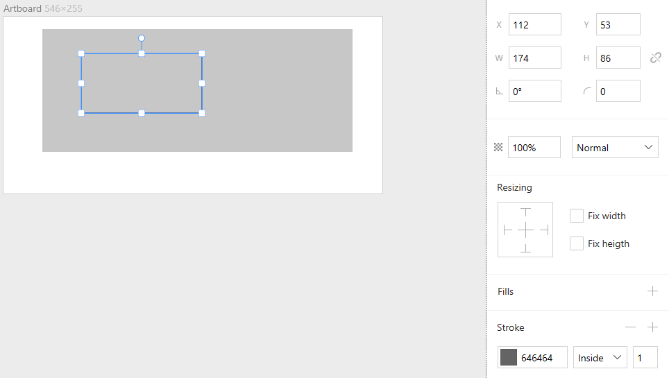

The border position of a stroke can be center, inside or outside.

Applying a 10px stroke for a rectangle object: Original object, center stroke, inside stroke, outside stroke

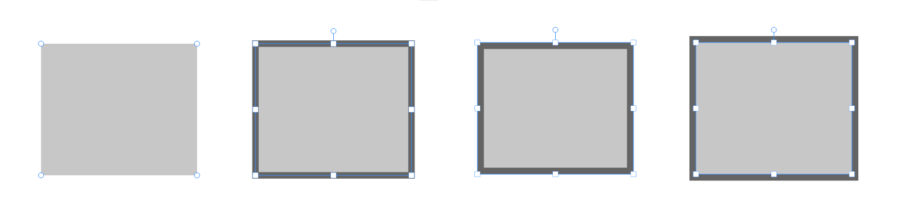

## Gaussian Blur

Gaussian blur is a blur type that will accurately blur in all directions.

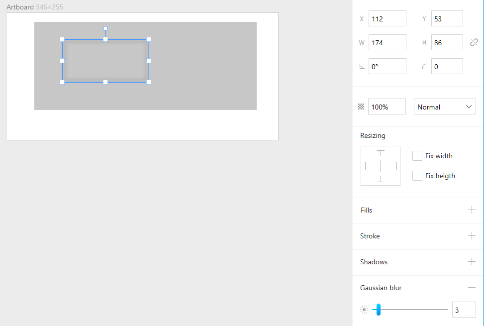

## Formulas

Inspector also supports formulas. You can type anything from 2+2, to complex algebra.

You can drag the values up and down; they will increase or decrease.

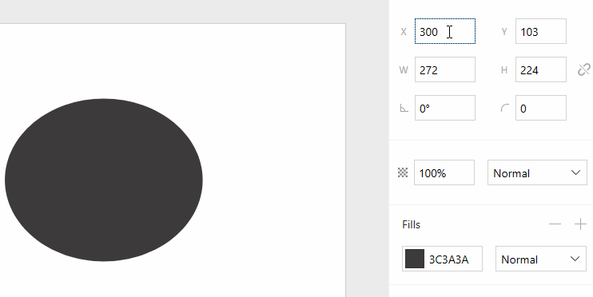

## Rounded Corner Hack

You can specify the radius for each corner separately. To do so, type 4 values, each separated  with a space.

This property is especially handy for tabs.

## Margins and Distances

Lunacy shows margins, as well as distances between elements.

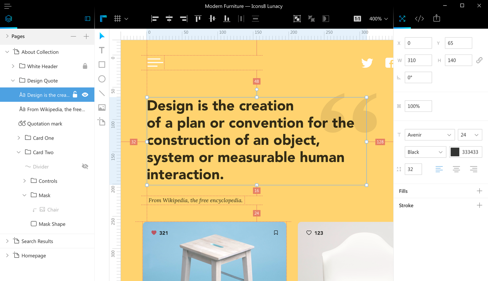