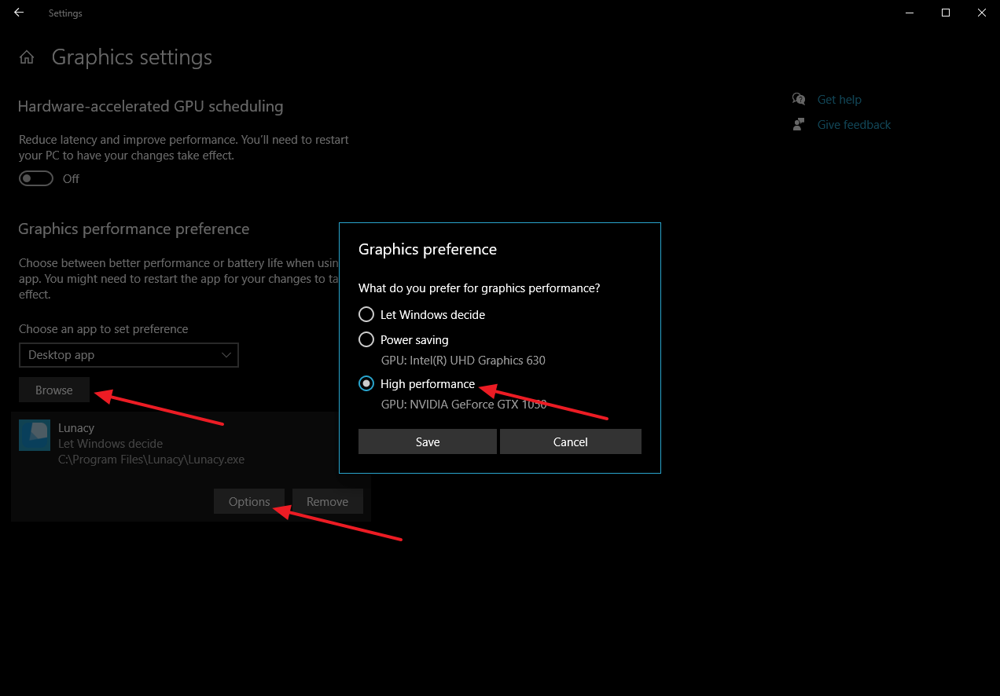
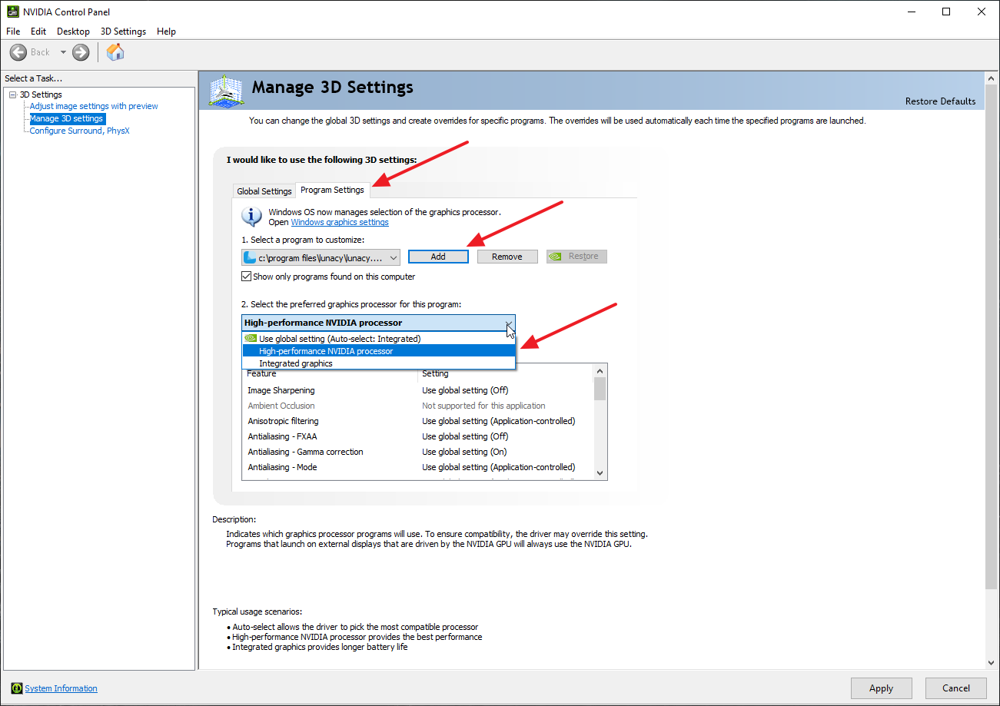
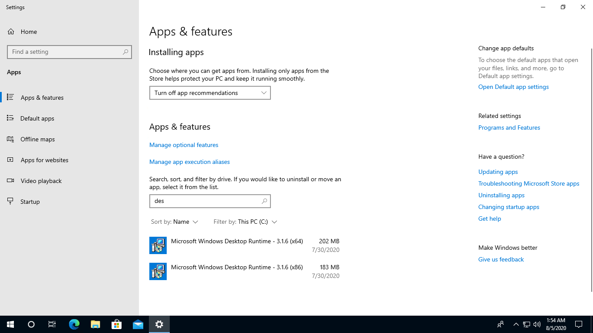

---
# Page settings
layout: default
keywords:
comments: false

# Hero section
title: FAQ and Сontacts
description:
icon: 'technical-support'

# Micro navigation
micro_nav: false

# Page navigation
page_nav:
    prev:
        content: Localization
        url: '/localization'
    next:
        content: Release History
        url: '/release-notes'
---

## FAQ

### What about a Linux version?

We receive many requests about Lunacy for Linux, but the thing is that Lunacy was created as an editor of .sketch files for Windows, so creating something for Linux is not a priority for us, as we would have to basically start from scratch and rewrite the whole interface to make that happen.

If you wish to contribute, you can join <a href="https://lunatics.icons8.com/ideas/1/version-for-linux" target="_blank">this thread</a>.

### What about a Mac version?

Lunacy was created as an editor of .sketch files for Windows and keeps heading this way, so we don't have plans for the Mac version within the foreseeable future. You can try Sketch instead or leave your suggestion <a href="https://lunatics.icons8.com/" target="_blank">here</a>.

### Is it really free?

 Yes. Lunacy is absolutely free: no hidden charges, no ads, no locked features. You can purchase our built-in assets (icons, photos and illustrations created by our team) in high quality if you need them for your project or if you just want to support us.

### Can I change the radius of a certain corner in a shape?

Thank you. That is one of our favorite questions. Check out the demos <a href="https://docs.icons8.com/editing/#adjusting-the-corner-radius-setting-for-rectangles" target="_blank">here</a>, <a href="https://docs.icons8.com/editing/#vector-editing" target="_blank">here</a> and <a href="https://community.icons8.com/uploads/default/original/1X/718c05c97ebb1fdbd09cd4e9579178e65f2e8afc.mp4" target="_blank">here</a>.

### I'm new to Lunacy. Where I can learn how to get started?

You can:

* Take an interactive tutorial (in Lunacy, go to **Help > Tutorial**)
* Read our <a href="https://docs.icons8.com/" target="_blank">docs</a>
* Watch our <a href="https://www.youtube.com/channel/UCIp9WVc3HlNF3TGqGvuDsnQ/videos" target="_blank">videos</a>

### Do I need internet connection to use Lunacy?

If you are not going to use the content of our <a href="https://docs.icons8.com/libraries" target="_blank">Libraries</a>, Lunacy doesn’t need to be connected to the internet.

### The content of Lunacy libraries is not loading. Why?

If you are sure that your internet connection is OK, contact us via the feedback form (in Lunacy, go to **Help > Report a problem**).

### How can I be sure that I won't lose my work if Lunacy crashes?

We understand how painful and frustrating it can be when you suddenly lose your unsaved progress due to a power outage, application crash or things like that. That is why Lunacy features the Shadow Copy mechanism that keeps track of all changes in your projects and silently saves them to temporary files.

Shadow copies of files that you have never saved appear in the folder of Lunacy temporary files*. When you save a file, the shadow copy of the file moves to the folder where the main file sits. Temporary files are hidden system files and to see them in a folder you should enable the display of such files in the Windows Explorer.

To prevent corruption of the main file, Lunacy first saves changes to the temporary file and only after successful saving replaces the old file with the new one.

{:.image-info}
\* C:\Users\YourUsername\AppData\Local\Icons8\Lunacy\NewProjects

### How can I downgrade Lunacy to one of the previous versions?

1. Uninstall the current version of Lunacy.
2. Download the required version and install it. The full list of versions with links to installers is <a href="https://docs.icons8.com/release-notes/" target="_blank">here</a>.

### Lunacy is slow. How can I fix it?

The most common reason for Lunacy getting slow are:

* Too many large-size images in a document. This often happens when a user imports lots of high-resolution images and then shrinks them to required dimensions.

    *Workaround:* Replace current images with their less heavy copies.
* Too many shadows and blurs.

    *Workaround:* Avoid excessive usage of shadows and blurs.
* Too many content-heavy artboards on a single page.

   *Workaround:* Try to move a part of artboards to another <a href="https://docs.icons8.com/interface/#document-pages" target="_blank">document page</a>.
* Large amount of text converted to outlines.

   *Workaround:* Avoid converting large blocks of text (sentences or paragraphs) to outlines.

### Is there a way to enhance Lunacy performance by adjusting video card settings?

If your computer features a discrete graphics card, you can adjust your graphics settings so that Lunacy will always use the discrete card.

The following will work for the majority of Windows 10 computers:

1. Go to **Start > Settings > Display > Graphics settings**.
2. Click **Browse**  and browse to the Lunacy.exe file (the default path is C:\Program Files\Lunacy\Lunacy.exe).
3. Click **Options** and  set **Graphics preference** to *High performance*.

If you are running an older Windows version, you can try to do the same using your video card control panel. The figure below shows settings of an NVidia card.

**Note:** These settings won't work in the energy saving mode and with some system configurations.

### Objects and images on the canvas are stretching and/or flickering on scroll and zoom. How can I fix it?

This is a known issue that typically occurs on Windows 10 computers with Intel CPUs and some latest models of video cards (for instance, GeForce RTX 20 Series).
 
Try the following:

1. Install the latest stable version of drivers for your video card from the manufacturer's website.
2. Make sure that you have all the latest Windows updates installed.
3. Install the latest update of the Intel chipset driver from the manufacturer's website.

If the above steps have no effect:

1. Open the Windows **Task manager** and switch to the **Services** tab.
2. Stop the Nahimic service (an audio service).
3. Restart Lunacy.

If this helps, report the problem to the manufacturers of your video card and motherboard. If not, contact our support team.

### I found a bug. How can I report it?

Contact us via the feedback form (in Lunacy, go to **Help > Report a problem**) and provide the details of the problem for us to reproduce it. If a problem manifests itself only with a specific file, please attach the file to the report. Don't worry about the content of the file, we will delete it after investigation.

### What is .Net Core?

.Net Core is a software framework developed by Microsoft. It is required for normal operation of Lunacy starting from version 6.0. 

### The "Download .Net Core" message appeared when I tried to launch Lunacy but I closed it. What should I do now?

To install .Net Core:

1. If you are running a 64-bit version of Windows, click <a href="https://dotnet.microsoft.com/download/dotnet-core/thank-you/runtime-desktop-3.1.6-windows-x64-installer" target="_blank">here</a>. If you are on a 32-bit machine, follow <a href="https://dotnet.microsoft.com/download/dotnet-core/thank-you/runtime-desktop-3.1.6-windows-x86-installer" target="_blank">this</a> link.
2. Download the installer.
3. Run the installer.

### Why does my antivirus flag Lunacy as suspicious?

Lunacy is free of viruses or spyware but in some rare cases false positives might occur.

If you installed Lunacy from the Microsoft Store, you should bear in mind that no app can appear in the Store until checked for malicious code.

If you downloaded Lunacy from our web site and want to be sure, you can upload and check the installer at <a href="https://www.virustotal.com/gui/home/upload" target="_blank">https://www.virustotal.com/gui/home/upload</a>. It is an acknowledged free online antivirus service.

After that, add the Lunacy installer and/or the application itself to the exception list of your antivirus software.

### Lunacy won't run. How can I fix it?

Make sure that:

* You have installed all the latest Windows updates and that you are not using an <a href="https://support.microsoft.com/en-us/help/10584/windows-10-stop-receiving-insider-builds" target="_blank">insider build</a>.

* You have the following components installed:

    * Microsoft Visual C++ 2015 (click <a href="https://www.microsoft.com/en-US/download/details.aspx?id=48145" target="_blank">here</a> to download)

    * Microsoft .Net Core 3.10+ (<a href="https://dotnet.microsoft.com/download/dotnet-core/thank-you/runtime-desktop-3.1.6-windows-x64-installer" target="_blank">64-bit version</a>, <a href="https://dotnet.microsoft.com/download/dotnet-core/thank-you/runtime-desktop-3.1.6-windows-x86-installer" target="_blank">32-bit version</a>)

    For this, check up the list of installed programs (in Windows, go to **Settings > Apps and Features**, see the figure below).

* You are using the latest stable version of the driver for your video card.
* Your user account has enough rights to run applications. Try to run Lunacy as administrator.
* Your antivirus is not blocking Lunacy. Disable virus protection and try to launch Lunacy.

### I can't log into Sketch Cloud through Lunacy. Why?

* If you are signing in with Sketch Cloud for the first time, make sure that the length of your username and/or password does not exceed 60 characters.
* Try to log into Sketch Cloud through its <a href="https://www.sketch.com/signin" target="_blank">website</a>. If these attempts also fail, then the problem is with Sketch Cloud. Wait until the service is restored.
* Make sure that you are not using proxy for internet connection. The Sketch Cloud API won't work through proxy.
* Make sure that Lunacy connection to the Sketch Cloud API is not blocked by adding exceptions to the Windows firewall, your antivirus and router.

If the problem persists, contact us via the feedback form (in Lunacy, go to **Help > Report a problem**).

<!--

It’s definitely an option, although it requires additional development. If you’re willing to contribute, please check out <a href="https://lunatics.icons8.com/ideas/1/version-for-linux" target="_blank">this thread</a>.

-->

### How about going Open Source?

Short answer: Not at the moment, not all of it.

Long answer: Certainly, that would speed up the development. On the other hand, it will slow it down too. Sometimes, a small team can advance more than a big community, especially in the beginning. We may reconsider it in the future.

If you are willing to contribute, you may want to create the interface for Linux. Check out [this thread](https://lunatics.icons8.com/ideas/1/version-for-linux).

<!--

### How do I scroll around the workspace?

You can scroll around the workspace in these ways:

* For vertical scrolling: `Mouse wheel` or Vertical scroll gesture on trackpad
* For horizontal scrolling: `Mouse wheel` `Shift` key or `Horizontal scroll` gesture on trackpad

### How to create and organize pages in Lunacy?

You can add, delete, and rename the pages.

* To add a page click on + sign on the page list and then hit Enter
* To rename/delete a page use the right mouse button on the needed page and choose Rename or Delete 

### How much are you planning to charge for Lunacy?

 Nothing. Lunacy is completely free (no hidden charges, no ads, no locked features).

### How would I know when to update Lunacy?

The Windows Store version updates silently. If not, check that you [have](https://support.microsoft.com/en-gb/help/15081/windows-turn-on-automatic-app-updates) automatic updates on. We recommend this option.

### Once there are updates, will I have to reinstall Lunacy, or do they install automatically?

If you installed Lunacy with a downloadable installer, it will notify you about the update with an alert in the window title.

Either way, you can check out our [release notes](https://docs.icons8.com/release-notes/).

-->

## Contacts

* [Community Support](https://community.icons8.com/) — our forum. The whole development team is there to help you.

* [Feature Requests](https://lunatics.icons8.com/) — a board similar to UserVoice. Vote for features and propose yours. One feature per post, please.

* [Improving This Manual](https://github.com/icons8/lunacy-docs/blob/master/docs/index.md) — we'll accept  pull requests for fixing errors, spelling and wording mistakes, inconsistencies or ideas on how to improve this manual.

<!--

please help us! We'll accept the pull requests for fixing the errors, expanding the sections, and updating it with new features (Icons8 team lags a little between adding a feature and writing the documentation for it). We'll also include the video tutorials covering certain features.

-->

* Saying hello — our [Lunacy page](https://icons8.com/lunacy) has comments at the bottom. If you have a review of our work or just want to say hello, you’re welcome!

* [Lunacy in the Windows Store](https://www.microsoft.com/en-us/p/lunacy/9pnlmkkpcljj) — we depend on your honest feedback. Please vote and leave a review so more people will learn about Lunacy. Thank you 🙏🏽
