---
# Page settings
layout: default
keywords:
comments: false

# Hero section
title: Symbols
description: Explore the power of Lunacy by learning how to use symbols
icon: 'refresh'

# Micro navigation
micro_nav: false

# Page navigation
page_nav:
    next:
        content: Layer and text styles
        url: '/layerstyles'
    prev:
        content: Styling
        url: '/styling'
---

**Symbols** are reusable objects or groups of objects that make your designs consistent and your life easier.

{:.is-big}
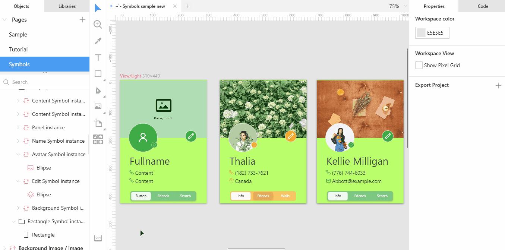

When working with symbols you should understand the idea of **master symbols** and **symbol instances**. For example, when you are designing a UI, you can create a button symbol (that will be a master symbol) and then add identical buttons (symbol instances) wherever you need them with just a click. If you later decide to change the size, shape or the color of your buttons, you'll need to modify only the master symbol, and the changes will immediately apply to all the instances.
Moreover, you can also change the text on one or even all instances. That will be an **override**. We will discuss overrides later in this section.

## [Creating symbols](#creating-symbols)

Select the object and perform one of the following actions:

* Click the plus icon on the symbols panel.
* Click the add symbol on the tool bar at the top of the window.
* Right-click and select **Create symbol** on the displayed menu.
* Press `Ctrl` + `Alt` + `K`, if you prefer shortcuts.

The **New symbol** dialog box appears.

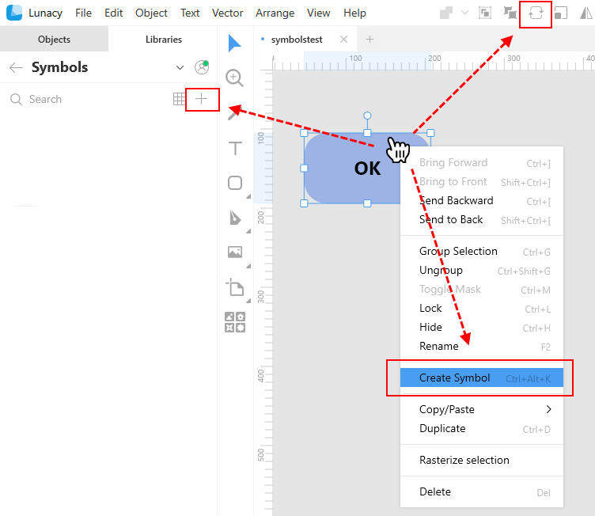

In the **New symbol** dialog box, define the name of the symbol and select the page where you will store your symbols and click OK.

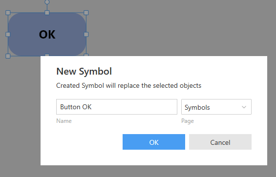

## [Symbols page](#symbols-page)

You should store all your symbols on a separate page apart from designs. When you create your first symbol within a project, Lunacy will offer you to save it to the default page named **Symbols**. This page will be added to the project automatically.

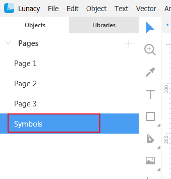

You can opt to select any other page but make sure that the primary intent of such page will be storing symbols.

For this, right-click the required page in the **Objects** panel an select **Set as Symbols page** on the displayed menu.

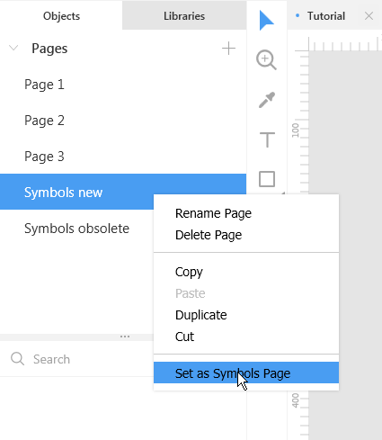

From now on, when you add new symbols, the **New symbol** dialog box will in the first place offer this page for saving symbols to.

## [Organizing symbols](#organizing-symbols)

As your project and the number of symbols in it grows, you will definitely face the need of organizing symbols into categories similar to those shown in the figure below.

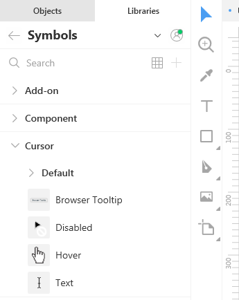

To divide your symbols into categories, consider the following format of symbol names:

`Category name / Subcategory name / Symbol name`  

For example, to organize your button symbols, you can give them the following names:

* Button / Blue
* Button / Grey
* etc.

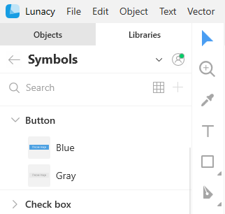

You don't need to manually create categories and subcategories. Lunacy will show them automatically based on symbol names. The number of nesting levels for subcategories is not limited.

To rename a symbol:

1. Go to **Libraries** > **Symbols**.
2. In the **Symbols** panel, right-click the symbol and select **Rename** on the displayed menu or use  `F2` as a shortcut.
3. Enter the new name and click `Enter`.

Also you can also rename  symbols through the **Objects** panel when you are on the **Symbols** page.

## Viewing symbols in the Symbols panel

There are two display modes for symbols in the **Symbols** panel:

* List mode: Shows more of your symbols library structure along with small previews of the symbols themselves.
* Grid mode: Shows larger symbol icons but it is less obvious from the library structure point of view, especially when the number of symbols in a category is large. It shows all the symbols from all the subcategories within a category.

To switch between the modes, click the **Show as List/Show as Grid** button at the upper-left corner of the **Symbols** panel.

To view a larger preview of a symbol, hover the cursor over the symbol icon for a moment.

To unfold/fold the content of all symbol categories, right-click anywhere over the category list and select **Expand All/Collapse All** on the displayed menu.

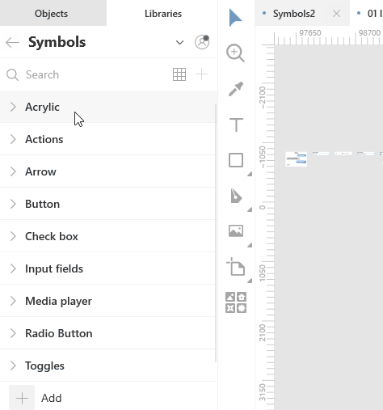

Also, to quickly find the required symbol, you can type its name in the search field at the top of the **Symbols** panel.

## Masters

As it was mentioned earlier, you should keep master symbols on a dedicated page.  In this section, you will learn other details of working with masters.

The first thing you should note is that names of master symbols appear in bold in the **Objects** panel. Also, all symbol names, of both masters and instances, come with the symbol icon () By clicking the name of a master, you can unfold it to see its content.

The figure below shows a view of a primitive master, which includes an automatically added symbol artboard with the name of the symbol at the top and a layered object.

The intent of symbol artboards is twofold:

* To provide full compatibility with the native .sketch files.
* To determine the object behavior during resizing.

You can choose to include or not to include the artboard fill into instances of a symbol. For this:

1. On the **Objects** tab, open the symbols page.
2. Click the symbol name in the list of objects.
3. Select/clear the **Include in instances** checkbox in the Inspector panel on the left.  

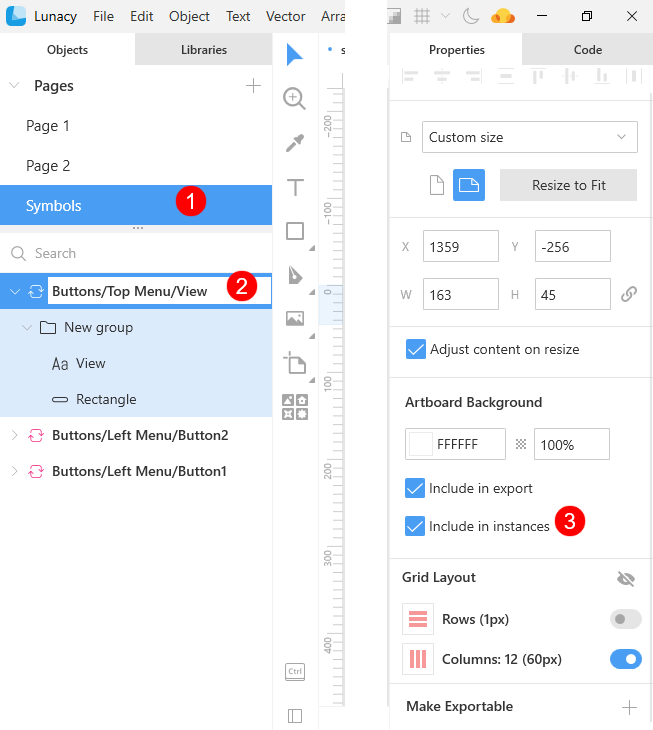

### Editing master symbols

To edit a master symbol:

1. Go to the symbols page.
2. Find the required symbol.
3. Expand the symbol node.
4. Edit the symbol the same way as any other layered object. You can change its size, color, text or any other properties using the set of tools in the Inspector.

The changes you make immediately apply to all the symbol instances across the project, except for the instances with respective overrides. The gif below shows how changes to a master symbol affect two its instances.

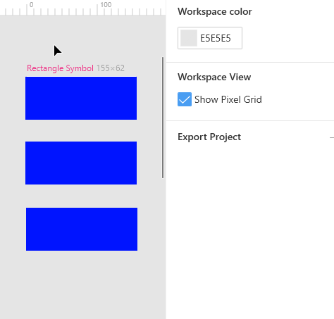

### Deleting  master symbols

To delete a master symbol, you should either do it from the **Library** or from the **Objects** panel.
Note that deletion of a master turns all its instances into groups.

## Symbol instances

Instances are copies of symbols that you use across your project.
In the **Objects** panel, symbols instances are displayed with the symbol icon in front of their names. Their names appear in regular type (while masters are displayed in bold) and have the following name format:

`<Symbol name> instance`  

Click the name of an instance to extend it. The nodes inside an instance are override nodes, that show the elements that you can modify for this symbol instance only.  For details about overrides, click [here](#overrides).

The figure below shows a view of a symbol (top) and the way it appears in the **Objects** panels and a view of an instance of this symbol (bottom).

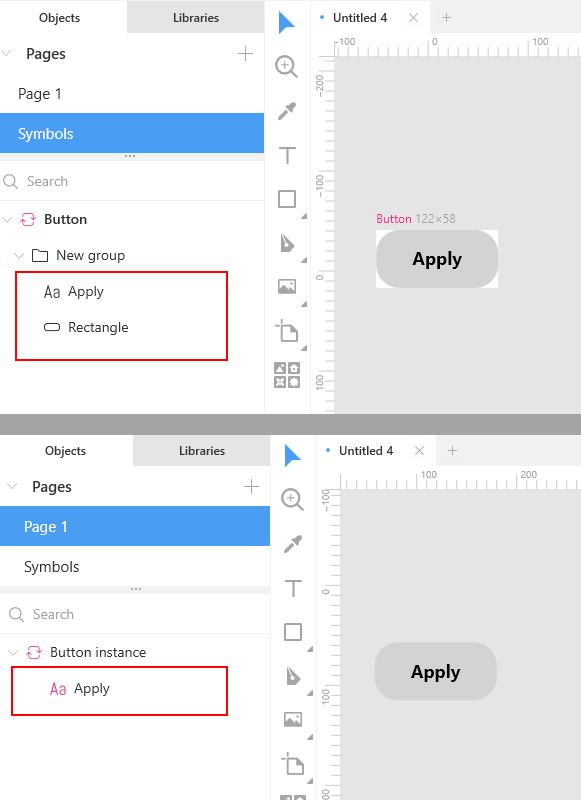

As you can see, the symbol node includes the text and the rectangle objects. You can change both these objects:

* The wording and its properties: font size, color, alignment, etc.
* The rectangle properties: size, color, shades, etc.

As for the instance, you can change only the wording (that will be an override) but cannot change typography properties.

### Adding instances to the canvas

To add an instance to a project page:

1. Switch to the **Libraries** tab.
2. Open **Symbols**.
3. Find the required symbol.
4. Drag the symbol to where you want it.

    OR

    Click the **Paste to workspace** icon at the left of the symbol block, if you are in the list view mode, or just click the symbol when in the grid view mode. This will add the symbol instance to the center of the visible canvas.

Also, you can hold down the `Ctrl` or `Shift` key, select and then drop several symbol instances on the canvas at a time.

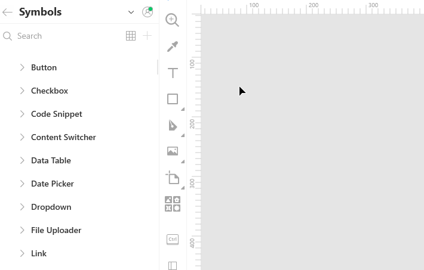

### Replacing instances

There are two ways to replace an instance on the canvas.

**Way 1.**

1. Select the symbol instance you want replace.
2. Find the new symbol on the symbols panel.
3. If you are in the list view mode, click the replacement icon at the left of the symbol block.

    OR

    If you are in the grid view mode, just click the symbol.

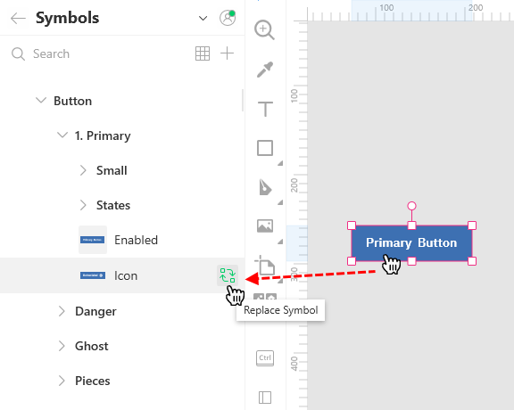

**Way 2**

1. Select the symbol instance you want replace.
2. In the **Symbol** section of the Inspector panel, click the down arrowhead to unfold the menu.
3. Use the menu to find and select the replacement symbol.

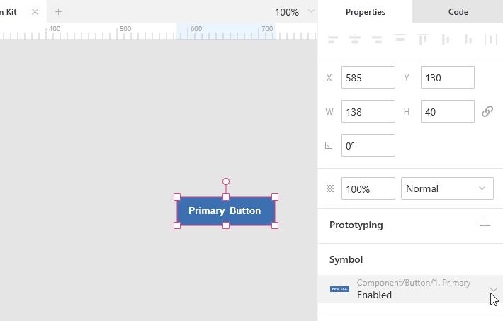

The menu features the following sections:

* Commands: Shows the list of symbol-related commands. Click [here](#symbol-related-commands) for details.
* Related: Shows the symbols that share the same category/subcategory with the selected symbol instance.
* Categories: Shows the list of available symbol categories. You can click through the categories and subcategories to find the required symbol. For your convenience, the category and subcategories to which the selected symbol instance belong will have a dot next their names (see the gif below). For details about how to organize symbols, read [here](#organizing-symbols).
* UI kits: Shows the list of external UI kits from where you can also select a replacement. For details about UI kits, click [here](https://docs.icons8.com/libraries/#ui-kits).

**Tip:** The size of the menu depends on the number of symbols and symbol categories in your project. If you don't see the content of the upper or lower menu sections in full, use the scroll.

## [Symbol-related commands](#symbol-related-commands)

The figure below shows menu commands that you can use when working with symbol instances.

To access them,  first select a symbol instance and then open the menu in the Inspector or click **Object** on the menu bar at the top of the window. Also, you can right-click the required symbol instance to invoke the context menu.

{:.is-big}
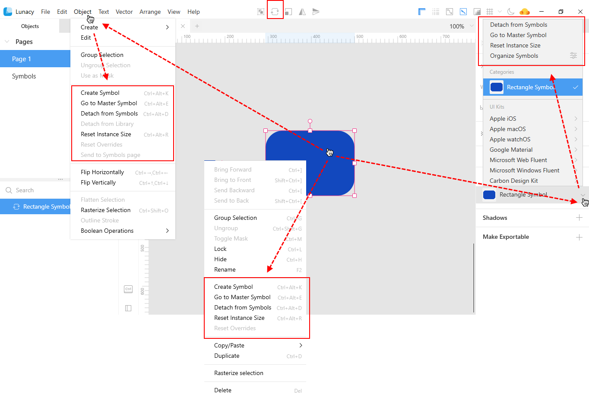

The commands are as follows:

<table>
  <thead>
    <tr>
      <th>Command</th>
      <th>Description</th>
      <th>Keyboard shortcut</th>
    </tr>
  </thead>
  <tbody>
    <tr>
      <td>Create Symbol</td>
      <td>Creates a new symbol. Optionally, you can use the <B>Create symbol</B> button which appears at the top of the window (see the figure above).</td>
      <td><code>Ctrl+Alt+K</code></td>
    </tr>
    <tr>
      <td>Go to Master Symbol</td>
      <td>Brings you to the master symbol of the selected instance. Optionally, you can just double-click the required instance. To return to the instance from the master, click the <B>Back to instance</B> button that will appear in the top-left corner of the canvas.</td>
      <td><code>Ctrl+Alt+E</code></td>
    </tr>
    <tr>
      <td>Detach from Symbols</td>
      <td>When you detach an instance from its master, it becomes a group. All further changes to the master symbol will no longer apply to its ex-instance.</td>
      <td><code>Ctrl+Alt+D</code></td>
    </tr>
    <tr>
      <td>Detach from Library</td>
      <td>This command applies only to symbols from external files, i.e. to symbols from UI kits. It adds a copy of the selected symbol to the document assets, i.e. to the <a href="https://docs.icons8.com/symbols/#symbols-page">symbols page</a>. For more information about UI kits, click <a href="https://docs.icons8.com/libraries/#ui-kits">here</a>.</td>
      <td><code>-</code></td>
    </tr>
    <tr>
      <td>Reset Instance Size</td>
      <td>By using this command you can at any moment restore the original size of any symbol instance.</td>
      <td><code>Ctrl+Alt+R</code></td>
    </tr>
    <tr>
      <td>Reset Overrides</td>
      <td>Use this command to undo all overrides and restore the initial look of an instance. For this, you can also use the reset overrides button that appears in the <B>Symbol</B> section of the Inspector panel, after an override takes place.</td>
      <td><code>-</code></td>
    </tr>
    <tr>
      <td>Send to Symbols page</td>
      <td>This command applies only to master symbols and becomes available only when a symbol is not on a dedicated symbols page.</td>
      <td><code>-</code></td>
    </tr>
    <tr>
      <td>Organize Symbols</td>
      <td>A click over this command opens the symbols panel on the <B>Libraries</B> tab, where you can organize symbols as described <a href="https://docs.icons8.com/symbols/#organizing-symbols">here</a>.</td>
      <td><code>-</code></td>
    </tr>
  </tbody>
</table>

## Nested symbols

Until now we've been considering  only primitive symbols. But you can also create complex symbols with other symbols inside. That will be nested symbols. And that is nested symbols that will become real time savers for your projects.

## [Overrides](#overrides)

Overrides are changes that you can make to a specific symbol instance not affecting the master symbol and other instances of this symbol across the project.

Currently, Lunacy provides the following types of overrides:

* Image overrides
* Text overrides
* Nested symbol overrides
* Layer style overrides
* Text style overrides
* Hotspot overrides

## Understanding overrides

This mini tutorial will help you better understand the idea and the power of overrides. Also, you will learn how to use some of the advanced Lunacy features.

Let's assume that we are designing a contact UI. We have prepared two templates: light and dark. In the figure below, they are on the right. The figure is a screenshot of the symbols page of the project. These two templates are complex symbols that include several individual symbols shown to the left of the templates. Once an individual symbol becomes a part of a complex symbol, we call it a nested symbol.

{:.is-big}

>**Note:** To demonstrate Lunacy capabilities to the maximum, we have also added some layer and text styles. For details about them, click [here](https://docs.icons8.com/layerstyles/).

Now, we'll move from the symbols page to our project page, add one of the templates to the artboard and let the magic begin.

{:.is-big}
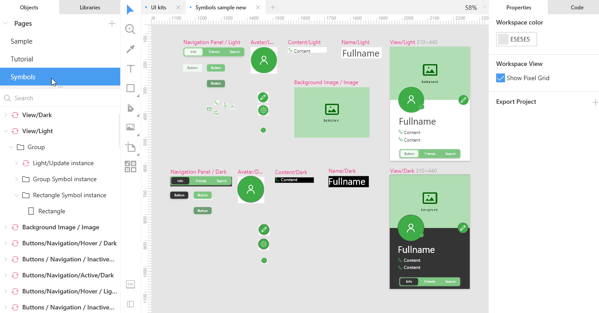

### Image overrides

Our template contains two image overrides: the avatar image and the background.

We will replace the avatar first. The procedure is follows:

1. Click over the image override on the canvas or select it in the **Objects** panel.
2. In the Inspector, click the **Replace image** button. The **Open** dialog box appears.
3. In the dialog box, select a new image.
4. Click the **Open** button.

Also, you can use the Lunacy photo and image libraries. We will do it for overriding the background image:

1. Switch over to the **Libraries** tab.
2. Open the required library and find the image you like.
3. Drop the image onto the override.

The gif below shows both methods of overriding images.

{:.is-big}
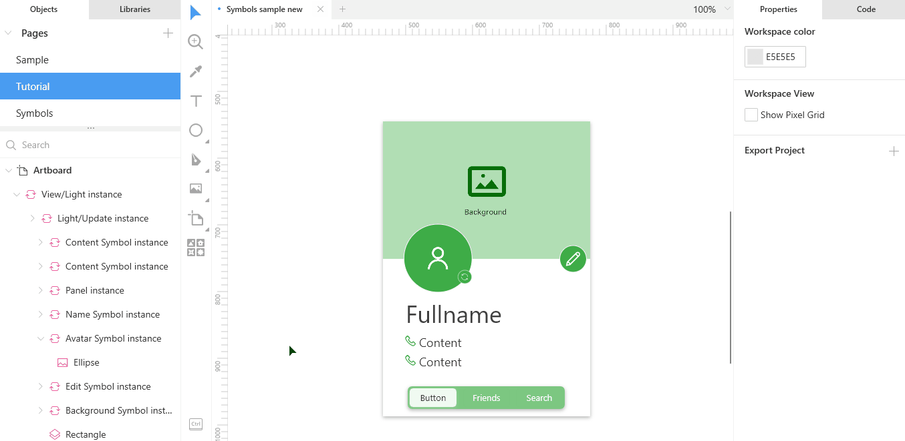

### Text overrides

To demonstrate text overrides we will change the contact's name and contact data.

**Step 1.**

Change the contact's name:

1. Click over the text override on the canvas or select it in the **Objects** panel.
2. Press `Enter` or click the **Edit Object** button on the top bar.
3. Enter the new text.
4. When done, press `Esc` to exit the edit mode.

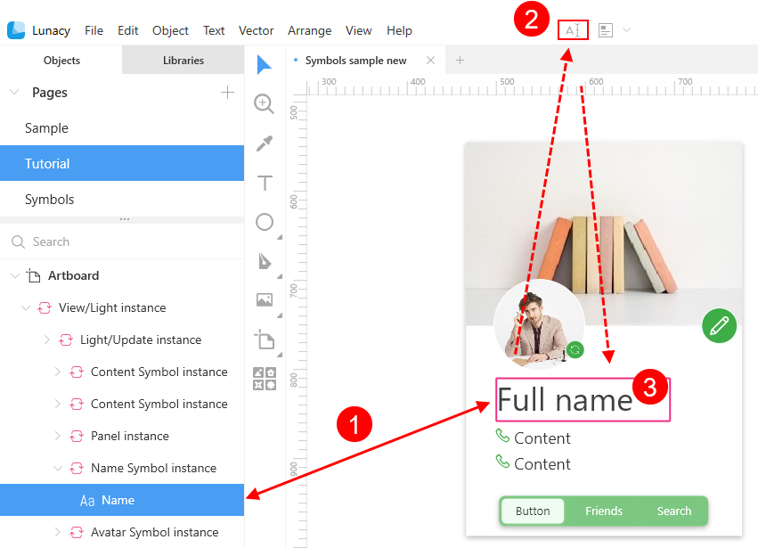

In Steps 2 and 3 we will use the text generation and text snippets features.

**Step 2.**

Add the contact's phone number:

1. Click over the text override on the canvas or select it in the **Objects** panel.
2. On the top bar, click the down arrowhead next to the **Generate text** button, then select **People > Phone**. Use the `Shift + R` shortcut to refresh generated content, if needed.

**Step 3.**

Add the contact's email:

1. Click over the next text override on the canvas or select it in the **Objects** panel.
2. Press `Enter` or click the **Edit Object** button on the top bar to start editing the override.
3. Enter *;em* and and press `Esc`. Lunacy will replace the *;em* text snippet with a random email address. Use the `Shift + R` shortcut to refresh generated content, if needed.

The gif below demonstrates text overrides described in Steps 2 and 3.

### Nested symbols overrides

Now we'll have a look at how nested symbols overrides work.

**Step 1.**

First of all, let's change the icon in front of the contact's email address for a more suitable one. To be able to quickly do it, we have prepared a set of icons that we will use across the project, converted them into symbols and placed them to the same category. For details about how to organize symbols, read [here](#organizing-symbols).

1. Find and select the icon override in the **Objects** panel or select it on the canvas. The **Symbol** section appears in the Inspector.
2. In the **Symbol** section of the Inspector, click the down arrowhead and select the mail icon on the displayed menu.

{:.is-big}
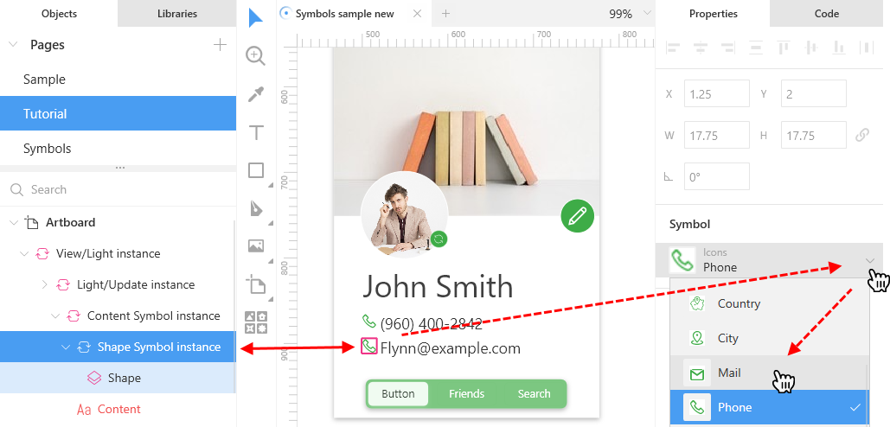

**Step 2.**

At the bottom of our template we have three buttons: one is in the active state, two others are inactive. Let's show how the button will look when hovered over. For this, we have also created an individual symbol, which will override the current one.
The procedure is as follows:

1. Find and select the button override in the **Objects** panel or select it on the canvas. The **Symbol** section appears in the Inspector.
2. In the **Symbol** section of the Inspector, click the down arrowhead. The menu appears.
3. In the categories section of the menu, navigate to the required symbol (see the gif below).

{:.is-big}

As you might notice, at the end we also made a text override.

#### None override

Also, you can hide a nested symbol from the template by using the **None override** option.

For this:

1. Find and select the nested symbol in the **Objects** panel or select it on the canvas. The **Symbol** section appears in the Inspector.
2. In the **Symbol** section of the Inspector, click the down arrowhead. The menu appears.
3. In the upper section of the menu, click **None Override**.

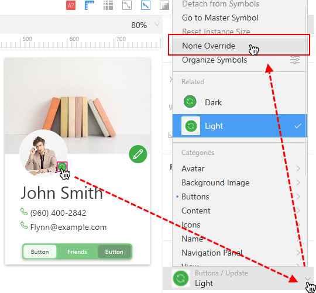

Lunacy will override the symbol you selected with the so-called *none symbol*. You can always override the none symbol with any other symbol.

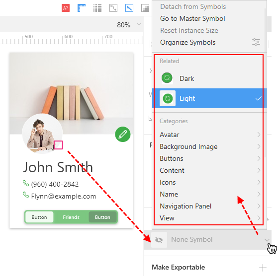

### Layer and text style overrides

To demonstrate these two types of overrides, let's change the layer style of the padding and the text style of the contact name.

For this:

1. Find and select the override in the **Objects** panel or select it on the canvas.
2. Apply the new style from the Inspector or from the **Libraries** panel as shown in the gif below.

{:.is-big}
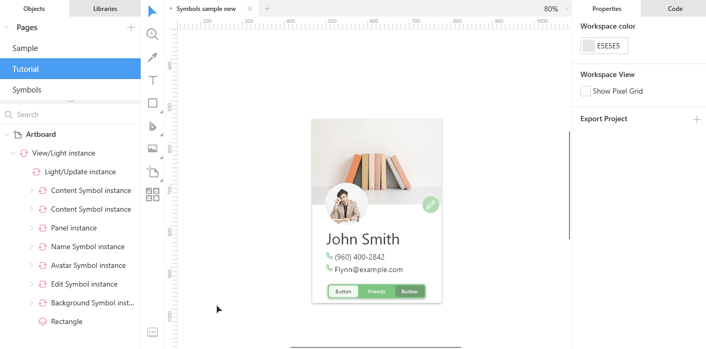

Repeat the procedure to override text styles of the phone number and email address.

### Hotspot overrides

If your template features a hotspot, you can override its target artboard. Optionally, you can select the none override option to disable the hotspot.
