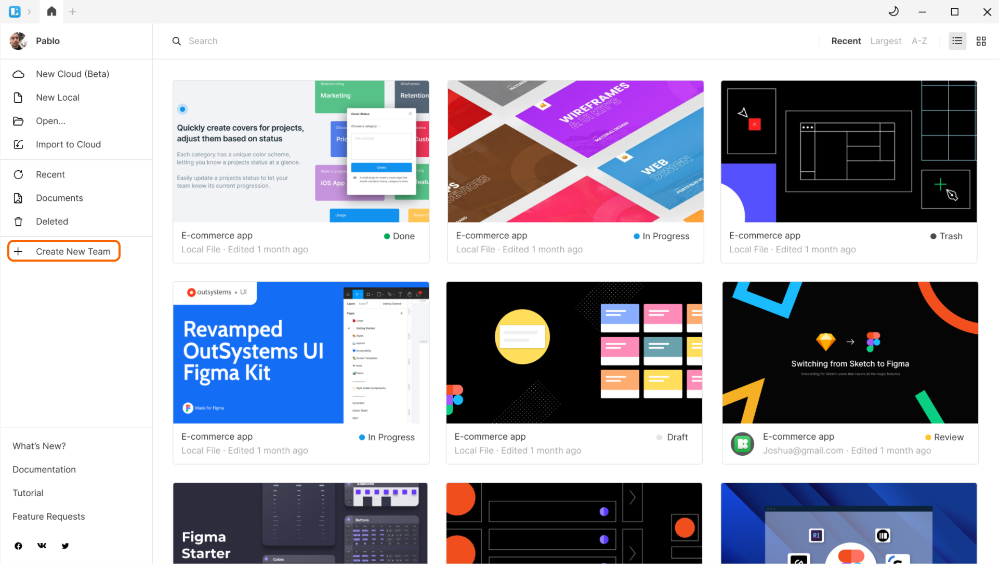
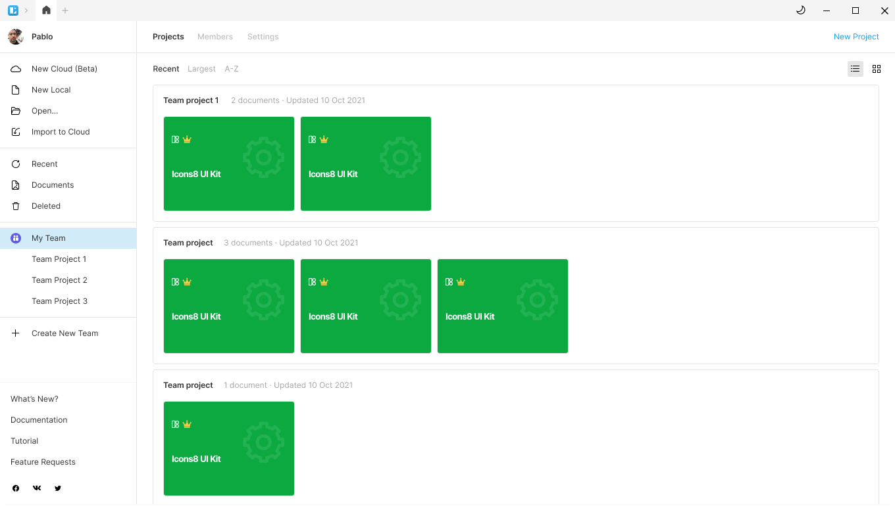
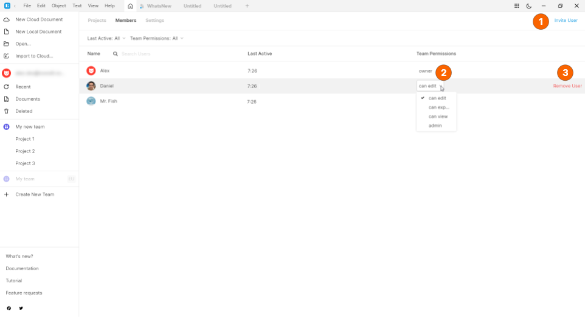
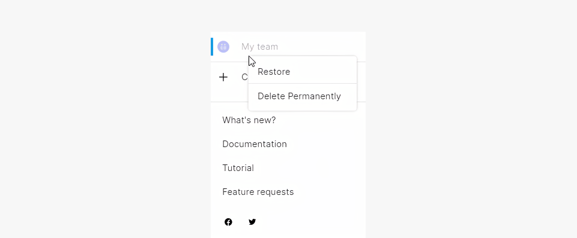

---
# Page settings
layout: default
keywords:
comments: false

# Hero section
title: Teams
description: Learn how to organize teamwork
icon: 'groups'

# Micro navigation
micro_nav: false

# Page navigation
page_nav:
    next:
        content: Prototyping
        url: '/prototyping'
    prev:
        content: Export
        url: '/export'
---

## Overview

Teams serve to make it easier for you to manage collaborative files and people who have access to them.

In version 8.5, you'll be able to try out how teams work on a free plan. In upcoming versions, we'll add some paid plans that will provide more opportunities and less limitations.

How it works with the free plan:

* To work with teams, you need to sign in to your Icons8 account.
* You can create one team and invite two more members to the team.Thus, a free team can include up to 3 members. A user can be a member of one free team only.
* You should use projects to organize team files. Think of projects as of folders. All the files within team projects automatically become available to the team members.
* The total number of files across all projects of a free team cannot exceed ten.

Note that you can still share cloud files with other users as you did it earlier, before we introduced teams.

## Creating a team

To create a team:

1. Open the **Home** tab.
2. In the left menu, click **Create New Team**.
3. On the displayed screen, type the name of the team, then click **Create team**.
4. (optional) On the next screen, click **Copy link** to send it to other team members. You can always copy the invite link in the top-right corner **Members** tab of the team page.  
5. Click **Continue**.

The user who created a team is a **team owner**.

## Managing teams

To manage a team, switch to the **Home** tab, then click the required team name in the left panel. The team screen appears.

Each team screen features three tabs: **Projects**, **Members**, and **Settings**.

### Projects

On this tab, you will keep your team files organized in projects. You can think of projects as of folders. To start creating team files, you should have at least one project.

To create a project:

1. Select the required team in the left menu of the **Home** tab. Make sure that the team screen opens on the **Projects** tab.
2. In the top-right corner of the screen, click **New Project**.
3. Define the project name on the displayed screen.

Now you can add files to the project. You can create new files or import existing .sketch files. For this, use the respective buttons that appear in the top-right corner when you're inside a project.

The figure below shows a view of the **Projects** tab with three projects.

To delete a file from a project:

1. Right-click the file. The context menu shows up.
2. On the menu, click **Delete**.

Deleted files move to the **Deleted** screen of the **Home** tab. There you can restore or permanently delete files. 

To delete a project:
1. Delete all files from the project first.
2. On the left menu of the **Home** tab, right-click over the project you're going to delete. The context menu shows up.
3. On the menu, click **Delete**.

    
<strong>Note:</strong> Not all users can delete documents and projects. For details, check out the table below.

### Members

On this tab, you can:

* Get invite links (1) for new members.
* Manage team members and their roles (2)
* Delete team members (3).

To get an invite link, click **Invite user** in the top-right corner of the screen. The link gets copied to your clipboard. Once a user opens the link, their avatar appears on the **Members** tab and you can assign the required user role:

* **Viewer** (can view). The role assigned by default to all users joining a team via an invite link. Users with this role can only view the content of team files.
* **Exporter** (can export). This role is intended for developer handoff. Users with this role can view designs, inspect layer properties in the left panel, and export file content.
* **Editor** (can edit). Users with this role can create and edit files within the team. But they don't have some administrative privileges.
* **Admin**. Team administrators get the extended set of privileges.

The table below shows the differences between user roles.

|         | Owner    | Admin | Editor | Viewer | Exporter |
| ------------- |-------------|---------------|-------------|---------------| ---------------|
| Rename team |+ | + |   |  |  |
| Change team plan |+ |  |   |  |  |
| Change team avatar |+ | + |   |  |  |
| Assign roles to team members |+ | + |   |  |  |
| Delete team |+ |  |   |  |  |
| Delete members from team  |+ | + |   |  |  |
| Invite new members (copy links) |+ | + | +  |  |  |
| View list of team members |+ | + | + | + | + |
| View list of projects | + | + |  + | + | + |
| Create project |+ | + | +  |  |  |
| Rename project |+ | + | if creator  |  |  |
| Delete project |+ | + | if creator  |  |  |
| View list of documents | + | + |  + | + | + |
| Create document |+ | + | +  |  |  |
| Delete document |+ | + | if creator  |  |  |
| Leave team |  | + |  + | + | + |

### Settings

This tab is available only for users with the owner and admin roles. Here you can change the team name and avatar.

## Deleting a team

To delete a team, right-click the team name on the left panel of the **Home** tab, then click **Delete** on the menu. Note that this operation is accessible only to the team owner.

Upon deletion:
* All the documents associated with the team will move to **Home** > **Deleted**.
* The name of the team appears dimmed in the left menu of the **Home** tab. A right-click over a deleted team invokes the context menu that lets you either permanently delete the team or restore it.

