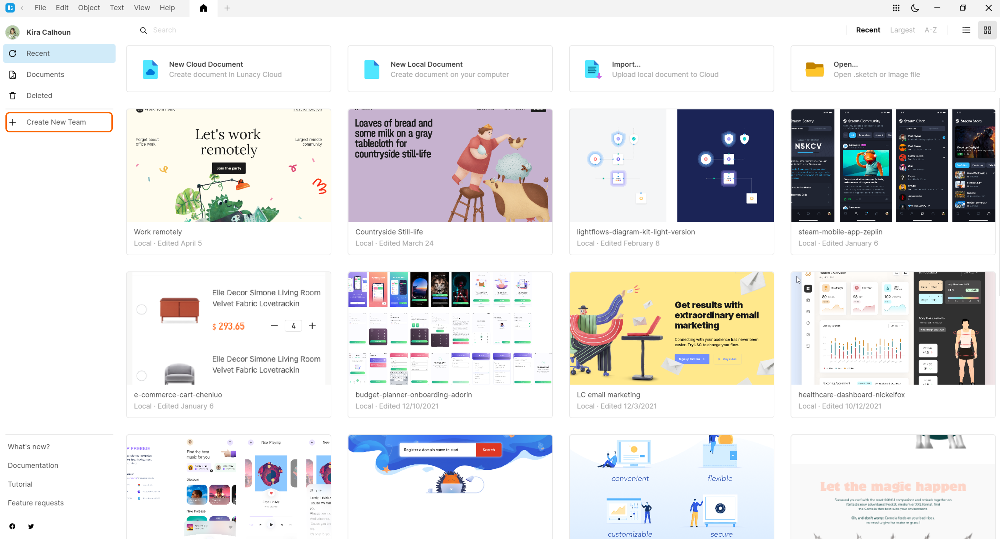
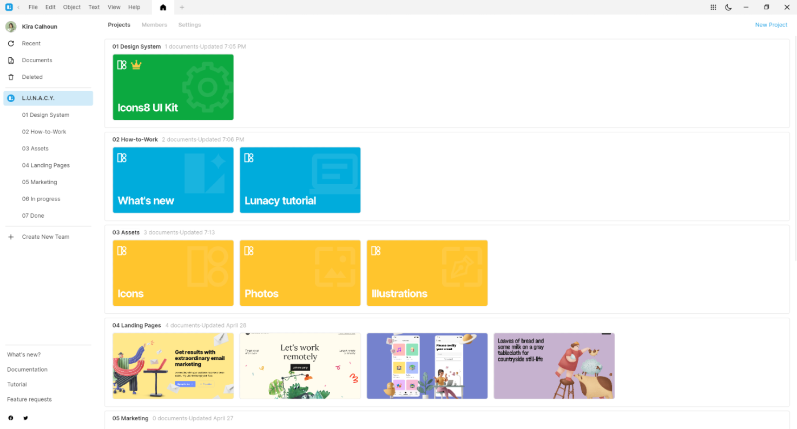
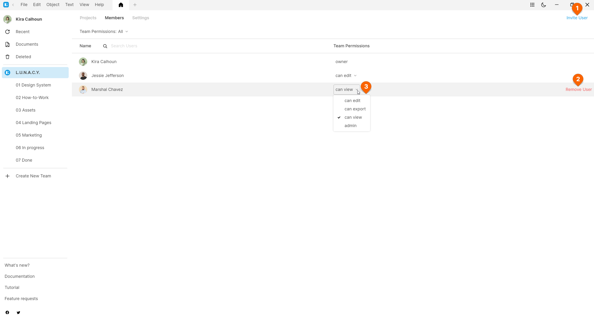
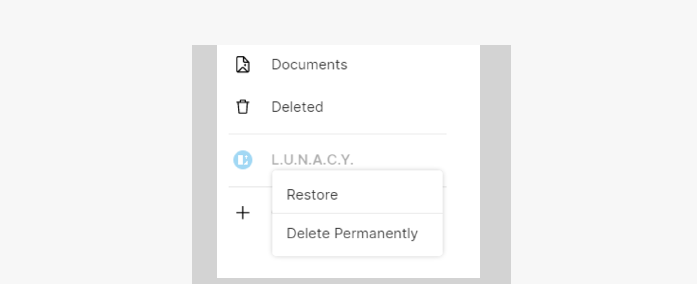

---
# Page settings
layout: default
keywords:
comments: false

# Hero section
title: Teams
description: Learn how to organize teamwork
icon: 'groups'

# Micro navigation
micro_nav: false

# Page navigation
page_nav:
    next:
        content: Tips and tricks
        url: '/tips'
    prev:
        content: Linked design
        url: '/linked_design'
---

Teams serve to make it easier for you to manage collaborative documents and people who have access to them. This chapter covers the details of working with teams.

    
<strong>Note:</strong> To start working with teams, make sure that you're signed into your Icons8 account.

## Free plan vs paid plan

You can try out teams on a free plan. When you think you are ready, you can switch to our paid plan.

How it works with the **free plan**:

* You can create one team and invite two more members to the team.Thus, a free team can include up to 3 members. A user can be a member of one free team only.
* The total number of documents across all projects (including the ones in the trash bin) of a free team cannot exceed ten
* Document version history is limited to 30 days.

When you switch to the **paid plan**, you get:

* As many team members as you need
* Unlimited number of team documents
* Unlimited version history
* Unlimited storage period for deleted documents
* Free *Personal Cloud* license for the team owner

## Creating teams

To create a team:

1. Open the **Home** tab.
2. In the left menu, click **Create New Team**.
3. On the displayed screen, type the name of the team, then click **Create team**.
4. (optional) On the next screen, click **Copy link** to send it to other team members. You can always copy the invite link in the top-right corner **Members** tab of the team page.  
5. Click **Continue**.

The user who created a team is a **team owner**.

By right-clicking a team name in the left panel of the **Home** tab you can invoke the context menu that lets you:

* Rename the team
* Change the team avatar
* Upgrade your plan
* [Delete the team](#deleting-a-team)

## Managing teams

To manage a team, switch to the **Home** tab, then click the required team name in the left panel. The team screen appears.

Each team screen features two tabs:

* [Projects](#projects)
* [Members](#members)

### [Projects](#projects)

On this tab, you will keep your team documents organized in projects. You can think of projects as of folders. To start creating team documents, you should have at least one project.

All the documents within team projects automatically become available to the team members.

To **create** a project:

1. Select the required team in the left menu of the **Home** tab. Make sure that the team screen opens on the **Projects** tab.
2. In the top-right corner of the screen, click **New Project**.
3. Define the project name on the displayed screen.

Now you can add documents to the project. You can:

* Create new cloud documents.
* Import existing .sketch files.
* Import existing documents from Figma.

For this, use the respective buttons that appear at the top of each project.

The figure below shows a view of the **Projects** tab.

To show/hide a project name in the left panel, use the **Pin/Unpin** button that appears when you hover over the project area in the **Home** tab.

To delete a document from a project:

1. Right-click over the document. The context menu shows up.
2. On the menu, click **Delete**.

Deleted documents move to the **Deleted** screen of the **Home** tab. There you can restore or permanently delete documents. 

To delete a project:
1. Delete all documents from the project first.
2. On the left menu of the **Home** tab, right-click over the project you're going to delete. The context menu shows up.
3. On the menu, click **Delete**.

    
<strong>Note:</strong> Not all users can delete documents and projects. For details, check out the table below.

### [Members](#members)

On this tab, you can:

* Get links to invite new members (1).
* Delete team members (2).
* Manage team members and their roles (3).

To get an invite link, click **Invite user** in the top-right corner of the screen. The link gets copied to your clipboard, and a new record appears in the table of team members. Until the invitee opens opens the link, you'll see the *Invite pending* caption instead of the username.  Use the drop-down list in the **Role** column, to assign the required user role:

* **Viewer** (can view). The role assigned by default to all users joining a team via an invite link. Users with this role can only view the content of team documents.
* **Developer** (can export). This role is intended for developer handoff. Users with this role can view designs, inspect layer properties in the left panel, and export document content.
* **Editor** (can edit). Users with this role can create and edit documents within the team. But they don't have some administrative privileges.
* **Admin**. Team administrators get the extended set of privileges.

Once a user opens the link, their username and avatar appear on the **Members** tab. You can view team members' profiles by right-clicking their avatars.

The table below shows the differences between user roles.

|         | Owner    | Admin | Editor | Viewer | Exporter |
| ------------- |-------------|---------------|-------------|---------------| ---------------|
| Rename team |+ | + |   |  |  |
| Change team plan |+ |  |   |  |  |
| Change team avatar |+ | + |   |  |  |
| Assign roles to team members |+ | + |   |  |  |
| Delete team |+ |  |   |  |  |
| Delete members from team  |+ | + |   |  |  |
| Invite new members (copy links) |+ | + | +  |  |  |
| View list of team members |+ | + | + | + | + |
| View list of projects | + | + |  + | + | + |
| Create project |+ | + | +  |  |  |
| Rename project |+ | + | +  |  |  |
| Delete project |+ | + | +  |  |  |
| View list of documents | + | + |  + | + | + |
| Create document |+ | + | +  |  |  |
| Rename document |+ | + | +  |  |  |
| Delete document |+ | + | +  |  |  |
| Leave team |  | + |  + | + | + |

## [Deleting a team](#deleting-a-team)

To delete a team, right-click the team name on the left panel of the **Home** tab, then click **Delete** on the menu. Note that this operation is accessible only to the team owner.

Upon deletion:
* All the documents associated with the team move to **Home** > **Deleted**.
* Team members no longer have access to the documents.
* The name of the team appears dimmed in the left menu of the **Home** tab. A right-click over a deleted team invokes the context menu that lets you either permanently delete the team or restore it.

