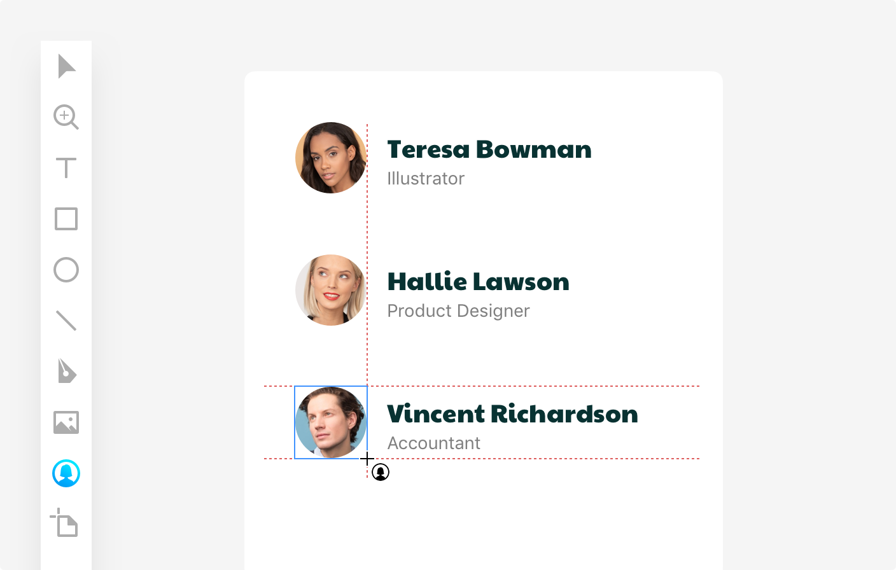
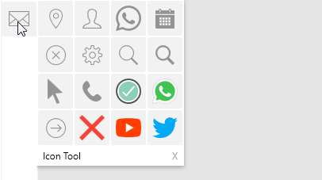

---
# Page settings
layout: default
keywords:
comments: false

# Hero section
title: Tools
description: Learn about tools and controls on the Lunacy toolbar 
icon: 'maintenance'

# Micro navigation
micro_nav: false

# Page navigation
page_nav:
    next:
        content: Editing
        url: '/editing'
    prev:
        content: Interface
        url: '/interface'
---

## Introduction

This section is a description of tools and controls on the Lunacy toolbar.

The table below provides an overview of the controls and their shortcuts.

<table>
  <thead>
    <tr>
      <th style="width: 85px;">Tool icon</th>
      <th>Description</th>
      <th>Keyboard shortcut</th>
    </tr>
  </thead>
  <tbody>
    <tr>
      <td></td>
      <td> Select tool. Allows you to select, move and resize objects and object groups.</td>
      <td><code>V</code> or <code>S</code> or just press <code>Esc</code> to exit the current tool.</td>
    </tr>
    <tr>
      <td></td>
      <td>Hand tool. Not presented on the toolbar. Serves for moving around the canvas without accidentally selecting objects, rulers, etc.</td>
      <td>Hold down <code>Space</code></td>
    </tr>
    <tr>
      <td></td>
      <td>Zoom tool. Serves for zooming in the selected object or canvas area.</td>
      <td><code>Z</code></td>
    </tr>
    <tr>
      <td></td>
      <td>Eyedropper tool. Serves for sampling colors.</td>
      <td><code>I</code></td>
    </tr>
    <tr>
      <td></td>
      <td>Text tool. Serves for adding text layers.</td>
      <td><code>T</code></td>
    </tr>
    <tr>
      <td></td>
      <td>Shape tool. Serves for adding pre-made shapes. The icon in the toolbar varies depending on the shape that you added last. Only the most frequently used shapes have shortcuts.</td>
      <td>
<code>R</code> - rectangle

<code>U</code> - rounded rectangle

<code>O</code> - oval

<code>L</code> - line
</td>
    </tr>
    <tr>
      <td></td>
      <td>Pen tool or Vector tool. Serves for adding custom vector shapes. Shares the same fly-out menu with the Pencil tool.</td>
      <td><code>P</code></td>
    </tr>
    <tr>
      <td></td>
      <td>Pencil tool. Serves for adding freehand shapes. Shares the same fly-out menu with the Pen tool.</td>
      <td><code>N</code></td>
    </tr>
    <tr>
      <td></td>
      <td>Image tool.  Serves for adding images to your designs. Shares the same fly-out menu with the Avatar and Slice tools.</td>
      <td><code>M</code></td>
    </tr>
    <tr>
      <td></td>
      <td>Avatar tool. Serves for quickly adding avatars to your designs. Shares the same fly-out menu with the Image and Slice tools.</td>
      <td><code>Q</code></td>
    </tr>
    <tr>
      <td></td>
      <td>Slice tool. Serves for quick export of selected areas. Shares the same fly-out menu with the Image and Avatar tools.</td>
      <td><code>E</code></td>
    </tr>
    <tr>
      <td></td>
      <td>Artboard tool. Serves for adding artboards onto the canvas. Shares the same fly-out menu with the Hotspot tool.</td>
      <td><code>A</code></td>
    </tr>
    <tr>
      <td></td>
      <td>Hotspot tool. Serves for adding hotspots when working on prototypes. Shares the same fly-out menu with the Artboard tool.</td>
      <td><code>H</code></td>
    </tr>
    <tr>
      <td></td>
      <td>Icon tool. Keeps the icons that you've recently use at hand. After you use the tool for the first time, the latest icon appears on the toolbar instead of the tool icon.</td>
      <td><code>X</code></td>
    </tr>
    <tr>
      <td></td>
      <td>Shortcuts button. Opens a panel with the full list of Lunacy shortcuts.</td>
      <td><code>Shift+F1</code></td>
    </tr>
    <tr>
      <td></td>
      <td>Hide/show sidebar button. Use this button to hide/show the left panel.</td>
      <td><code>-</code></td>
    </tr>
  </tbody>
</table>

For details about using the tools, read further.

## Select tool

The Select tool is likely the tool that you will be using most often when working with Lunacy. It is the default tool which gets enabled, if no other tool is active. The Select tool allows you to select, move and resize objects and object groups.

In general, to select an object, just click over it. As you do it, a selection frame with handles appears around the object, and the object's name gets highlighted in the **Objects** panel. To select multiple objects, hold down the `Shift` key and click the objects you want to select. Alternatively, you can use the click-and-drag method for selecting objects. The demo below shows both methods of selecting objects.

To move the selected object(-s):

1. Point the cursor over the object or an object within a group (not over the empty space within the selection frame).
2. Move the selection to where you want it.

To resize the selected object(-s) with the Select tool, drag the handles on the selection frame. As in all similar apps, use the `Shift` key and corner handles to preserve the aspect ratio of the  object you resize.

<video autoplay="" muted="" loop="" playsinline="" width="100%" poster="/public/tool-selectplaceholder.png" height="auto"><source src="/public/tool-selectltool.mp4" type="video/mp4"></video>

### Using the Select tool with grouped objects

When you click or drag over a group of objects, you select the group. To select a certain object within the group:

* Hold down the `Ctrl` key and click over the required object.
  
  OR
* Click to select the group, then double-click to select the object.

 After you select an object within a group, you can switch to other objects of that group by simply clicking them.

<video autoplay="" muted="" loop="" playsinline="" width="100%" poster="/public/tool-selectplaceholder.png" height="auto"><source src="/public/tool-selectltoolgroup.mp4" type="video/mp4"></video>

>**Tip:** Alternatively, you can select objects through the **Objects** panel. In some cases it may be more convenient. For instance, when handling fully overlapping objects. For details about working with objects, click here.

## Hand tool

The Hand is another tool that you will be using a lot to quickly move to the required canvas area. The Hand is not available on the toolbar. To use it, just hold down the `Space` key and use the mouse to move the canvas as you need.

## Zoom tool

The Zoom tool allows you to zoom in the selected object or canvas area. To use the tool:

1. Select the Zoom tool on the tool bar or press `Z`.
2. Click the object you want to zoom in as many times as you need. Alternatively, click and drag over the required area. For your convenience, when the zoom value exceeds 500, Lunacy starts displaying the pixel grid.
3. To zoom out, hold down `Alt` and click over the object or area.

<video autoplay="" muted="" loop="" playsinline="" width="100%" poster="/public/tool-zoomplaceholder.png" height="auto"><source src="/public/tool-zoom.mp4" type="video/mp4"></video>

Also, for zooming and focusing you can use the shortcuts from the table below.

<table>
  <thead>
    <tr>
      <th>Operation</th>
      <th>Keyboard shortcut</th>
    </tr>
  </thead>
  <tbody>
    <tr>
      <td>Zoom to object</td>
      <td><code>Ctrl + Mouse Wheel</code></td>
    </tr>
    <tr>
      <td>Soft zoom to object</td>
      <td><code>Ctrl + Shift + Mouse Wheel</code></td>
    </tr>
    <tr>
      <td>Zoom in/out</td>
      <td><code>+/-</code> or <code>Ctrl + "+/-"</code></td>
    </tr>
    <tr>
      <td>Zoom to 100%</td>
      <td><code>Ctrl + 0</code></td>
    </tr>
    <tr>
      <td>Zoom to all objects</td>
      <td><code>Ctrl + 1</code></td>
    </tr>
    <tr>
      <td>Zoom to selection</td>
      <td><code>Ctrl + 2</code></td>
    </tr>
    <tr>
      <td>Zoom to fit width</td>
      <td><code>Ctrl + 3</code></td>
    </tr>
    <tr>
      <td>Zoom to fit height</td>
      <td><code>Ctrl + 4</code></td>
    </tr>
  </tbody>
</table>

The above options, except for *Zoom to object* and *Soft zoom to object*, are also accessible through the **View** menu, see the figure below.

## Eyedropper tool

Working with colors is an essential part of a designer's job. The Lunacy's smart eyedropper tool is designed to make this work easy and effective.

To use the eyedropper tool:

1. Select an object to which you are going to apply a color. If you don't select any object, Lunacy applies the color to the workspace.
2. Click the eyedropper icon on the toolbar or on the color picker panel, or just press `I`. The cursor turns into the eyedropper. Also, the **Colors** panel appears on the left. It features four pallets:
  
    * Recent colors
    * Document colors
    * Flat colors
    * Material colors

3. Hover the eyedropper over the color that you want to sample anywhere on the screen and click to apply it.

{:.is-big}

That is typically how all eyedroppers work in similar apps. But Lunacy's eyedropper also features a very nice zoom option that comes in handy when the target area is small and you need pixel precision. To enable zoom, hover the eyedropper over the target and hold down the left mouse button. Then point the eyedropper to the required pixel and release the mouse button. To exit the zoom mode, press `Esc` or quickly swipe the cursor anywhere away from the current area, see the demo below.

<video autoplay="" muted="" loop="" playsinline="" width="100%" poster="/public/eyedropper3-placeholder.png" height="auto"><source src="/public/eyedropper3.mp4" type="video/mp4"></video>

### How Lunacy applies color to objects

Depending on the styling properties of an object, Lunacy applies colors in the following order:

1. Fill
2. Border
3. Shadow
4. Inner shadow

So, if an object has a fill and a border, Lunacy updates the fill. If an object has no fill, but has a border and a shadow, Lunacy changes the border color and so on. If an object has several fills/borders/shadows/inner shadows, Lunacy applies the color to the one which sits at the top of the property list in the Inspector. Similar rules apply to text objects where text color has top priority.

To demonstrate all this, in the figure below we applied the colors of the rectangles to the ellipses with different sets of styling properties.

{:.is-big}

## Text tool

The Text tool serves for adding text layers. For details about working with text in Lunacy, click <a href="https://docs.icons8.com/text/" target="_blank">here</a>.

## Shape tool

The Shape tool allows you to quickly add pre-made shapes that include:

* Rectangles
* Rounded rectangles
* Ovals
* Lines
* Stars
* Polygons
* Arrows

To add a shape, select the required shape on the fly-out menu and then drag and click on the canvas where you want it.

{:.is-big}

For details about working with shapes, click here.

## Pen tool

The Pen tool serves for building custom vector shapes.

<video autoplay="" muted="" loop="" playsinline="" width="100%" poster="/public/tool-penplaceholder.png" height="auto"><source src="/public/tool-pen.mp4" type="video/mp4"></video>

For details about working with vector shapes, click here.

## Pencil tool

The Pencil is a tool for drawing freehand shapes with a stylus or, having some skill, with the mouse. You will find the Pencil on the same fly-out menu with the Pen tool. Alternatively, you can use `N` as a shortcut.

If you are using the mouse, just hold down the left-mouse button and draw the required path. Release the button when you are done.

Unlike other tools that switch to the select mode right after you create an object, the Pencil tool allows you to create as many objects as you need. Each Pencil "stroke" adds a new layer to the **Objects** panel. You can group them later.

The figure below shows two words *Lunacy* written with the Pencil tool. The bottom one is written in one stroke, while the top one is in a stroke per letter (grouped for convenience). See how they appear in the **Objects** panel.

{:.is-big}

To exit the Pencil, press `Esc` or click the Select tool. When you exit the Pencil, Lunacy selects the latest path that you've added.

### Editing shapes drawn with the Pencil

Lunacy automatically smooths the paths that you create. But you can also edit pencil-drawn paths like all other vector shapes: add, delete and move points, bend segments, etc. To switch to the edit mode, select the required path and press `Enter` or click the **Edit object** button at the top bar. To exit the edit mode, press `Esc` or click anywhere on the canvas beyond the selected object, see the demo below.

<video autoplay="" muted="" loop="" playsinline="" width="100%" poster="/public/pencil-editplaceholder.png" height="auto"><source src="/public/tool-penciltool.mp4" type="video/mp4"></video>

Finally, you can make use of such styling properties as borders, shadows, inner shadows and blurs. As for fills, you should remember that the Pencil always draws open shapes, even if they appear as closed. You can try to apply fills but in many cases the result can be weird. If you need to close a shape, enable the object edit mode and click the **Close path** button which will appear in the Inspector.

## Image tool

The Image tool serves for quick adding images from files to your designs. Lunacy supports all the most common image formats like PNG, JPG, JPEG, etc.

To add an image:

1. Click the tool icon on the toolbar. The **Open** dialog box appears.
2. In the **Open** dialog box, browse to the required file.
3. Select the file. You can select multiple files at a time, if you want.
4. Click over the area where you want to put the image or click and drag to get required size of the image as shown in the the demo below.

## Avatar tool

Creating views of user profiles is one of the most common tasks when designing user interfaces. Combined with Lunacy's <a href="https://docs.icons8.com/text/#text-generation-and-text-snippets" target="_blank">text snippets</a> the avatar tool becomes a real time saver.

{:.is-big}

To add an avatar to your design:

1. Click the avatar tool.
2. Click or click and drag to place the avatar to where you want it.

Lunacy remembers the size of the latest avatar you add (at the moment you release the tool). The next time you invoke the tool it will appear with an avatar of that very size.

<video autoplay="" muted="" loop="" playsinline="" width="100%" poster="/public/tool-avatarsizeplaceholder.png" height="auto"><source src="/public/tool-avatarsize.mp4" type="video/mp4"></video>

To change the image of an avatar, click the refresh button at the top left corner of the avatar (see the demo below). The default collection of avatars installed with the app includes five images. You can use them even when your computer has no internet connection. When you're online, you have access to the full collection of avatars.

>**Tip:** Although avatars appear as circles when you add them to the canvas, in fact they are rounded rectangles. So, you can play with the value of the corner radius, if you wish.

<video autoplay="" muted="" loop="" playsinline="" width="100%" poster="/public/tool-avatardemo.png" height="auto"><source src="/public/avatardemo.mp4" type="video/mp4"></video>

## Artboard tool

Artboards are a way to divide the canvas into separate areas with different content. Artboards are optional but they come in handy when you're designing for a certain screen size or device.

To add an artboard:

1. Select the artboard tool on the toolbar or press `A`.
2. Click and drag to create a custom size artboard or select an option from the artboard selection panel which will appear on the right (see the figure below).

{:.is-big}

**Tip:** If there are already some layers on the canvas and you decide to put them on an artboard, just drag the artboard tool over these layers.

For details, about using artboards read here.

## Slice tool

The Slice tool allows you to select a specific area on your design and export it to a file.

To make use of the Slice tool:

1. Enable the tool by selecting it on the toolbar or simply press `E`.
2. Click and drag over the area you want to export. The **Export assets** panel appears in the Inspector.
3. Define the required export settings.
4. Click **Export selected**.

To hide/show slices on the canvas, use the **Show slices** button on the top bar.

To remove a slice from the canvas, select it and press`Del`.

For more information about export in Lunacy, click here.

## Hotspot tool

Use the Hotspot tool to create hotspot zones when designing prototypes. To add a hotspot:

1. Enable the tool by selecting it on the toolbar or simply press `H`.
2. Click and drag over the area you want to have a hotspot.

The demo below shows the procedure of creating a hotspot and setting a target artboard.

<video autoplay="" muted="" loop="" playsinline="" width="100%" poster="/public/tool-addhotspotplaceholder.png" height="auto"><source src="/public/tool-addhotspot.mp4" type="video/mp4"></video>

To hide/show hotspots on the canvas, use the **Show prototyping** button on the top bar.

For more information about prototyping in Lunacy, click here.

## Icon tool

The Icon tool serves to simplify your work with icons and keeps the items that you've recently use at hand. A click over the icon tool on the toolbar opens the <a href="https://docs.icons8.com/libraries/#icons" target="_blank">Icons library</a> where you can select the required icon. To invoke a panel with recent icons, just hover the cursor over the icon tool. The maximum number of recent icons is 16.

Alternatively, to start using the tool, press `X`. When enabled, the tool appears with the latest icon that you've used. Press `X` again to switch to the next recent icon or `Shift + X` to return to the previous one.

To add an icon from the panel of recent icons to the canvas, drag the icon onto the canvas.

**Note**: The color selected in the **Icons** library affects the color of icons in the icon tool.
