---
# Page settings
layout: default
keywords:
comments: false

# Hero section
title: Tools
description: Learn about tools and controls on the Lunacy toolbar 
icon: 'maintenance'

# Micro navigation
micro_nav: false

# Page navigation
page_nav:
    next:
        content: Objects
        url: '/objects'
    prev:
        content: Interface
        url: '/interface'
---

## Introduction

This section is a description of tools and controls on the Lunacy toolbar.

The table below provides an overview of the controls and their shortcuts.

<table>
  <thead>
    <tr>
      <th style="width: 85px;">Tool icon</th>
      <th>Description</th>
      <th>Keyboard shortcut</th>
    </tr>
  </thead>
  <tbody>
    <tr>
      <td></td>
      <td><a href="https://docs.icons8.com/tools/#select-tool">Select tool</a>. Allows you to select, move and resize objects and object groups.</td>
      <td><code>V</code> or <code>S</code> or just press <code>Esc</code> to exit the current tool.</td>
    </tr>
    <tr>
      <td></td>
      <td><a href="https://docs.icons8.com/tools/#artboard-tool">Artboard tool</a>. Serves for adding artboards onto the canvas. Shares the same fly-out menu with the Hotspot tool.</td>
      <td><code>A</code></td>
    </tr>
    <tr>
      <td></td>
      <td><a href="https://docs.icons8.com/tools/#image-tool">Image tool</a>.  Serves for adding images to your designs.</td>
      <td><code>M</code></td>
    </tr>
    <tr>
      <td></td>
      <td><a href="https://docs.icons8.com/tools/#text-tool">Text tool</a>. Serves for adding text layers.</td>
      <td><code>T</code></td>
    </tr>
    <tr>
      <td></td>
      <td><a href="https://docs.icons8.com/tools/#pen-tool">Pen tool</a>. Serves for adding custom vector shapes. Shares the same fly-out menu with the Pencil tool.</td>
      <td><code>P</code></td>
    </tr>
    <tr>
      <td></td>
      <td><a href="https://docs.icons8.com/tools/#pencil-tool">Pencil tool</a>. Serves for adding freehand shapes. Shares the same fly-out menu with the Pen tool.</td>
      <td><code>N</code></td>
    </tr>
    <tr>
      <td>

</td>
      <td><a href="https://docs.icons8.com/tools/#shape-tools">Shape tools</a>. Serve for adding pre-made shapes. The Line tool shares the same fly-out menu with the Arrow. The Rectangle tool shares the same fly-out menu with the Rounded rectangle. The Triangle tool shares the same fly-out menu with the Polygon and Star. Only the most frequently used shapes have shortcuts.</td>
      <td>
<code>R</code> - rectangle

<code>U</code> - rounded rectangle

<code>O</code> - ellipse

<code>L</code> - line
</td>
    </tr>
    <tr>
      <td></td>
      <td><a href="https://docs.icons8.com/tools/#icon-tool">Icon tool</a>. Keeps the icons that you've recently used at hand. After you use the tool for the first time, the latest icon appears on the toolbar instead of the original tool icon.</td>
      <td><code>X</code></td>
    </tr>
    <tr>
      <td></td>
      <td><a href="https://docs.icons8.com/tools/#avatar-tool">Avatar tool</a>. Serves for quickly adding avatars to your designs.</td>
      <td><code>Q</code></td>
    </tr>
    <tr>
      <td></td>
      <td><a href="https://docs.icons8.com/tools/#gui-tool">GUI tool</a>. A set of tools that allows you to quickly add basic GUI controls.</td>
      <td>
<code>B</code> - button

<code>D</code> - text input

<code>Y</code> - radio button

<code>F</code> - checkbox

<code>K</code> - toggle

<code>W</code> - dropdown list
</td>
    </tr>
    <tr>
      <td></td>
      <td><a href="https://docs.icons8.com/tools/#component-tool">Component tool</a>. Allows you to quickly create mockups of interfaces by adding placeholder components and then replacing them with required GUI elements.</td>
      <td><code>C</code></td>
    </tr>
    <tr>
      <td></td>
      <td><a href="https://docs.icons8.com/tools/#hotspot-tool">Hotspot tool</a>. Serves for adding hotspots when working on prototypes.</td>
      <td><code>H</code></td>
    </tr>
    <tr>
      <td></td>
      <td><a href="https://docs.icons8.com/tools/#slice-tool">Slice tool</a>. Serves for quick export of selected areas. Shares the same fly-out menu with the Image and Avatar tools.</td>
      <td><code>E</code></td>
    </tr>
    <tr>
      <td></td>
      <td><a href="https://docs.icons8.com/tools/#eyedropper-tool">Eyedropper tool</a>. Serves for sampling colors.</td>
      <td><code>I</code></td>
    </tr>
    <tr>
      <td></td>
      <td><a href="https://docs.icons8.com/tools/#zoom-tool">Zoom tool</a>. Serves for zooming in the selected object or canvas area.</td>
      <td><code>Z</code></td>
    </tr>
  </tbody>
</table>

For details about using the tools, read further.

**Note:** If you need more space or prefer shortcuts you can toggle off the display of the toolbar through the menu (**View** > **Toolbar**).

## Select tool

The Select tool is likely the tool that you will be using most often when working with Lunacy. It is the default tool which gets enabled, if no other tool is active. The Select tool allows you to select, move and resize objects and object groups.

In general, to select an object, just click over it. As you do it, a selection frame with handles appears around the object, and the object's name gets highlighted in the **Objects** panel. To select multiple objects, hold down the `Shift` key and click the objects you want to select. Alternatively, you can use the click-and-drag method for selecting objects. The demo below shows both methods of selecting objects.

To move the selected object(-s):

1. Point the cursor over the object or an object within a group (not over the empty space within the selection frame).
2. Move the selection to where you want it.

To resize the selected object(-s) with the Select tool, drag the handles on the selection frame. As in all similar apps, use the `Shift` key and corner handles to preserve the aspect ratio of the  object you resize.

<video autoplay="" muted="" loop="" playsinline="" width="100%" poster="/public/tool-selectplaceholder.png" height="auto"><source src="/public/tool-selecttool.mp4" type="video/mp4"></video>

### Using the Select tool with grouped objects

When you click or drag over a group of objects, you select the group. To select a certain object within a group:

* Hold down the `Ctrl` key and click over the required object.
  
  OR
* Click to select the group, then double-click to select the object.

 After you select an object within a group, you can switch to other objects of that group by simply clicking them.

<video autoplay="" muted="" loop="" playsinline="" width="100%" poster="/public/tool-selectplaceholder.png" height="auto"><source src="/public/tool-selectltoolgroup1.mp4" type="video/mp4"></video>

>**Tip:** Alternatively, you can select objects through the **Objects** panel. In some cases it may be more convenient. For instance, when handling fully overlapping objects. For details about working with objects, click <a href="https://docs.icons8.com/objects/" target="_blank">here</a>.

## Artboard tool

Artboards are a way to divide the canvas into separate areas with different content. Artboards are optional but they come in handy when you're designing for a certain screen size or device.

To add an artboard:

1. Select the artboard tool on the toolbar or press `A`.
2. Click and drag to create a custom size artboard or select an option from the artboard selection panel which will appear on the right (see the figure below).

{:.is-big}
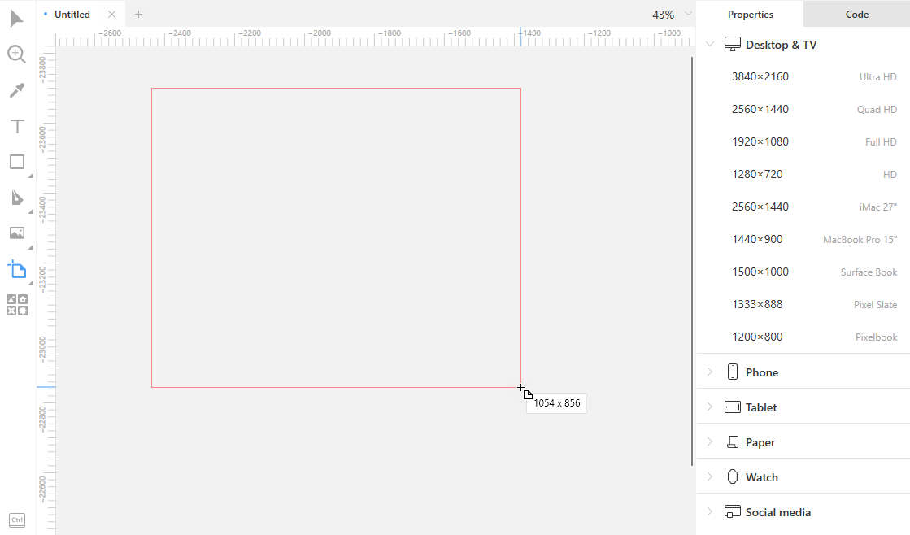

**Tip:** If there are already some objects on the canvas and you decide to put them on an artboard, just drag the artboard tool over these objects.

For details, about using artboards read <a href="https://docs.icons8.com/interface/#artboards" target="_blank">here</a>.

## Image tool

The Image tool serves for quick adding images from files to your designs. Lunacy supports all the popular image formats like PNG, JPG, JPEG, WEBP, BMP, ICO, GIF, SVG. The TIFF format is not supported.

To add an image:

1. Click the tool icon on the toolbar. The **Open** dialog box appears.
2. In the **Open** dialog box, browse to the required file.
3. Select the file. You can select multiple files at a time, if you want.
4. Click over the area where you want to put the image (this will add the image in its original size) or click and drag to get the required size of the image as shown in the demo below.

{:.is-big}
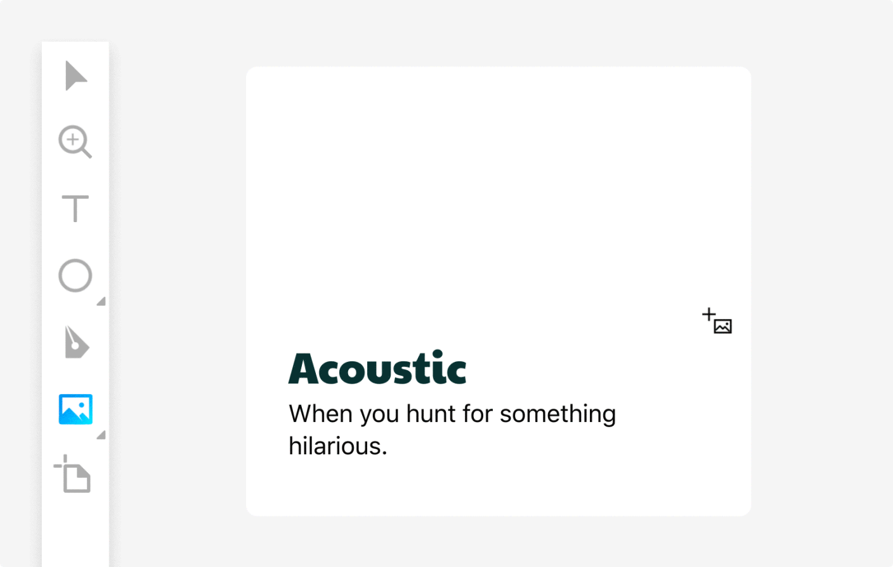

For details about working with images, read <a href="https://docs.icons8.com/images/" target="_blank">here</a>.

<!--

Also, you can:

* Drag images onto the canvas from your desktop or the Explorer.
* Copy image files from your desktop or the Explorer and then paste them onto the canvas.
* Import images from the internet.

There are several ways of adding images from the internet.

**Way 1**

1. In your web browser, right-click over the image. The context menu appears.
2. On the displayed menu, click **Copy image** or similar command.
3. Switch to Lunacy and right-click over the canvas.
4. Click **Paste here** on the context menu.

**Way 2**

1. In your web browser, right-click over the image. The context menu appears.
2. On the displayed menu, click **Copy image address** or similar command.
3. Switch to Lunacy and right-click over the canvas.
4. Click **Paste here** on the context menu. The **Paste as image** dialog box appears.
5. Click **OK** to paste the image. If you click **Cancel**, Lunacy will paste the image address as text.

**Note:** The second method works only when a web site provides direct links to images with an image extension at the end (.jpg, .png, .etc.).

The demo below shows the above two methods.

<video autoplay="" muted="" loop="" playsinline="" width="100%" poster="/public/tool-imgeimportph.png" height="auto"><source src="/public/tool-importimage11.mp4" type="video/mp4"></video>

**Way 3**

1. In your web browser, right-click over the image. The context menu appears.
2. On the displayed menu, click **Copy image address** or similar command.
3. Switch to Lunacy and click the Image tool. The **Open** dialog box appears.
4. Paste the image URL into the **File name** field.
5. Click **Open**.
6. Click over the area where you want to put the image (this will add the image in its original size) or click and drag to get the required size of the image.

-->

## Text tool

The Text tool serves for adding text layers. For details about working with text in Lunacy, click <a href="https://docs.icons8.com/text/" target="_blank">here</a>.

## Pen tool

The pen is a tool for creating vector shapes. It is used in all similar apps. But if you are a complete novice to design, it might take you some time and practice to master it.

The pen builds shapes by drawing segments between points that you add onto the canvas. Altogether, the segments between interconnected points are called a *path*. Paths that have no end points, which means that all points are connected with two segments, are called *closed paths* or *shapes*.

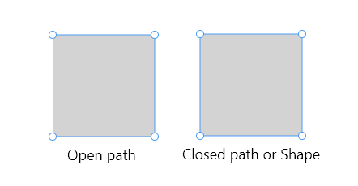

Path segments can be straight lines or curves.

To build a shape that consists of straight lines:

1. Click on the canvas to add the first point, then click where you want to have the second point.
2. Go on clicking until the shape that you want is ready and close the path by clicking over the point from where you started or clicking the **Close path** button in the Inspector.
3. Press `Esc` to exit the tool.

<video autoplay="" muted="" loop="" playsinline="" width="100%" poster="/public/tool-penplaceholder.png" height="auto"><source src="/public/tool-pen.mp4" type="video/mp4"></video>

To build a shape that includes curves, double-click when setting a point or click and drag a little. You will see two handles near the point. By dragging these handles and changing their length, you determine the shape of the curve. You can even drag the point, if necessary (see the demo below).

<video autoplay="" muted="" loop="" playsinline="" width="auto" poster="/public/tools-pentool2placholder.png" height="auto"><source src="/public/tools-pentool2.mp4" type="video/mp4"></video>

Don't worry if the resulting shape is not exactly what you wanted. You can always refine it by modifying curves and straight lines, moving points, adding new points or deleting unnecessary ones.

For this:

1. Select the shape.
2. Click the **Edit object** button () on the context tool bar or press `Enter`, to enable the edit mode.
3. Make the required changes.
4. To exit the edit mode, press `Esc` or click the canvas anywhere beyond the shape.

In the demo below we added some curves to a heart-shaped object built with straight lines. Note how a double-click turns a straight point into a curved (mirrored) point. It works in the opposite way as well. For details about the types of points, read the subsection below.

<video autoplay="" muted="" loop="" playsinline="" width="100%" poster="/public/tools-pentool3placeholder.png" height="auto"><source src="/public/tools-pentool31.mp4" type="video/mp4"></video>

**Tip:** To draw a perfectly horizontal, vertical or 45-degree diagonal path, hold down `Shift` when placing the second point of a segment.

### Types of points

There are two types of points: the so-called **Straight** (1) and curved points. Curved points appear with handles for building <a href="https://en.wikipedia.org/wiki/Bézier_curve" target="_blank">B&#x00e9;zier curves</a>.

And also, there are three subtypes of curved points. The difference between them is determined by the handles behavior:

* **Mirrored points** (2) come with identical handles that mirror each other as you drag one of the handles.
* **Disconnected points** (3) have entirely independent handles.
* **Asymmetric points** (4) come with handles that share the same angle but can have different lengths.  

As it was mentioned earlier, to switch between straight and mirror points, you can use double-clicking. To get a disconnected or asymmetric point, use the controls that appear at the top of the Inspector when you draw with the pen or enable the object editing mode. The numbers in the figure below correspond to the numbers in the description of point types.

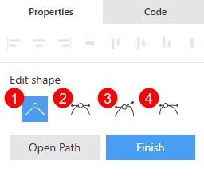

To better understand how it all works, see the demo below.

<video autoplay="" muted="" loop="" playsinline="" width="auto" poster="/public/tools-curvesplaceholder.png" height="auto"><source src="/public/tools-curves.mp4" type="video/mp4"></video>

For more information about editing vector objects, also read <a href="https://docs.icons8.com/editing/#vector-editing" target="_blank">here</a>.

## Pencil tool

The Pencil is a tool for drawing freehand paths with a stylus or, having some skill, with the mouse. You will find the Pencil on the same fly-out menu with the Pen tool. Alternatively, you can use `N` as a shortcut.

If you are using the mouse, just hold down the left mouse button and draw the required path. Release the button when you are done.

Unlike other tools that switch to the select mode right after you create an object, the Pencil tool allows you to create as many objects as you need. Each Pencil "stroke" adds a new object to the **Objects** panel. You can group them later.

The figure below shows two words *Lunacy* written with the Pencil tool. The top one is written in one stroke, while the bottom one is in a stroke per letter (grouped for convenience). See how they appear in the **Objects** panel.

{:.is-big}
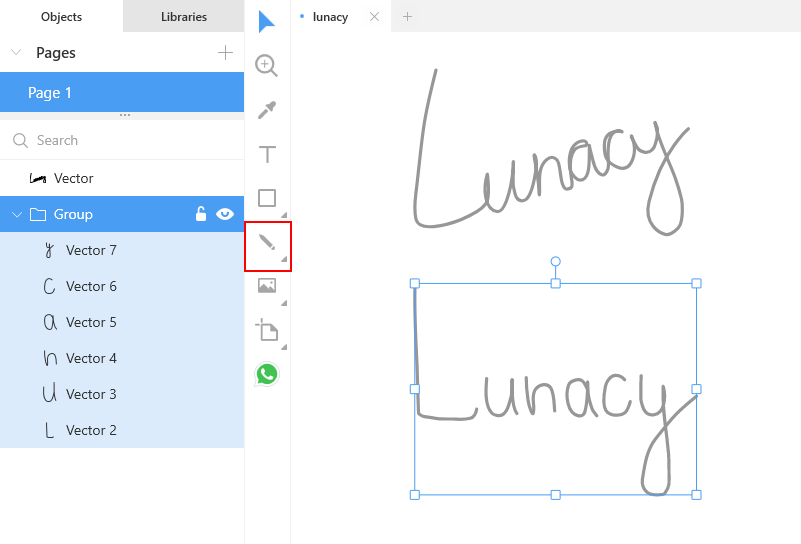

To exit the Pencil, press `Esc` or click the Select tool. When you exit the Pencil, Lunacy selects the latest path that you've added.

### Editing paths drawn with the Pencil

Lunacy automatically smooths the paths that you create. But you can also edit pencil-drawn paths like all other vector paths: add, delete and move points, bend segments, etc. To switch to the edit mode, select the required path and press `Enter` or click the **Edit object** button at the top bar. To exit the edit mode, press `Esc` or click anywhere on the canvas beyond the selected object, see the demo below.

<video autoplay="" muted="" loop="" playsinline="" width="100%" poster="/public/pencil-editplaceholder.png" height="auto"><source src="/public/tool-penciltool.mp4" type="video/mp4"></video>

Finally, you can make use of such styling properties as borders, shadows, inner shadows and blurs. As for fills, you should remember that the Pencil always draws open paths, even if they appear as closed. You can try to apply fills but in many cases the result can be weird. If you need to close a path, enable the object edit mode and click the **Close path** button which will appear in the Inspector.

## Shape tools

The Shape tools allow you to quickly add pre-made shapes that include:

* Rectangles
* Rounded rectangles
* Ovals
* Lines
* Stars
* Polygons
* Arrows

To add a shape, select the required shape on the toolbar and then drag and click on the canvas where you want it.

{:.is-big}
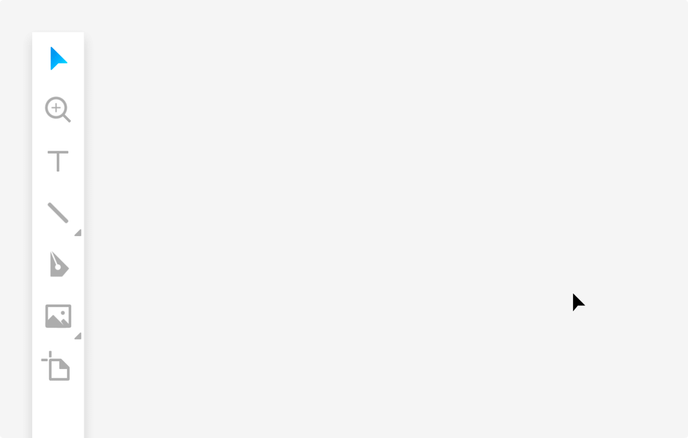

For details about working with shapes, click <a href="https://docs.icons8.com/editing/" target="_blank">here</a>.

## Icon tool

The Icon tool serves to simplify your work with icons and keeps the items that you've recently used at hand. A click over the icon tool on the toolbar opens the <a href="https://docs.icons8.com/libraries/#icons" target="_blank">Icons library</a> where you can select the required icon.

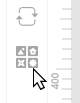

Alternatively, to start using the tool, press `X`. When enabled, the tool appears with the latest icon that you've used. Press `X` again to switch to the next recent icon or `Shift + X` to return to the previous one.

For your convenience, when you select an icon on the canvas, Lunacy displays the suggestions panel with your recent icons. To replace the selected icon with an icon from the suggestions panel, just click the required icon. The maximum number of displayed recent icons is 16.

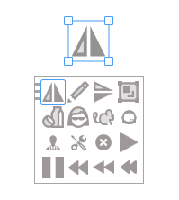

**Note**: The color selected in the **Icons** library affects the color of icons in the suggestion panel.

## Avatar tool

Creating views of user profiles is one of the most common tasks when designing user interfaces. Combined with Lunacy's <a href="https://docs.icons8.com/text/#text-generation-and-text-snippets" target="_blank">text snippets</a> the avatar tool becomes a real time saver.

{:.is-big}
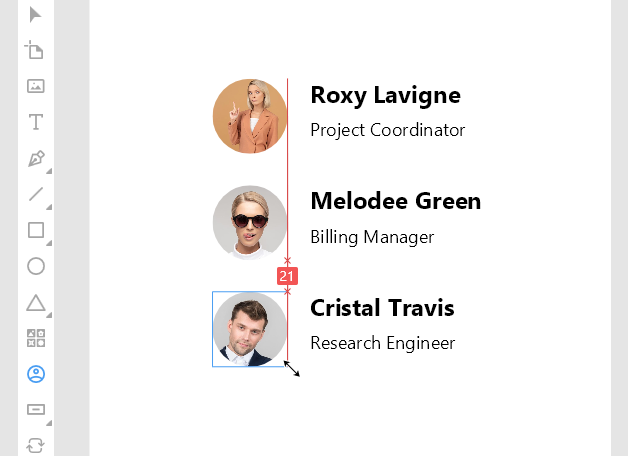

To add an avatar to your design:

1. Click the avatar tool.
2. Click or click and drag to place the avatar to where you want it.

Lunacy remembers the size of the latest avatar you add (at the moment you release the tool). The next time you invoke the tool it will appear with an avatar of that very size.

<video autoplay="" muted="" loop="" playsinline="" width="auto" poster="/public/tool-avatarsizeplaceholder.png" height="auto"><source src="/public/tool-avatarsize1.mp4" type="video/mp4"></video>

The default collection of avatars installed with the app includes five images. You can use them even when your computer has no internet connection. When you're online, you have access to the full collection of avatars.

Also, thanks to integration with the <a href="https://generated.photos/" target="_blank">generated.photos</a> project, you can select between the photos of real-life models (default) and photos of people generated by AI. In the latter case, you can choose the desired gender, age, ethnicity, and hair color of a model. These options appear in the Inspector. When you're done, click **Generate avatar** and enjoy the magic!

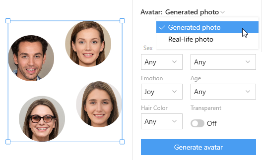

**Note:** You need an internet connection to be able to use generated photos.

To change the image of an avatar, select the avatar and click the refresh button at the top-left corner of the avatar or press `Shift+R`.

<video autoplay="" muted="" loop="" playsinline="" width="auto" poster="/public/tools-refreshavatarph.png" height="auto"><source src="/public/tools-refreshavatar.mp4" type="video/mp4"></video>

Also, you can refresh multiple avatars at a time. For this, select several avatars and press `Shift+R` or click **Generate avatar** in the Inspector.

<video autoplay="" muted="" loop="" playsinline="" width="auto" poster="/public/rn-newavatarph.png" height="auto"><source src="/public/rn-newavatar.mp4" type="video/mp4"></video>

Although avatars appear as circles when you add them to the canvas, in fact they are rounded rectangles. So, you can play with the value of the corner radius, if you wish.

<video autoplay="" muted="" loop="" playsinline="" width="100%" poster="/public/tool-avatardemo.png" height="auto"><source src="/public/avatardemo.mp4" type="video/mp4"></video>

Moreover, you can create avatars from any shapes. For this, select a shape, then enable the Avatar tool and click **Generate avatar** in the Inspector (see the demo below).

<video autoplay="" muted="" loop="" playsinline="" width="auto" poster="/public/rn-newavatar2ph.png" height="auto"><source src="/public/rn-newavatar2-1.mp4" type="video/mp4"></video>

### Adjusting background in avatars with generated photos

You can change the background in avatars based on generated photos. The procedure is as follows:

1. Select an avatar.
2. In the **Avatar** section of the Inspector, switch to *Generated photos*.
3. Enable the **Transparent** toggle.
4. Set the rest of the options as needed.
5. Click **Generate avatar**. A new avatar with a transparent background appears on the canvas.
6. In the **Fills** section of the Inspector, click `+`. This will add a new fill layer above the image.
7. Drag the new layer below the image layer.
8. Enable the color picker and set the required background color (see the demo below).

<video autoplay="" muted="" loop="" playsinline="" width="auto" poster="/public/tools-avatarbgph.png" height="auto"><source src="/public/tools-avatarbg.mp4" type="video/mp4"></video>

## GUI tool

Lunacy features a set of tools that allows you to quickly add basic GUI controls that include:

* Drop-down lists
* Buttons
* Text fields
* Checkboxes
* Radio buttons and
* Toggles

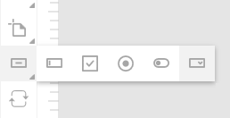

When you select a control added with any of these tools, you see the suggestions panel that allows you to:

1. Change the type of the control.
2. Select the style of the control.
3. Select the control state.

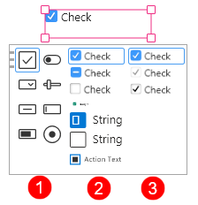

To edit the appearance of a control, use the <a href="https://docs.icons8.com/components/#editing-main-components" target="_blank">component editor</a>.

## Component tool

The component tool allows you to quickly create mockups of interfaces by adding placeholder components and then replacing them with required GUI elements.

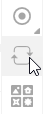

* To draw a placeholder component just select the Сomponent tool and drag over the required area. Placeholder components appear as pink rectangles with the question mark.

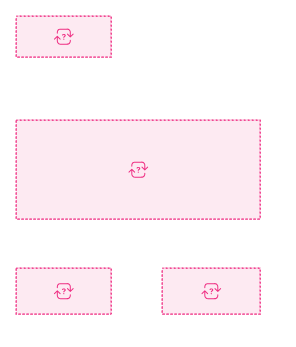

* To replace a placeholder component, select it and use the suggestions panel that will appear.
* You can also use use components from the Components page. For this, enable the tool, then go to the Components page and click the required component. The same applies to components from UI kits.
* When the Component tool is enabled, you can press the `C` and `Shift+C` hotkeys to switch between the components that you've used earlier and quickly add them onto the canvas.
* If you want your custom components to appear on the suggestions panel, you should properly tag them in the Inspector. For this, click  in the **Component** section of the Inspector and select a proper category.

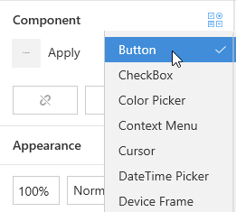

## Hotspot tool

Use the Hotspot tool to create hotspot zones when designing prototypes. To add a hotspot:

1. Enable the tool by selecting it on the toolbar or simply press `H`.
2. Click and drag over the area you want to have a hotspot.

The demo below shows the procedure of creating a hotspot and setting a target artboard.

<video autoplay="" muted="" loop="" playsinline="" width="100%" poster="/public/tool-addhotspotplaceholder.png" height="auto"><source src="/public/tool-addhotspot.mp4" type="video/mp4"></video>

To hide/show hotspots and prototyping links on the canvas, use the **Show prototyping** button on the top bar.

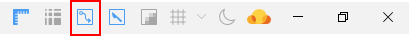

For more information about prototyping in Lunacy, click <a href="https://docs.icons8.com/prototyping" target="_blank">here</a>.

## Slice tool

The Slice tool allows you to select a specific area on your design and export it to a file.

To make use of the Slice tool:

1. Enable the tool by selecting it on the toolbar or simply press `E`.
2. Click and drag over the area you want to export. The **Export assets** panel appears in the Inspector.
3. Define the required export settings.
4. Click **Export selected**.

To hide/show slices on the canvas, use the **Show slices** button on the top bar.

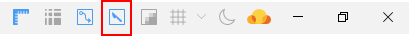

To remove a slice from the canvas, select it and press`Del`.

For more information about export in Lunacy, click <a href="https://docs.icons8.com/export" target="_blank">here</a>.

## Eyedropper tool

Working with colors is an essential part of a designer's job. The smart eyedropper tool is designed to make this work easy and effective.

To use the eyedropper tool:

1. Select an object to which you are going to apply a color. If you don't select any object, Lunacy applies the color to the workspace.
2. Click the eyedropper icon on the toolbar or on the color picker panel, or just press `I`. The cursor turns into the eyedropper. Also, the **Colors** panel appears on the left. It features four pallets:
  
    * Recent colors
    * Document colors
    * Flat colors
    * Material colors

3. Hover the eyedropper over the color that you want to sample anywhere on the screen and click to apply it.

{:.is-big}

That is typically how all eyedroppers work in similar apps. But Lunacy's eyedropper also features a very nice zoom option that comes in handy when the target area is small and you need pixel precision. To enable zoom, hover the eyedropper over the target and hold down the left mouse button. Then point the eyedropper to the required pixel and release the mouse button. To exit the zoom mode, press `Esc` or quickly swipe the cursor anywhere away from the current area, see the demo below.

<video autoplay="" muted="" loop="" playsinline="" width="100%" poster="/public/eyedropper3-placeholder.png" height="auto"><source src="/public/eyedropper3.mp4" type="video/mp4"></video>

### How Lunacy applies color to objects

Depending on the styling properties of an object, Lunacy applies colors in the following order:

1. Fill
2. Border
3. Shadow
4. Inner shadow

So, if an object has a fill and a border, Lunacy updates the fill. If an object has no fill, but has a border and a shadow, Lunacy changes the border color and so on. If an object has several fills/borders/shadows/inner shadows, Lunacy applies the color to the one which sits at the top of the property list in the Inspector. Similar rules apply to text objects where text color has top priority.

To demonstrate all this, in the figure below we applied the colors of the rectangles to the ellipses with different sets of styling properties.

{:.is-big}

## Zoom tool

The Zoom tool allows you to zoom in the selected object or canvas area. To use the tool:

1. Select the Zoom tool on the tool bar or press `Z`.
2. Click the object you want to zoom in or drag over the required area (the smaller the area is, the higher the resulting zoom value will be).
3. To zoom out, hold down `Alt` and click or drag over the object or area.

<video autoplay="" muted="" loop="" playsinline="" width="auto" poster="/public/tool-zoomplaceholder.png" height="auto"><source src="/public/tool-zoom61.mp4" type="video/mp4"></video>

For your convenience, when the zoom value exceeds 500, Lunacy starts displaying the pixel grid. There are two ways to disable this feature:

1. Through the menu (**View** > **Pixel grid**).
2. Deselect all objects on the canvas and clear the **Show pixel grid** checkbox that will appear in the Inspector.

For information about other zooming options in Lunacy, read <a href="https://docs.icons8.com/interface/#zooming-options" target="_blank">here</a>.
